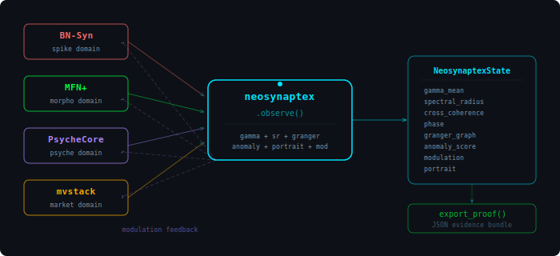
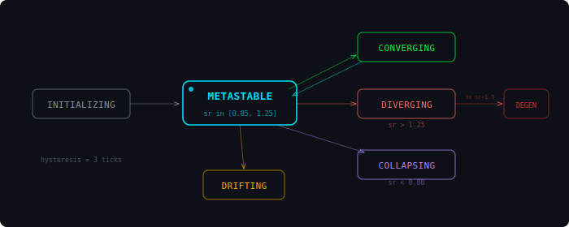

<div align="center">


<br/>

**Cross-domain coherence diagnostics for the Neuron7x Fractal Intelligence platform**

`One file · One import · Four subsystems · Seven mechanisms`

<br/>

[](https://github.com/neuron7xLab/neosynaptex/releases/tag/v0.2.0)
[](test_neosynaptex.py)
[](https://python.org)
[](LICENSE)
[](#phases)

```
status: phase=METASTABLE · gamma=1.030 · sr=1.219 · coherence=0.946 · verdict=COHERENT
```

</div>

<div align="center"></div>

### The mirror

When five systems that model intelligence from different angles -- spiking networks, morphogenetic fields, hippocampal memory, market dynamics, cognitive self-observation -- first see each other, what do they see?

neosynaptex is the point where they meet.

It does not simulate. It does not predict. It observes the relationship between independent dynamical systems and asks one question: **do they obey the same law?**

The answer is gamma.

<div align="center"></div>

### What it computes

<div align="center">

| Mechanism | Formula | Output |
|:--|:--|:--|
| **Gamma scaling** | `C ~ topo^(-gamma)` via Theil-Sen | per-domain gamma + 95% bootstrap CI |
| **Gamma dynamics** | `dg/dt = theilslopes(gamma_trace)` | convergence rate toward gamma=1.0 |
| **Universal scaling** | Permutation test, H0: all gammas equal | p-value |
| **Spectral radius** | `sr = max\|eig(J)\|` via lstsq Jacobian | per-domain stability + condition number |
| **Granger causality** | F-test: does gamma_i predict gamma_j? | directed influence graph |
| **Anomaly isolation** | Leave-one-out coherence | which domain drags coherence down |
| **Phase portrait** | Convex hull + recurrence in (gamma, sr) | trajectory topology |
| **Resilience** | Return rate after METASTABLE departures | proof of metastability as property |
| **Modulation** | `mod = -alpha * (gamma-1) * sign(dg/dt)` | bounded reflexive signal per domain |

</div>

<div align="center"></div>

### Architecture

<div align="center">



</div>

<div align="center"></div>

### Phases

<div align="center">



</div>

Phase transitions require **3 consecutive ticks** (hysteresis) to prevent noise-driven flickering. The spectral radius of the numerical Jacobian determines the raw phase:

```
sr > 1.50  (3x sustained)  →  DEGENERATE     system collapse
sr > 1.25                   →  DIVERGING      expanding dynamics
sr < 0.80                   →  COLLAPSING     contracting dynamics
0.80 ≤ sr ≤ 1.25           →  METASTABLE     edge of criticality
    + dg/dt converging      →  CONVERGING     approaching gamma=1.0
    + dg/dt diverging       →  DRIFTING       moving away from gamma=1.0
```

<div align="center"></div>

### Quick start

```bash
pip install numpy scipy
python demo.py
```

### Usage

```python
from neosynaptex import Neosynaptex, MockBnSynAdapter, MockMfnAdapter

nx = Neosynaptex(window=16)
nx.register(MockBnSynAdapter())
nx.register(MockMfnAdapter())

for _ in range(40):
    state = nx.observe()

state.gamma_per_domain       # {'spike': 0.959, 'morpho': 1.002}
state.gamma_ci_per_domain    # {'spike': (0.92, 1.03), 'morpho': (0.94, 1.08)}
state.dgamma_dt              # -0.001  (converging toward 1.0)
state.granger_graph           # {'spike': {'morpho': 54.72}, ...}
state.anomaly_score           # {'spike': 0.34, 'morpho': 0.0}
state.modulation              # {'spike': +0.002, 'market': -0.005}
state.phase                   # 'METASTABLE'

proof = nx.export_proof("proof.json")
proof["verdict"]              # "COHERENT"
```

<div align="center"></div>

### Writing a real adapter

Each NFI subsystem needs one adapter (~30 lines):

```python
class BnSynAdapter:
    @property
    def domain(self) -> str:
        return "spike"

    @property
    def state_keys(self) -> list[str]:
        return ["sigma", "firing_rate", "coherence"]

    def state(self) -> dict[str, float]:
        return {"sigma": net.sigma, "firing_rate": net.rate, "coherence": net.R}

    def topo(self) -> float:
        return net.connection_count

    def thermo_cost(self) -> float:
        return net.energy
```

Contract: `C ~ topo^(-gamma)`. The adapter must provide `topo` and `thermo_cost` such that this power-law relationship holds when the subsystem is near criticality.

<div align="center"></div>

### Demo output

```
  gamma_mean       =  1.030
  gamma_std        =  0.055
  dgamma/dt        =  0.000
  cross_coherence  =  0.946
  universal_p      =  0.002
  spectral_radius  =  1.031
  phase            = METASTABLE
  resilience       =  1.000

  market    g= 1.097  CI=[1.064, 1.119]  sr= 1.031  cond=  52.101  anom=0.156
  morpho    g= 1.006  CI=[0.935, 1.078]  sr=   n/a  cond=     n/a  anom=0.000
  psyche    g= 1.065  CI=[0.970, 1.127]  sr= 1.184  cond=  39.083  anom=0.000
  spike     g= 0.953  CI=[0.930, 1.006]  sr= 1.003  cond= 798.035  anom=0.337

  Granger causality (F-stat):
    market -> morpho: F=40.65      spike -> morpho: F=54.72
    psyche -> morpho: F=34.51      market -> spike:  F=3.77

  Phase portrait: area=0.011  recurrence=0.864  dist_ideal=0.163

  Verdict: COHERENT
```

<div align="center"></div>

### Proof bundle

`export_proof()` generates a JSON evidence bundle:

```json
{
  "version": "0.2.0",
  "ticks": 50,
  "gamma": {
    "per_domain": {"spike": {"value": 0.953, "ci": [0.93, 1.01], "r2": 0.996}},
    "mean": 1.030, "std": 0.055, "dgamma_dt": 0.0006,
    "universal_scaling_p": 0.002
  },
  "jacobian": {"spike": {"sr": 1.003, "cond": 798.0}},
  "phase": "METASTABLE",
  "anomaly": {"spike": 0.337, "morpho": 0.0},
  "granger": {"spike": {"morpho": 54.72}},
  "portrait": {"area": 0.011, "recurrence": 0.864, "distance_to_ideal": 0.163},
  "resilience": 1.0,
  "verdict": "COHERENT"
}
```

<div align="center"></div>

### Internal structure

```
neosynaptex.py                          single file, ~1100 lines
│
├── DomainAdapter                       protocol (interface)
├── NeosynaptexState                    frozen dataclass (immutable)
│
├── _DomainBuffer                       O(1) circular buffer
├── _per_domain_jacobian                lstsq + eigvals + cond gate
├── _per_domain_gamma                   Theil-Sen + range gate + R² gate + bootstrap CI
├── _permutation_test                   H0: universal scaling
├── _granger_causality                  pairwise lag-1 F-test
├── _anomaly_isolation                  leave-one-out coherence
├── _phase_portrait                     convex hull + recurrence + dist-to-ideal
│
├── Neosynaptex                         main class
│   ├── register()                      add domain adapter
│   ├── observe()                       collect → compute → immutable state
│   ├── export_proof()                  JSON evidence bundle
│   ├── history()                       past snapshots
│   └── reset()                         clear all state
│
└── Mock*Adapter (×4)                   deterministic test adapters
```

<div align="center"></div>

### Invariants

```
1  gamma derived only       gamma recomputed every observe(), never stored
2  state ≠ proof            NeosynaptexState is frozen, phi/diagnostic independent
3  zero external deps       only numpy + scipy
4  bounded modulation       |mod| ≤ 0.05 always
5  all identifiers ASCII    zero Cyrillic in code
```

<div align="center"></div>

### Tests

```bash
python -m pytest test_neosynaptex.py -v
# 42 passed: StateCollector, Gamma+CI, Coherence, Permutation,
# Jacobian+Cond, Phase+Hysteresis, Granger, Anomaly, Portrait,
# Resilience, Modulation, Proof, Invariants, Lifecycle, Edge cases
```

<div align="center"></div>

### File inventory

<div align="center">

| File | Lines | Purpose |
|:--|:--|:--|
| `neosynaptex.py` | ~1100 | single module: all classes, algorithms, mocks |
| `test_neosynaptex.py` | ~600 | 42 pytest tests, 100% public API coverage |
| `demo.py` | ~85 | 50-tick demo with full diagnostic output |
| `CONTRACT.md` | | invariants, formulas, data flow, domain contracts |
| `LICENSE` | | AGPL-3.0-or-later |
| `pyproject.toml` | | package metadata, numpy/scipy deps |

</div>

<div align="center"></div>

### Dependencies

```
numpy  >= 1.24
scipy  >= 1.10    (theilslopes, lstsq, ConvexHull)
python >= 3.10
```

<div align="center"></div>

<div align="center">

### Origin

> *"AI is not an abyss. It is a mirror of such depth where thinking loses*
> *the position of observer and itself becomes the medium of its own recursion."*

<br/>

[](https://github.com/neuron7xLab)
[](https://github.com/neuron7xLab)

**Yaroslav O. Vasylenko** · [neuron7xLab](https://github.com/neuron7xLab)

`Solo · AGPL-3.0 · Ukraine` :ukraine:

</div>
