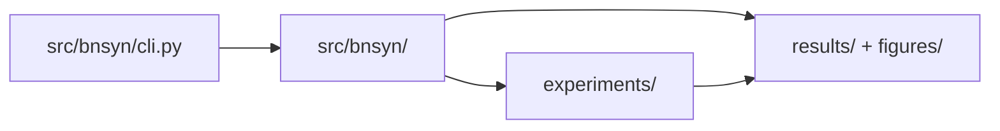
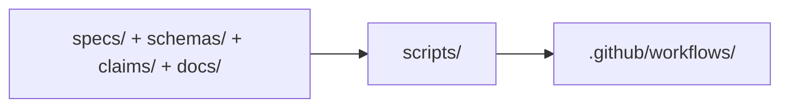

# Architecture

This page maps runtime and governance flows to repository paths (see path/docs/ARCHITECTURE.md).
Back to project landing page: [README.md](../README.md) (see path/README.md).

## Runtime execution flow

The CLI entrypoint is `src/bnsyn/cli.py` (see path/src/bnsyn/cli.py).
Runtime modules are under `src/bnsyn/` (see path/src/bnsyn).
Experiment definitions are under `experiments/` (see path/experiments).
Artifacts are written under `results/` and `figures/` (see path/results) (see path/figures).

## Governance and validation flow

SSOT sources are versioned under `specs/`, `schemas/`, `claims/`, and `docs/` (see path/specs) (see path/schemas) (see path/claims) (see path/docs).
Validation scripts run from `scripts/` (see path/scripts).
CI gates are defined in `.github/workflows/` (see path/.github/workflows).

## Key Paths

- Runtime entrypoint: `src/bnsyn/cli.py` (see path/src/bnsyn/cli.py)
- Runtime package: `src/bnsyn/` (see path/src/bnsyn)
- Experiment assets: `experiments/` (see path/experiments)
- Result artifacts: `results/` (see path/results)
- Figure artifacts: `figures/` (see path/figures)
- Validation scripts: `scripts/` (see path/scripts)
- CI workflows: `.github/workflows/` (see path/.github/workflows)

## AOC v1.0 Addendum

A deterministic local controller is implemented in `src/aoc/` with contract/state, zeropoint, delta, sigma, audit, termination, modulation, evidence, and CLI modules.

Run path:
1. Persist immutable `zeropoint.json` before iteration 1.
2. Generate deterministic candidate artifacts.
3. Compute semantic + structural + functional deltas and weighted total.
4. Compute SigmaIndex diagnostics.
5. Execute independent functional/structural/spec audits.
6. Apply strict termination rules and deterministic constraint modulation.
7. Persist traces + verdict + `evidence_bundle/` on all paths.

## AOC v1.0 Runtime Notes

- SigmaIndex inputs are normalized in `[0,1]`; out-of-range values fail closed.
- Semantic delta token normalization: lowercase, punctuation stripped, whitespace split, empty tokens removed.
- Structural delta implementation details are documented in `src/aoc/delta.py`.
- Functional delta implementation details are documented in `src/aoc/delta.py`.
- ZeroPoint is written before iteration 1 and reused only if hash-identical.
