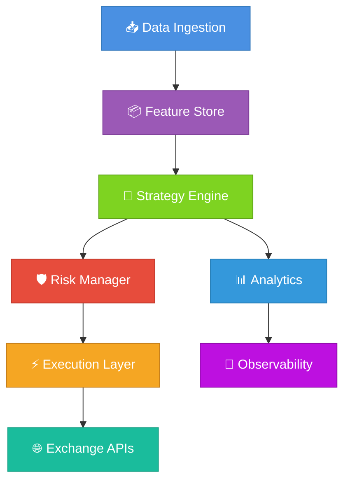

<div align="center">

# TradePulse

*Enterprise-Grade Algorithmic Trading Platform with Geometric Market Intelligence*

<br>

[](https://github.com/neuron7x/TradePulse/actions/workflows/tests.yml)
[](https://github.com/neuron7x/TradePulse/actions/workflows/ci.yml)
[](LICENSE)
[](https://www.python.org/)

**TradePulse** is a production-grade algorithmic trading platform combining advanced geometric market indicators with enterprise reliability for quantitative researchers, algorithmic traders, and financial institutions.

[Quick Start](#-quick-start) • [Features](#-feature-highlights) • [Documentation](#-documentation) • [Contributing](#-contributing)

</div>

---

## 📋 Table of Contents

- [Why TradePulse?](#-why-tradepulse)
- [Feature Highlights](#-feature-highlights)
- [System Architecture](#-system-architecture)
- [Quick Start](#-quick-start)
- [Usage Examples](#-usage-examples)
- [TACL: Thermodynamic Control Layer](#-tacl-thermodynamic-autonomic-control-layer)
- [Testing & Quality](#-testing--quality)
- [Performance](#-performance)
- [Configuration](#-configuration)
- [Deployment](#-deployment)
- [Use Cases](#-use-cases)
- [Project Status & Roadmap](#-project-status--roadmap)
- [Contributing](#-contributing)
- [License](#-license)
- [Disclaimer](#-disclaimer)

---

## 🎯 Why TradePulse?

### For Quantitative Researchers
- **Geometric Market Indicators**: Kuramoto oscillators, Ricci flow, entropy measures for deep market analysis
- **Research → Production Pipeline**: Seamless transition from research to live trading
- **Advanced Backtesting**: Event-driven engine with walk-forward optimization and property-based testing

### For Algorithmic Traders
- **Multi-Exchange Support**: Binance, Coinbase, Kraken, Alpaca, and more via CCXT
- **Live Trading**: Real-time signal generation and execution with built-in risk management
- **Observability**: Prometheus metrics, OpenTelemetry tracing, and comprehensive logging

### For Infrastructure Engineers
- **Enterprise-Grade**: Security controls aligned with NIST SP 800-53 and ISO 27001 (design aligned, no external audit)
- **Scalable Architecture**: Event-driven design, Kubernetes-ready (GPU acceleration planned)
- **Comprehensive Testing**: CI pipeline spans unit, integration, property-based, and fuzz suites; coverage expansion is in progress (~71% overall) toward a 98% target on `core/`, `execution`, `runtime`, and `tacl`

---

## ✨ Feature Highlights

### 🧮 Geometric Market Intelligence

**Kuramoto Oscillators** — Detect synchronization patterns in market dynamics  
**Ricci Flow** — Measure geometric curvature for regime detection  
**Entropy Measures** — Information-theoretic market analysis  
**Multi-Scale Analysis** — Fractal pattern recognition across timeframes  

Code: [`core/indicators/`](core/indicators/)

### 📊 Backtesting & Simulation

**Event-Driven Engine** — Microsecond-latency simulation architecture  
**Portfolio Management** — Multi-asset portfolio optimization and rebalancing  
**Risk Management** — Pre-trade checks, position limits, drawdown protection  
**Walk-Forward Optimization** — Defense against overfitting  
**Property-Based Tests** — Hypothesis-driven strategy validation  

Code: [`backtest/`](backtest/), [`execution/`](execution/)

### ⚡ Live Trading & Integration

**Exchange Connectors** — CCXT, Alpaca, Polygon APIs  
**Execution Layer** — REST and WebSocket execution adapters  
**Runtime Layer** — Live trading orchestration and monitoring  
**Paper Trading** — Safe testing before live deployment  
**Kill Switch** — Emergency stop with secure admin API  

Code: [`execution/`](execution/), [`runtime/`](runtime/), [`interfaces/live_runner.py`](interfaces/live_runner.py)

### 🛡️ Observability & Safety

**Metrics** — Prometheus exporters for real-time monitoring  
**Tracing** — OpenTelemetry distributed tracing  
**Circuit Breakers** — Auto trading halt after failures  
**Audit Logging** — 400-day retention with compliance support  
**Health Checks** — Kubernetes-ready liveness and readiness probes  
**Reliability Testing** — 40+ tests validating graceful failure modes ([docs/RELIABILITY_SCENARIOS.md](docs/RELIABILITY_SCENARIOS.md))

Code: [`observability/`](observability/), [`infra/`](infra/), [`tests/reliability/`](tests/reliability/)

### 🔐 Enterprise Security

> ⚠️ **No External Audit**: TradePulse has not undergone external security audit or compliance certification.

**Security Framework** — Controls aligned with NIST SP 800-53 and ISO 27001 (design aligned, no external audit)  
**Secrets Management** — HashiCorp Vault and AWS Secrets Manager integration  
**Encrypted Storage** — AES-256 at rest, TLS 1.3 in transit  
**MFA Support** — Multi-factor authentication for admin operations  
**Compliance Controls** — GDPR, CCPA, SEC, FINRA patterns implemented (not certified)  

Code: [Security Documentation](docs/security/), [`SECURITY.md`](SECURITY.md)

### 🚀 Extensibility

**Strategy Plugins** — Easy integration of custom strategies  
**Custom Indicators** — Add your own technical or geometric indicators  
**Rust Accelerators** — High-performance compute kernels  
**Neuro Modules** — Advanced neural trading components  

All plugins implement the standard registry contracts in [`strategies/registry.py`](strategies/registry.py) and indicator interfaces in [`core/indicators/base.py`](core/indicators/base.py); RL/Neuro modules are exercised in a sandbox gate before any live test.

Code: [`strategies/`](strategies/), [`rust/tradepulse-accel/`](rust/tradepulse-accel/), [`hydrobrain_v2/`](hydrobrain_v2/), [`rl/`](rl/)

---

## 🏗️ System Architecture



### Key Modules

| Module | Path | Language | Purpose |
|--------|------|----------|---------|
| **Core Indicators** | `core/indicators/` | Python | Geometric and technical indicators |
| **Backtest Engine** | `backtest/` | Python | Event-driven backtesting |
| **Execution** | `execution/` | Python | Order execution and adapters |
| **Runtime** | `runtime/` | Python | Live trading orchestration |
| **Observability** | `observability/` | Python | Metrics, traces, dashboards |
| **UI Dashboard** | `ui/dashboard/` | TypeScript | Interactive web interface |
| **Rust Accelerators** | `rust/tradepulse-accel/` | Rust | High-performance compute |
| **HydroBrain v2** | `hydrobrain_v2/` | Python | Advanced neural components |
| **RL Module** | `rl/` | Python | Reinforcement learning strategies |
| **TACL** | `tacl/` | Python | Thermodynamic control layer |

📖 **Full Architecture**: [docs/ARCHITECTURE.md](docs/ARCHITECTURE.md)
📦 **Independent Models Split**: [docs/architecture/independent_models.md](docs/architecture/independent_models.md)

---

## 🚀 Quick Start

### Prerequisites

- **Python** 3.11 or 3.12 ([Download](https://www.python.org/downloads/))
- **Git** 2.30+ for version control
- **Docker** (optional, for containerized deployment)

### Installation

```bash
# Clone the repository
git clone https://github.com/neuron7x/TradePulse.git
cd TradePulse

# Create and activate virtual environment
python -m venv .venv
source .venv/bin/activate  # On Windows: .venv\Scripts\activate

# Install dependencies (choose one):
make install           # Runtime dependencies only
make dev-install       # Full development environment

# Configure environment variables
cp .env.example .env
# Edit .env with your settings (see SETUP.md for details)
```

**Alternative installation** (without Make):
```bash
pip install --upgrade pip setuptools wheel
pip install -c constraints/security.txt -r requirements.lock          # Runtime only
pip install -c constraints/security.txt -r requirements-dev.lock      # Add dev tools
```

📖 **Detailed Setup**: [SETUP.md](SETUP.md)  
🔐 **Security**: All dependencies are pinned to exact versions with security constraints applied

### Your First Analysis

```bash
# Run the quick start example
PYTHONPATH=. python examples/quick_start.py
```

**Expected output:**
```
=== TradePulse Market Analysis ===
----------------------------------------
Market Phase:     transition
Confidence:       0.893
Entry Signal:     0.000
----------------------------------------

📊 Interpretation:
  • Market is transitioning between regimes
  • High confidence (89.3%) in current phase

✅ Analysis complete!
```

> **Note:** Use `PYTHONPATH=.` to ensure Python can find the local modules. On Windows PowerShell: `$env:PYTHONPATH='.'; python examples/quick_start.py`

### Run the control platform (canonical)

```bash
tradepulse-server --allow-plaintext --host 127.0.0.1 --port 8000
```

- Optional: `--config path/to/config.yaml` (precedence: CLI > ENV > YAML > defaults)
- Logs include `effective_config_source=... controllers_loaded=[...]`
- Fallback (non-canonical): `PYTHONPATH=. python -m application.runtime.server --allow-plaintext --host 127.0.0.1 --port 8000`

### Canonical code root

- Package root: `tradepulse` under `src/`
- Import controllers from canonical paths, e.g.:
  ```python
  from tradepulse.core.neuro.serotonin.serotonin_controller import SerotoninController
  ```
- Legacy `core.*` imports are deprecated shims and will be removed in a future release; see `docs/ARCHITECTURE_MAP.md`.

### Interactive Dashboard

**Canonical — TypeScript dashboard (`ui/dashboard`)**

```bash
cd ui/dashboard
npm ci
npm test  # fast, headless smoke that exercises the canonical UI
```

> Optional preview: open `demo.html` in a local HTTP server for visual inspection.

**Prototype — Streamlit dashboard (dev-only)**

```bash
PYTHONPATH=. streamlit run interfaces/dashboard_streamlit.py
```

> Prototype only; keep Streamlit installed separately (`pip install streamlit streamlit-authenticator`).

📖 **Dashboard Guide**: [docs/ui_logical_structure.md](docs/ui_logical_structure.md)

### Golden Path Workflow

Demonstrate the complete TradePulse workflow from data to results:

```bash
# One-command demonstration of the full workflow
make golden-path
```

**What it does:**
1. **Data Generation** — Creates 500 bars of synthetic market data with deterministic seed
2. **Market Analysis** — Detects regime using Kuramoto-Ricci indicators
3. **Backtest Integration** — Validates strategy execution with PnL calculation
4. **Results** — Produces validated output in <30 seconds

**Expected output:**
```
🎯 TradePulse Golden Path Workflow
====================================
Step 1/3: Generating synthetic market data...
✓ Generated 500 bars of synthetic data

Step 2/3: Running market analysis...
=== TradePulse Market Analysis ===
Market Phase:     transition
Confidence:       0.658
Entry Signal:     0.000

Step 3/3: Running backtest integration test...
tests/integration/test_golden_path_backtest.py . [100%]
1 passed in 0.84s

✅ Golden Path Complete!
```

> **Note:** This is a demonstration workflow using synthetic data. For production use with real market data, see [DEPLOYMENT.md](DEPLOYMENT.md) and [docs/runbook_live_trading.md](docs/runbook_live_trading.md).

---

## 💻 Usage Examples

### Basic Market Analysis

```python
import numpy as np
import pandas as pd
from core.indicators.kuramoto_ricci_composite import TradePulseCompositeEngine

# Generate sample market data
index = pd.date_range("2024-01-01", periods=720, freq="5min")
prices = 100 + np.cumsum(np.random.normal(0, 0.6, 720))
volume = np.random.lognormal(9.5, 0.35, 720)
bars = pd.DataFrame({"close": prices, "volume": volume}, index=index)

# Analyze market regime
engine = TradePulseCompositeEngine()
snapshot = engine.analyze_market(bars)

print(f"📊 Phase: {snapshot.phase.value}")
print(f"🎯 Confidence: {snapshot.confidence:.3f}")
print(f"📈 Entry Signal: {snapshot.entry_signal:.3f}")
```

### Backtesting a Strategy

```python
import numpy as np
from backtest.event_driven import EventDrivenBacktestEngine
from core.indicators import KuramotoIndicator

# Generate price series
rng = np.random.default_rng(seed=42)
prices = 100 + np.cumsum(rng.normal(0, 1, 500))

# Define indicator and signal function
indicator = KuramotoIndicator(window=80, coupling=0.9)

def kuramoto_signal(series: np.ndarray) -> np.ndarray:
    order = indicator.compute(series)
    signal = np.where(order > 0.75, 1.0, np.where(order < 0.25, -1.0, 0.0))
    warmup = min(indicator.window, signal.size)
    signal[:warmup] = 0.0
    return signal

# Run backtest
engine = EventDrivenBacktestEngine()
result = engine.run(
    prices,
    kuramoto_signal,
    initial_capital=100_000,
    strategy_name="kuramoto_demo",
)

print(f"💰 PnL: ${result.pnl:,.2f}")
print(f"📉 Max Drawdown: {result.max_dd:.2%}")
print(f"📊 Trades: {result.trades}")
```

### CLI Analysis

```bash
# Analyze CSV data
python -m interfaces.cli analyze \
    --csv data/sample.csv \
    --window 200 \
    --price-col close

# Generate sample data
python -m interfaces.cli generate \
    --output data/synthetic.csv \
    --bars 1000
```

📖 **CLI Reference**: [docs/tradepulse_cli_reference.md](docs/tradepulse_cli_reference.md)

---

## 🌡️ TACL: Thermodynamic Autonomic Control Layer

**TACL is the governing brain of system stability**, not a feature. It manages the TradePulse topology as a thermodynamic system where autonomous changes must respect **Monotonic Free Energy Descent**: no self-degrading change without explicit human approval.

### Global Invariants

TACL enforces five non-negotiable invariants across all autonomous operations:

| Invariant | Description | Failure Consequence |
|-----------|-------------|---------------------|
| **Safety** | No uncontrolled degradation; explicit human approval for non-monotonic moves | Automated rollback triggered |
| **Auditability** | 7-year retention for decisions, config, model/policy versions, regime switches | Compliance violation, incident response blocked |
| **Resource Governance** | Latency, coherency, and resource cost are first-class (Free Energy F) | SLO breach, capacity exhaustion |
| **Reproducibility** | Deterministic replay; versioned configs; testable interfaces | Debug/audit impossible |
| **Event-based Sparsity** | Compute is sparse and triggered; avoid always-on overhead | Resource waste, latency degradation |

### Core Mechanisms

#### Free Energy Measurement

Free Energy `F = U - T·S` where:
- **U** (Internal Energy): Weighted penalties from latency, coherency, and resource metrics
- **T** (Temperature): Control temperature (0.60) representing discount on available slack
- **S** (Entropy): Stability term proportional to headroom relative to thresholds

| Metric | Threshold | Weight | Unit |
|--------|-----------|--------|------|
| `latency_p95` | 85.0 | 1.6 | ms |
| `latency_p99` | 120.0 | 1.9 | ms |
| `coherency_drift` | 0.08 | 1.2 | ratio |
| `cpu_burn` | 0.75 | 0.9 | ratio |
| `mem_cost` | 6.5 | 0.8 | GiB |
| `queue_depth` | 32.0 | 0.7 | messages |
| `packet_loss` | 0.005 | 1.4 | ratio |

**Energy Envelope**: Free energy ≤ 1.35 (12% safety margin from hot-path load tests)

**Telemetry Discipline**: Latency, coherency, and cost signals are exported as OTLP traces and Prometheus time-series. Every controller state transition is logged for ≥400-day retention. RL/GA/LinkActivator actuators remain locked behind dual human approval plus CI safety gates—no autonomous refactors are permitted without the gate.

#### Safety Model: Monotonic Free Energy Descent

```
IF F(t+1) > F(t) + tolerance THEN
  IF has_dual_approval(operations, safety) THEN
    log_override_with_approvals()
    proceed()
  ELSE
    trigger_automated_rollback()
    engage_kill_switch_authority()
  END
END
```

- **Rest Potential**: 1.0 (stabilised baseline)
- **Action Potential**: 1.35 (maximum tolerable stress before kill-switch)
- **Monotonic Tolerance**: 5×10⁻³

#### Protocol Hot-Swap

Dynamic switching between communication protocols with admissibility guards:

- **RDMA**: Low-latency, high-throughput (requires compatible hardware)
- **CRDT**: Conflict-free replicated data types for eventual consistency
- **gRPC**: Standard RPC with protobuf serialization
- **Shared Memory**: Ultra-low latency for co-located services
- **Gossip**: Epidemic protocol for distributed state synchronization

**Rollback Policy**: Any hot-swap that increases F beyond tolerance triggers automatic reversion within 30s.

### Technical Classification

| Aspect | Status | Verification |
|--------|--------|--------------|
| **TRL** | 7 (internal assessment, post-staging) | Staging load tests |
| **Adaptation** | GA/RL with runtime monotonic gates | CI safety gates |
| **Audit Trail** | 7-year retention (config present, production validation pending) | `.ci_artifacts/energy_validation.json` |
| **Crisis Modes** | Adaptive recovery with severity escalation | `runtime/thermo_controller.py` |

### Authorization for Exceptions

Temporary exceptions to the energy budget require **dual approval**:

1. **Thermodynamic Duty Officer** (rotating weekly)
2. **Platform Staff Engineer** (responsible for affected cluster)

Both approvals must be recorded in the release ticket with telemetry snapshots.

📖 **TACL Documentation**: [docs/TACL.md](docs/TACL.md), [`tacl/`](tacl/), [`runtime/thermo_controller.py`](runtime/thermo_controller.py)

📊 **Metrics Formalization**: [docs/thermodynamics/METRICS_FORMALIZATION.md](docs/thermodynamics/METRICS_FORMALIZATION.md)

⚙️ **Operational Runbook**: [docs/thermodynamics/OPERATIONAL_RUNBOOK.md](docs/thermodynamics/OPERATIONAL_RUNBOOK.md)

---

## 🧪 Testing & Quality

> 📊 **Claims Registry**: All high-level quality, performance, and security claims are tracked in [docs/METRICS_CONTRACT.md](docs/METRICS_CONTRACT.md).

TradePulse maintains multi-layer testing. Current coverage is ~71% (see [docs/project-status.md](docs/project-status.md)); CI is configured for a 98% critical-surface target that is still being activated while coverage expands. The testing strategies include:

### Test Types

- **Unit Tests**: Module-level validation (`tests/unit/`)
- **Integration Tests**: End-to-end workflows (`tests/integration/`)
- **Property-Based Tests**: Hypothesis-driven testing (`tests/property/`)
- **Fuzz Tests**: Adversarial input testing (`tests/fuzz/`)
- **Contract Tests**: API schema validation (`tests/contracts/`)
- **Mutation Testing**: Test suite quality assurance

### Running Tests

```bash
# Run all tests
pytest tests/

# Fast feedback loop (skip slow tests)
pytest tests/ -m "not slow"

# With coverage report
pytest tests/ --cov=core --cov=backtest --cov=execution --cov-report=html

# Property-based tests only
pytest tests/property/

# Mutation testing
mutmut run --use-coverage

# UI dashboard smoke (canonical)
cd ui/dashboard && npm test
```

### CI/CD Merge Gates

- **Test coverage**: CI configurations run `pytest -m "not flaky"` across unit, integration, property-based, fuzz, contracts, reliability, and e2e smoke suites. The critical-surface coverage target is 98%, but the enforcement gate is not yet active (current overall coverage ~71%).  
- **Security & Quality**: Required workflows execute SAST (ruff, mypy, bandit, golangci-lint), dependency checks (`pip-audit` with `constraints/security.txt`), and SBOM generation/verification (CycloneDX) before merge.  
- **Artifacts**: Coverage XML, mutation reports, and SBOMs are uploaded per run to document evidence for internal audits.

### Coverage Status

**Target Gate**: CI configuration sets a 98% line coverage goal on `core/`, `execution/`, `runtime/`, and `tacl/` using the critical-surface guardrail (`configs/quality/critical_surface.coveragerc` + `configs/quality/critical_surface.toml`), but enforcement is pending while coverage expands. Current snapshot: ~71% overall coverage (backtest ~74%, execution ~44%, core ~32%).  
**Module Goals**: backtest (100%), execution (100%), core modules (90-95%) with branch coverage parity.

To verify current coverage:
```bash
make test-coverage
# View report: reports/coverage/index.html
```

📊 **Full claims mapping**: [docs/METRICS_CONTRACT.md](docs/METRICS_CONTRACT.md)

---

## ⚡ Performance

TradePulse is designed for low-latency, high-throughput trading operations.

> ⚠️ **Design Targets Only**: Performance metrics below are architecture targets (status: `design_target`), NOT measured results.

Instrumentation captures latency, memory, and compute budgets for data ingestion, execution, runtime orchestration, and dashboard queries via Prometheus/OpenTelemetry. Any code path consuming >30% of the hot-loop budget must ship (or fall back to) a Rust accelerator from [`rust/tradepulse-accel/`](rust/tradepulse-accel/).

### Design Goals

All claims below have status `design_target`. See [docs/METRICS_CONTRACT.md](docs/METRICS_CONTRACT.md) for definitions.

- **Backtesting**: 1M+ bars/second throughput
- **Live Trading**: Sub-5ms order latency (exchange dependent)
- **Signal Generation**: Sub-1ms with cached indicators
- **Memory**: ~200MB steady-state for live trading
- **GPU Acceleration**: `planned` — CUDA kernels not implemented

### Benchmarks

```bash
# Run performance benchmarks
make perf

# Run specific benchmark tests
pytest tests/performance/test_indicator_benchmarks.py --benchmark-enable
```

📊 **Full claims mapping**: [docs/METRICS_CONTRACT.md](docs/METRICS_CONTRACT.md)

---

## ⚙️ Configuration

TradePulse uses **Hydra** for flexible, composable configuration management.

📜 **Environment Charter**: Deterministic dependency/config/data rules live in [docs/ENVIRONMENT_CHARTER.md](docs/ENVIRONMENT_CHARTER.md).

### Configuration Structure

TradePulse uses three configuration directories, each with a specific purpose:

- **`conf/`** — Hydra framework configs and experiment settings
- **`config/`** — Core neuromodulator and thermodynamic system configs
- **`configs/`** — Application and service-level configurations
- **`envs/`** — Environment-specific settings
- **`.env`** — Environment variables (not committed)

For detailed information about each directory's purpose and usage, see [Configuration Structure Guide](docs/architecture/configuration_structure.md).

### Example Configuration

```yaml
# config.yaml
strategy:
  name: momentum
  capital: 100000

data:
  source: binance
  symbols: [BTC/USDT, ETH/USDT]
  timeframe: 1h

execution:
  slippage: 0.001
  commission: 0.001

risk:
  max_position_pct: 0.2
  stop_loss_pct: 0.02
```

### Command-Line Overrides

```bash
# Override configuration from command line
tradepulse run strategy.capital=200000 data.timeframe=4h
```

📖 **Configuration Guide**: [docs/configuration.md](docs/configuration.md)

---

## 🚀 Deployment

### Docker Compose (Development & Staging)

```bash
# Configure environment
cp .env.example .env
# Edit .env with your secrets

# Start services
docker compose up -d

# Check status
docker compose ps

# View logs
docker compose logs -f tradepulse
```

### Kubernetes (Production)

```bash
# Provision EKS cluster (Terraform)
terraform -chdir=infra/terraform/eks init
terraform -chdir=infra/terraform/eks workspace select production
terraform -chdir=infra/terraform/eks apply -var-file=environments/production.tfvars

# Deploy with Kustomize
kubectl apply -k deploy/kustomize/overlays/production
kubectl rollout status deployment/tradepulse-api -n tradepulse-production
```

📖 **Deployment Guide**: [DEPLOYMENT.md](DEPLOYMENT.md)

---

## 🎯 Use Cases

### Quantitative Researcher

```python
# Multi-scale indicator composition
from tradepulse.indicators import MultiscaleKuramoto

indicator = MultiscaleKuramoto(
    scales=[5, 15, 60],  # Multi-timeframe analysis
    coupling=0.7,
)

# Automatic feature versioning
signals = indicator.compute(data, version="v2.1.0")
```

**Use for**: Strategy development, indicator research, pattern discovery, hypothesis testing

### Algorithmic Trader

```python
# Real-time signal generation
from tradepulse.live import LiveTrader

trader = LiveTrader(
    strategy=your_strategy,
    exchange="binance",
    mode="paper",  # Safe testing before live
)
trader.start()
```

**Use for**: Fast execution, real-time signals, live trading, mobile alerts

### Infrastructure Engineer

```python
# Enterprise risk management
from tradepulse.risk import RiskManager

risk_manager = RiskManager(
    max_position_size=100_000,
    max_leverage=3.0,
    stop_loss_pct=0.02,
    compliance_checks=["mifid2", "position_limits"],
)
```

**Use for**: Compliance, portfolio management, risk control, multi-strategy orchestration

---

## 📈 Project Status & Roadmap

### Current Version: v0.1.0

**Status**: Pre-Production Beta — Core functionality stable, preparing for v1.0 release

**Current Focus** (December 2025): Test coverage expansion, documentation finalization, dashboard hardening

### Component Maturity

| Component | Status | Stability |
|-----------|--------|-----------|
| **Core Engine** | ✅ Production Ready | Stable |
| **Indicators (50+)** | ✅ Production Ready | Stable |
| **Backtesting** | ✅ Production Ready | Stable |
| **Live Trading** | 🔄 Beta | Active Development |
| **Web Dashboard** | 🚧 Alpha | Early Preview |
| **Documentation** | 🔄 In Progress | 85% Complete |

### Development Roadmap

- **Q4 2025 → Q1 2026**: Complete live trading module, finalize dashboard
- **Q1 2026**: v1.0 production release preparation
- **Q2 2026**: Options & derivatives support
- **Q3-Q4 2026**: Multi-asset portfolio optimization and advanced features

📖 **Full Roadmap**: [docs/roadmap.md](docs/roadmap.md)  
📰 **Changelog**: [CHANGELOG.md](CHANGELOG.md)  
📋 **Product Planning**: [PRODUCT_PAIN_SOLUTION.md](PRODUCT_PAIN_SOLUTION.md)

---

## 🤝 Contributing

We welcome contributions! Whether bug fixes, new features, or documentation improvements — every contribution matters.

### Developer Workflow & Automation

TradePulse provides standardized `make` commands for all development tasks:

```bash
# Setup development environment
git clone https://github.com/neuron7x/TradePulse.git
cd TradePulse
python -m venv .venv
source .venv/bin/activate  # On Windows: .venv\Scripts\activate

# Core commands
make install       # Install all dependencies
make test          # Run core test suite (fast, CI-safe)
make lint          # Run all linters (Python + Go + shell)
make format        # Auto-format code (black, isort, ruff)
make audit         # Run security audits (bandit, pip-audit)
make clean         # Remove cache and build artifacts

# Extended commands
make test-all      # Full test suite with coverage
make test-fast     # Fast unit tests only
make perf          # Performance benchmarks
make e2e           # End-to-end smoke tests
make docs          # Build documentation
make release       # Local release build helper

# View all available commands
make help
```

**CI/CD Pipelines**:
- 🧪 **tests.yml** — Comprehensive test suite for all PRs (lint, type-check, unit, integration, property tests)
- 📊 **ci.yml** — Coverage tracking and mutation testing on main branch
- 🔒 **security-policy-enforcement.yml** — Security scans for PRs
- 🚀 **publish-python.yml** / **publish-image.yml** — Release automation on tagged versions

See [CONTRIBUTING.md](CONTRIBUTING.md) for detailed development guidelines.

### First-Time Contributors

1. Browse [**good first issues**](https://github.com/neuron7x/TradePulse/issues?q=is%3Aissue+is%3Aopen+label%3A%22good+first+issue%22)
2. Read the [**Contributing Guide**](CONTRIBUTING.md)
3. Join our [**GitHub Discussions**](https://github.com/neuron7x/TradePulse/discussions)
4. Submit your first PR!

📖 **Contributing Guide**: [CONTRIBUTING.md](CONTRIBUTING.md)  
🤝 **Code of Conduct**: [CODE_OF_CONDUCT.md](CODE_OF_CONDUCT.md)

---

## 📚 Documentation

### Getting Started

- [⚙️ Environment Setup](SETUP.md) — Development environment guide
- [🚀 Quickstart Guide](docs/quickstart.md) — Step-by-step tutorials
- [🖥️ User Interaction Guide](docs/USER_INTERACTION_GUIDE.md) — CLI, Dashboard, API

### Technical Documentation

- [🏗️ Architecture Overview](docs/ARCHITECTURE.md) — System design deep dive
- [📡 API Reference](docs/api.md) — Complete API documentation
- [📊 Indicator Library](docs/indicators.md) — Available indicators and usage
- [🚀 Deployment Guide](DEPLOYMENT.md) — Production rollouts
- [🧭 Requirements Traceability Matrix](docs/requirements/traceability_matrix.md) — Requirement-to-implementation mapping

### Security & Operations

- [🔐 Security Framework](docs/security/) — Comprehensive security documentation
- [🛡️ Security Policy](SECURITY.md) — Vulnerability reporting
- [⚙️ Operational Artifacts](docs/OPERATIONAL_ARTIFACTS_INDEX.md) — Production ops guide
- [📋 Incident Playbooks](docs/incident_playbooks.md) — Response procedures

📖 **Full Documentation**: [docs/](docs/)

---

## 🌐 Community & Support

### Documentation
- [📖 User Guide](docs/quickstart.md)
- [📡 API Reference](docs/api.md)
- [❓ FAQ](docs/faq.md)
- [🔧 Troubleshooting](docs/troubleshooting.md)

### Community
- [💬 GitHub Discussions](https://github.com/neuron7x/TradePulse/discussions) — Q&A, ideas, show & tell
- [📚 Stack Overflow](https://stackoverflow.com/questions/tagged/tradepulse) — Tagged questions

### Issues
- [🐛 Bug Reports](https://github.com/neuron7x/TradePulse/issues/new?template=bug_report.md)
- [✨ Feature Requests](https://github.com/neuron7x/TradePulse/issues/new?template=feature_request.md)
- [🔒 Security Issues](SECURITY.md) — Private vulnerability reporting

---

## 📜 License

TradePulse is distributed under the **TradePulse Proprietary License Agreement (TPLA)**.

[](LICENSE)

The TPLA permits **internal, non-commercial evaluation and development use only**. Commercial usage requires a separate written agreement.

📄 **Full License**: [LICENSE](LICENSE)

---

## ⚠️ Disclaimer

> **⚠️ Trading involves substantial risk of loss and is not suitable for everyone.**

**TradePulse is an R&D/research platform** provided for **educational and research purposes only**. 

- **No Performance Guarantees**: This is a research laboratory, not a production trading system with guaranteed returns
- **Beta Software**: Live trading components are in beta; paper trading recommended for evaluation
- **Due Diligence Required**: Always perform your own analysis and testing before deploying strategies
- **Risk Management**: Never invest more than you can afford to lose

Past performance does not guarantee future results. Test strategies thoroughly in paper trading before risking real capital.

**Trade responsibly. This is research software, not investment advice.**

---

## 🙏 Acknowledgments

TradePulse is built with love using open source technology:

**Core Stack**: Python, NumPy, pandas, FastAPI, Streamlit  
**Analytics**: SciPy, scikit-learn, PyTorch, Numba  
**Infrastructure**: Docker, Kubernetes, Prometheus, Redis  
**Inspired by**: Zipline, Backtrader, QuantLib

Special thanks to all [contributors](https://github.com/neuron7x/TradePulse/graphs/contributors) who have helped build TradePulse!

---

<div align="center">

**Made with ❤️ by the TradePulse Community**

[⬆️ Back to Top](#tradepulse)

© 2024 TradePulse Technologies. All rights reserved.

</div>
