# Cortex Service Architecture

## Overview

The Cortex Service follows a **layered architecture** pattern with clear separation of concerns:

1. **API Layer** (`api.py`, `schemas.py`): HTTP interface and request/response handling
2. **Service Layer** (`services/`): Business logic orchestration
3. **Domain Layer** (`core/`, `ethics/`, `modulation/`): Core algorithms and domain models
4. **Persistence Layer** (`memory/`, `models.py`): Data access and repository pattern
5. **Infrastructure Layer** (`middleware.py`, `decorators.py`, `metrics.py`): Cross-cutting concerns

## Component Diagram

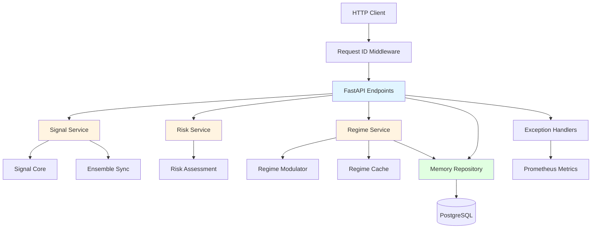

## Signal Computation Flow

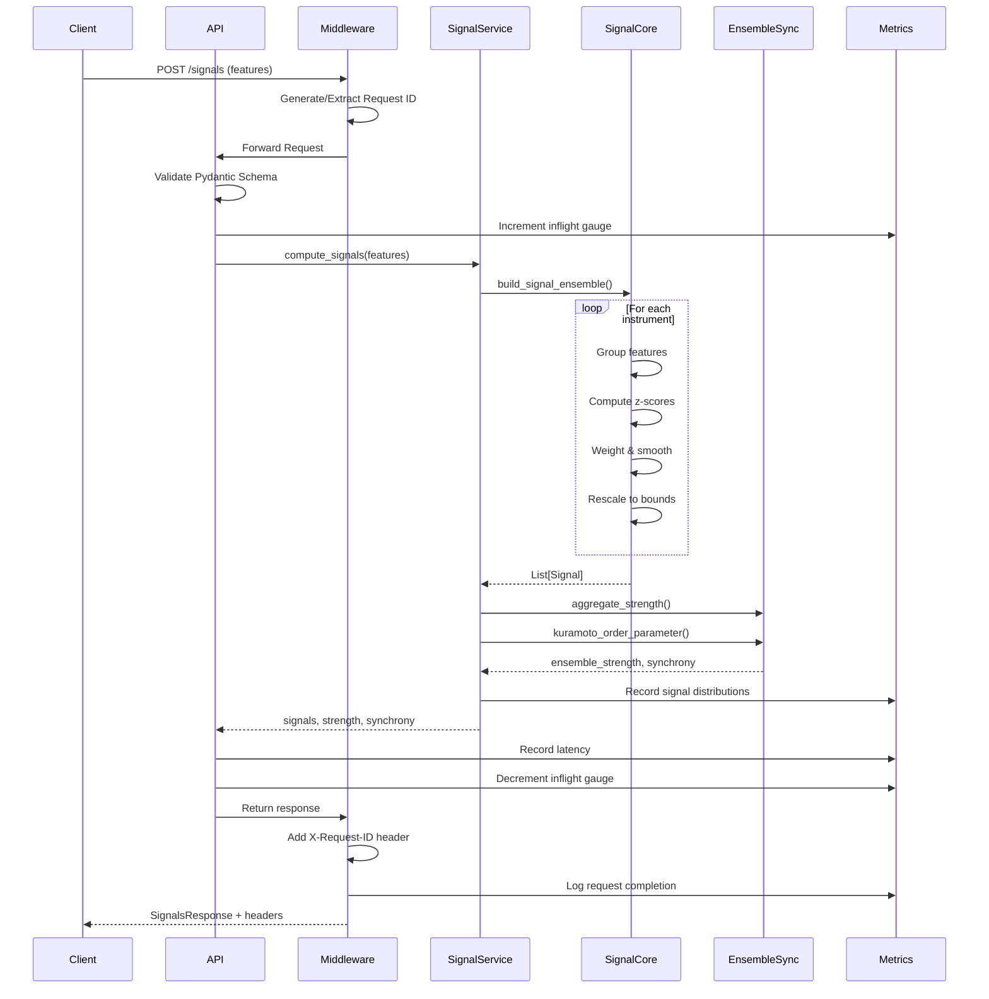

## Risk Assessment Flow

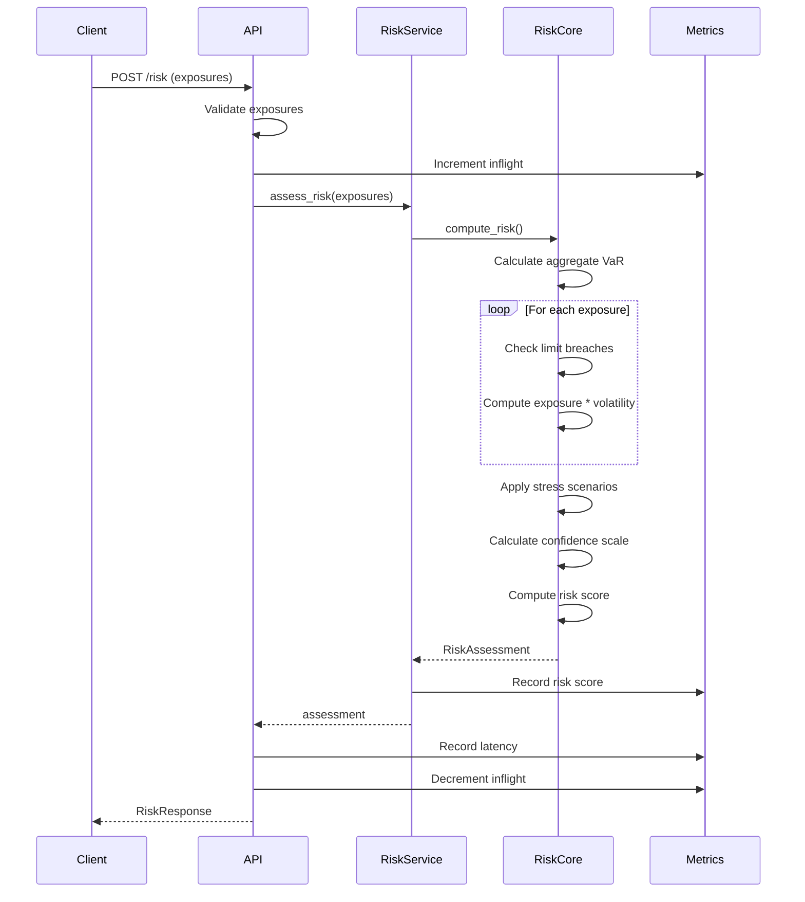

## Regime Update Flow

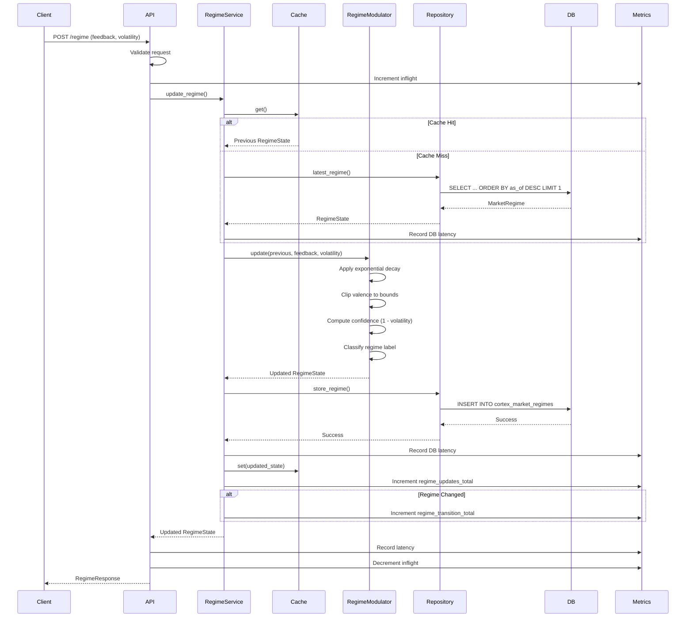

## Error Handling Flow

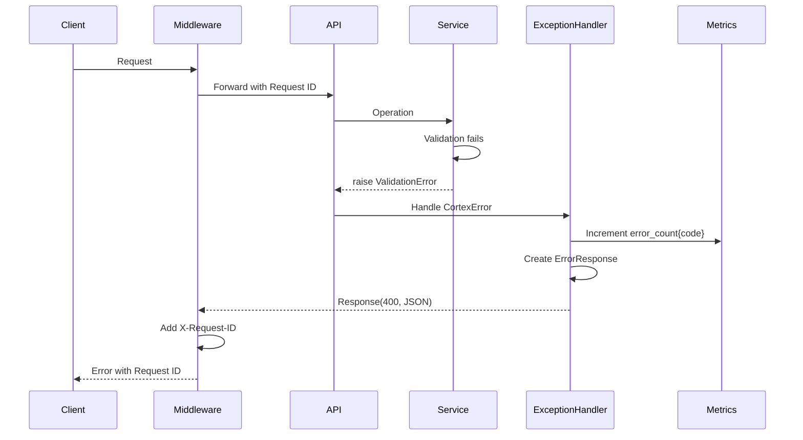

## Data Flow - Memory Operations

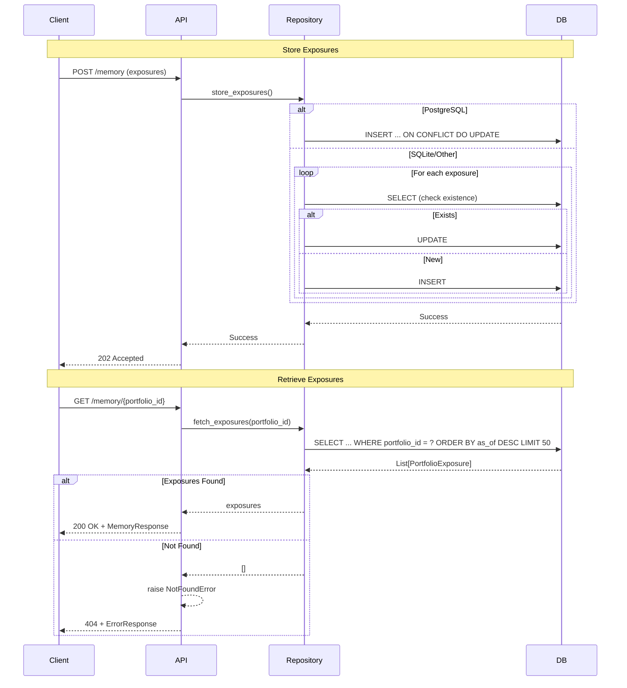

## Middleware Pipeline

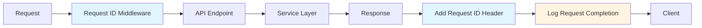

## Retry & Transaction Decorators

### Retry with Exponential Backoff

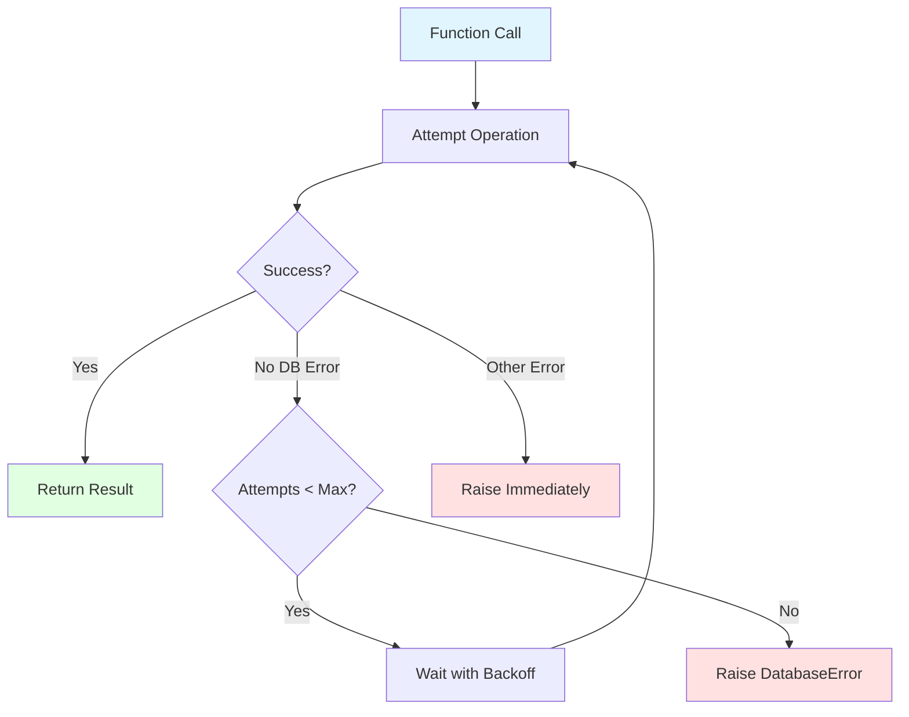

### Transactional Decorator

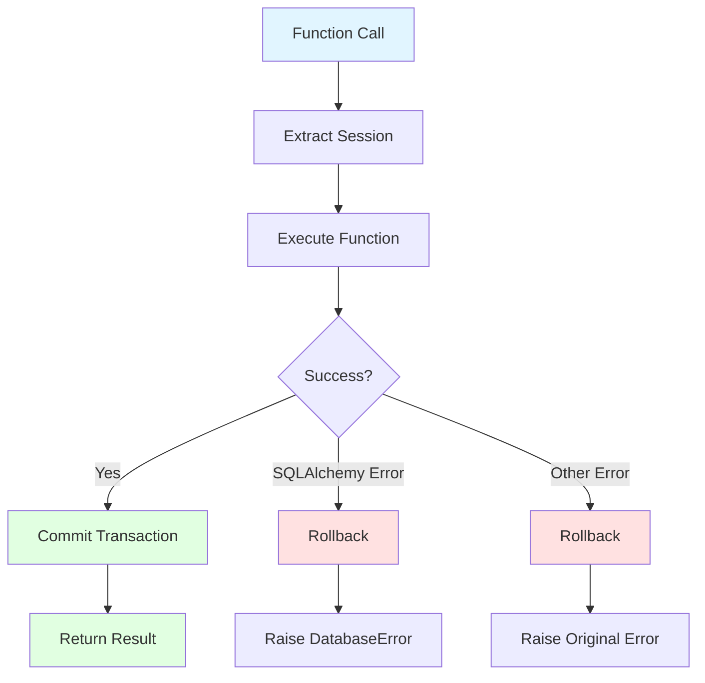

## Configuration Loading

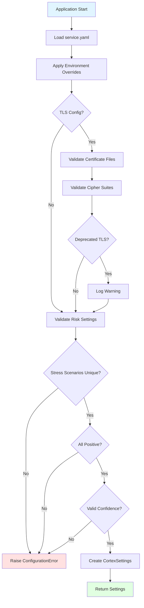

## Testing Strategy

### Test Pyramid

```
                    /\
                   /  \
                  / E2E \ (6 tests - API integration)
                 /______\
                /        \
               /Integration\ (28 tests - services + repo)
              /____________\
             /              \
            /   Unit Tests   \ (9 tests - decorators, core)
           /                  \
          /____________________\
         /                      \
        /   Property-Based Tests \ (7 tests - Hypothesis)
       /__________________________\
```

### Test Coverage by Layer

- **API Layer** (91.50%): Endpoint testing, error handlers, middleware
- **Service Layer** (92-95%): Business logic, caching, metrics
- **Domain Layer** (90-100%): Signals, risk, regime algorithms
- **Persistence Layer** (87.80%): Repository operations, bulk upsert
- **Infrastructure** (96-100%): Decorators, middleware, metrics

## Deployment Architecture

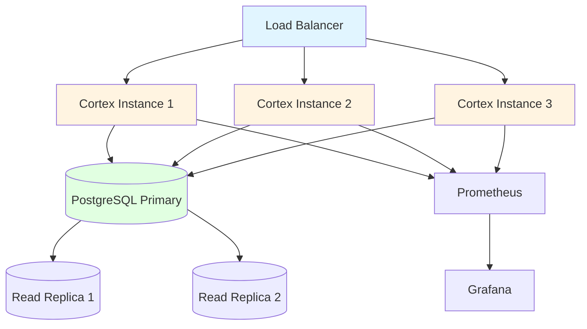

## Key Design Patterns

1. **Repository Pattern**: Abstracts data access, enables testing with in-memory DB
2. **Service Layer Pattern**: Business logic separate from HTTP concerns
3. **Decorator Pattern**: Cross-cutting concerns (retry, transactions) as decorators
4. **Middleware Pattern**: Request ID propagation and logging
5. **Frozen Dataclasses**: Immutable domain models prevent bugs
6. **Global Exception Handlers**: Unified error responses
7. **TTL Caching**: Performance optimization for frequently accessed data
8. **Metrics at Boundaries**: Observability without business logic pollution

## Performance Considerations

- **Signal Computation**: O(n) complexity where n = number of features
- **Risk Assessment**: O(m) where m = number of exposures
- **Regime Caching**: 5-second TTL reduces DB load for high-frequency updates
- **Bulk Upsert**: PostgreSQL-specific optimization with ON CONFLICT
- **Connection Pooling**: Configurable pool size for database connections
- **Retry with Backoff**: Exponential backoff prevents thundering herd

## Security Measures

1. **Input Validation**: Pydantic models with length limits
2. **TLS Configuration Validation**: Cipher suite checks, deprecation warnings
3. **SQL Injection Prevention**: SQLAlchemy ORM, parameterized queries
4. **Error Information Leakage**: Generic error messages, detailed logs server-side
5. **Request ID Tracking**: Enables security audit trails
6. **Rate Limiting Ready**: Middleware placeholder for future rate limiting

## Observability

- **Structured Logging**: JSON format with request IDs
- **Prometheus Metrics**: 9 metric families covering all operations
- **Request Tracing**: X-Request-ID propagates through entire request lifecycle
- **Health Checks**: Separate /health and /ready endpoints
- **Error Tracking**: Errors counted by code for alert rules

## Future Enhancements

1. **OpenTelemetry**: Distributed tracing integration
2. **Rate Limiting**: Token bucket or sliding window implementation
3. **Caching Layer**: Redis for distributed caching
4. **Event Sourcing**: Store regime transitions as events
5. **GraphQL API**: Alternative to REST for complex queries
6. **WebSocket Support**: Real-time signal streaming
