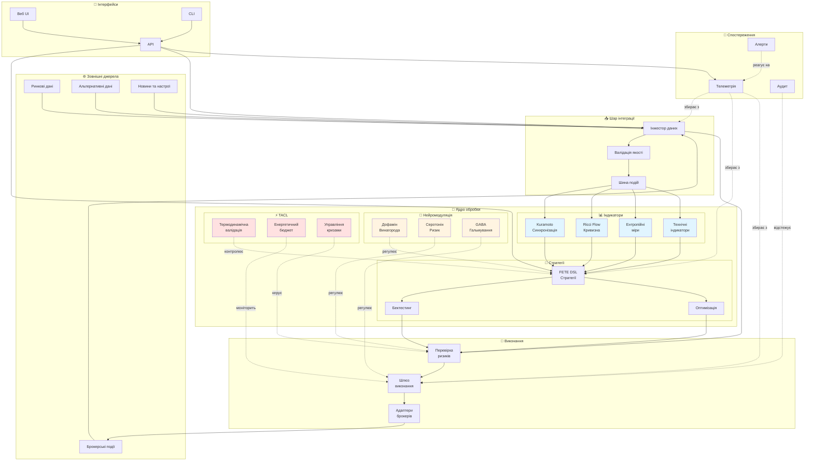
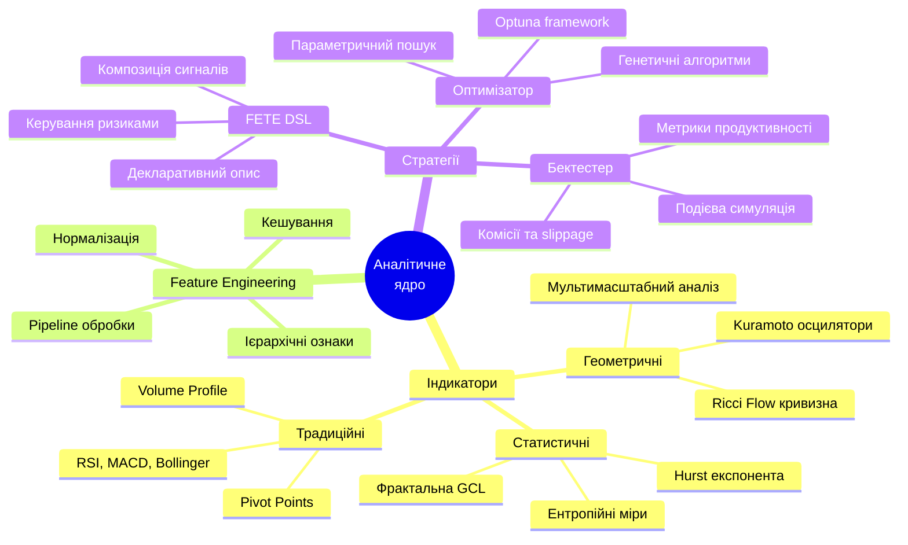
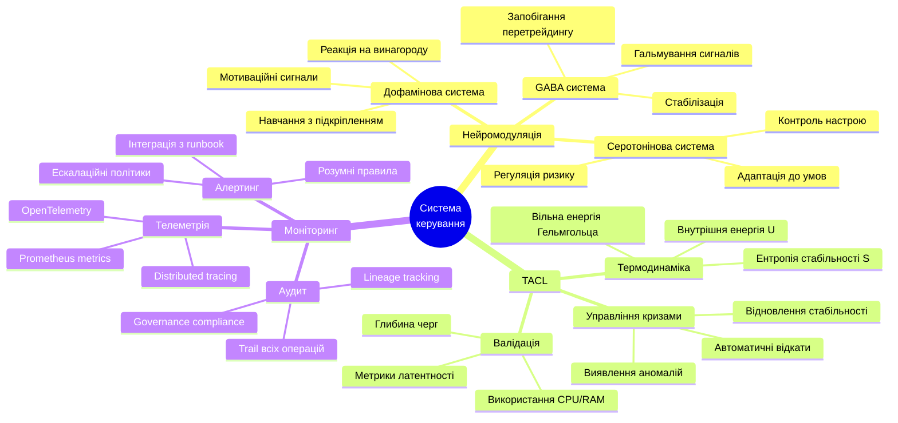
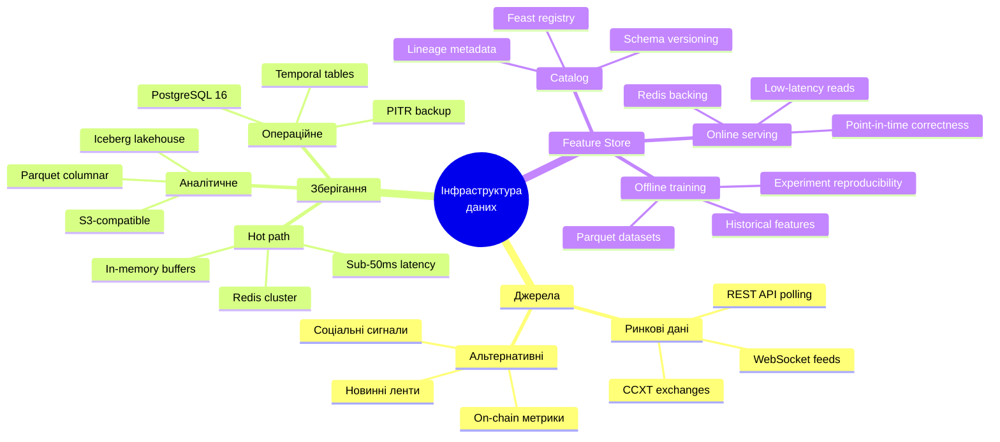
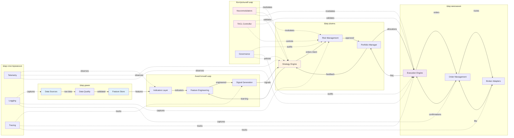
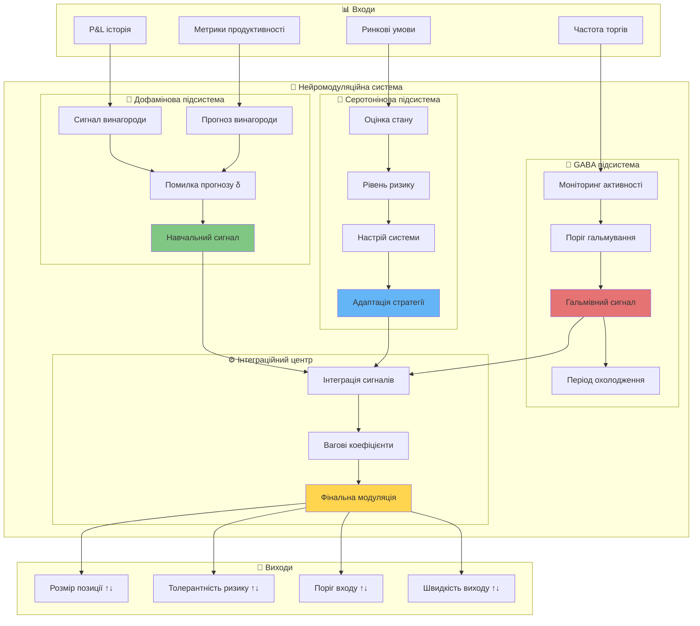
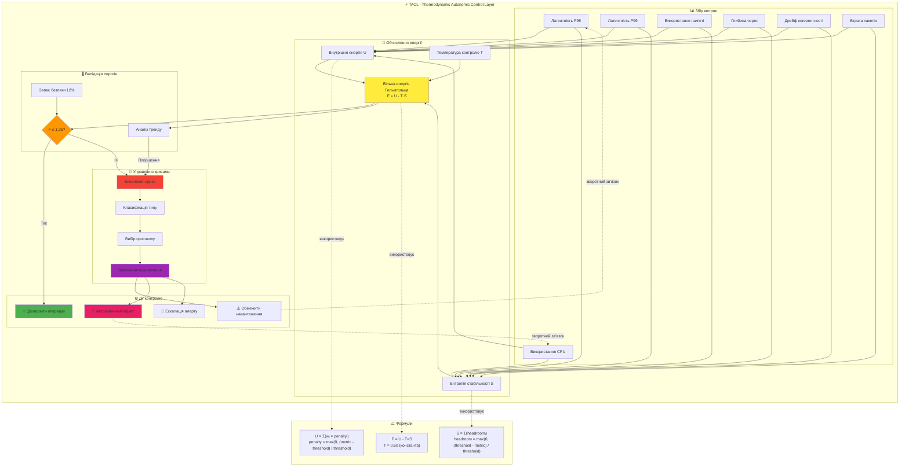
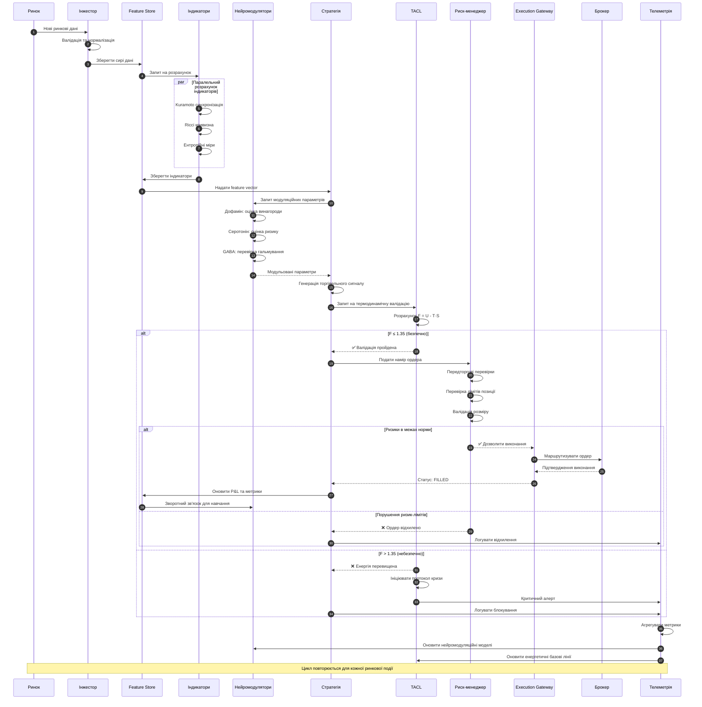

# Концептуальна архітектура TradePulse

## Огляд

Цей документ візуалізує концептуальні елементи системи TradePulse та їхні взаємозв'язки. Документація розроблена для розуміння архітектури на високому рівні абстракції.

## Зміст

- [Концептуальна карта системи](#концептуальна-карта-системи)
- [Основні концептуальні елементи](#основні-концептуальні-елементи)
- [Взаємозв'язки модулів](#взаємозвязки-модулів)
- [Потоки даних та сигналів](#потоки-даних-та-сигналів)
- [Нейромодуляційний контроль](#нейромодуляційний-контроль)
- [Термодинамічний контроль (TACL)](#термодинамічний-контроль-tacl)
- [Життєвий цикл торгівельного сигналу](#життєвий-цикл-торгівельного-сигналу)

---

## Концептуальна карта системи

Ця діаграма показує високорівневу концептуальну архітектуру TradePulse з усіма ключовими елементами:

---

## Основні концептуальні елементи

### 1. Аналітичне ядро

Компоненти, відповідальні за аналіз ринкових даних та генерацію торгівельних сигналів:

### 2. Система керування

Контрольні механізми для забезпечення стабільності та безпеки:

### 3. Інфраструктура даних

---

## Взаємозв'язки модулів

Ця діаграма демонструє детальні взаємозв'язки між основними модулями системи:

---

## Потоки даних та сигналів

Детальний життєвий цикл даних від отримання до виконання:

```mermaid
flowchart TB
    START([Початок: Ринкова подія])
    
    subgraph "Фаза 1: Прийом"
        RECV[Отримання сирих даних]
        NORM[Нормалізація формату]
        VALID[Валідація схеми]
        STAMP[Часові мітки]
    end

    subgraph "Фаза 2: Збагачення"
        FEAT_EXT[Витяг базових ознак]
        CALC_IND[Розрахунок індикаторів]
        HIER_FEAT[Ієрархічні ознаки]
        CACHE[Кешування]
    end

    subgraph "Фаза 3: Генерація сигналів"
        KURA_SIG[Kuramoto сигнал]
        RICCI_SIG[Ricci сигнал]
        ENTR_SIG[Ентропійний сигнал]
        COMPOSITE[Композитний сигнал]
    end

    subgraph "Фаза 4: Нейромодуляція"
        DOP_MOD[Дофамінова модуляція]
        SER_MOD[Серотонінова модуляція]
        GABA_MOD[GABA модуляція]
        ADJUST[Адаптація параметрів]
    end

    subgraph "Фаза 5: Стратегічні рішення"
        EVAL_STRAT[Оцінка стратегії]
        SIZE_POS[Розрахунок розміру]
        RISK_CHECK[Перевірка ризиків]
        ORDER_GEN[Генерація ордера]
    end

    subgraph "Фаза 6: Термодинамічний контроль"
        THERMO_VAL[Валідація енергії]
        CRISIS_CHECK{Криза?}
        CIRCUIT{Автомат<br/>захисту}
        PROCEED[Дозволити виконання]
        BLOCK[Заблокувати]
    end

    subgraph "Фаза 7: Виконання"
        PRE_TRADE[Передторгові перевірки]
        ROUTE[Маршрутизація]
        SUBMIT[Подання до брокера]
        CONFIRM[Підтвердження]
    end

    subgraph "Фаза 8: Зворотний зв'язок"
        RECORD[Запис результатів]
        UPDATE_PNL[Оновлення P&L]
        LEARN[Навчання моделі]
        TELEM_LOG[Телеметрія]
    end

    START --> RECV
    RECV --> NORM
    NORM --> VALID
    VALID --> STAMP

    STAMP --> FEAT_EXT
    FEAT_EXT --> CALC_IND
    CALC_IND --> HIER_FEAT
    HIER_FEAT --> CACHE

    CACHE --> KURA_SIG
    CACHE --> RICCI_SIG
    CACHE --> ENTR_SIG
    KURA_SIG --> COMPOSITE
    RICCI_SIG --> COMPOSITE
    ENTR_SIG --> COMPOSITE

    COMPOSITE --> DOP_MOD
    COMPOSITE --> SER_MOD
    COMPOSITE --> GABA_MOD
    DOP_MOD --> ADJUST
    SER_MOD --> ADJUST
    GABA_MOD --> ADJUST

    ADJUST --> EVAL_STRAT
    EVAL_STRAT --> SIZE_POS
    SIZE_POS --> RISK_CHECK
    RISK_CHECK --> ORDER_GEN

    ORDER_GEN --> THERMO_VAL
    THERMO_VAL --> CRISIS_CHECK
    CRISIS_CHECK -->|Так| BLOCK
    CRISIS_CHECK -->|Ні| CIRCUIT
    CIRCUIT -->|OK| PROCEED
    CIRCUIT -->|Порушення| BLOCK
    BLOCK --> TELEM_LOG

    PROCEED --> PRE_TRADE
    PRE_TRADE --> ROUTE
    ROUTE --> SUBMIT
    SUBMIT --> CONFIRM

    CONFIRM --> RECORD
    RECORD --> UPDATE_PNL
    UPDATE_PNL --> LEARN
    LEARN --> TELEM_LOG

    TELEM_LOG --> END([Кінець циклу])

    style RECV fill:#bbdefb
    style CALC_IND fill:#c5e1a5
    style COMPOSITE fill:#fff9c4
    style ADJUST fill:#ffccbc
    style ORDER_GEN fill:#f8bbd0
    style THERMO_VAL fill:#ffcdd2
    style BLOCK fill:#ef9a9a
    style PROCEED fill:#a5d6a7
    style CONFIRM fill:#ce93d8
    style LEARN fill:#90caf9
```

---

## Нейромодуляційний контроль

Детальна візуалізація нейромодуляційної системи:

---

## Термодинамічний контроль (TACL)

Візуалізація термодинамічного шару автономного контролю:

### Таблиця метрик TACL

| Метрика | Опис | Поріг | Вага |
|---------|------|-------|------|
| `latency_p95` | 95-й перцентиль латентності (мс) | 85.0 | 1.6 |
| `latency_p99` | 99-й перцентиль латентності (мс) | 120.0 | 1.9 |
| `coherency_drift` | Дрейф спільного стану | 0.08 | 1.2 |
| `cpu_burn` | Коефіцієнт використання CPU | 0.75 | 0.9 |
| `mem_cost` | Footprint пам'яті (GiB) | 6.5 | 0.8 |
| `queue_depth` | Довжина черги | 32.0 | 0.7 |
| `packet_loss` | Коефіцієнт втрати пакетів | 0.005 | 1.4 |

---

## Життєвий цикл торгівельного сигналу

Послідовна діаграма повного циклу від генерації сигналу до виконання:

---

## Додаткові ресурси

### Пов'язана документація

- [Основна архітектурна схема](ARCHITECTURE.md)
- [Системний огляд](architecture/system_overview.md)
- [Документація TACL](TACL.md)
- [Керівництво з нейромодуляторів](docs/neuromodulators/)
- [Специфікація індикаторів](core/indicators/README.md)
- [DSL стратегій FETE](core/strategies/README.md)

### Діаграми та активи

Усі діаграми Mermaid можна знайти в:
- `docs/architecture/assets/` - архітектурні діаграми
- `docs/security/assets/` - діаграми безпеки

### Інструменти візуалізації

Для рендерингу діаграм використовуються:
- MkDocs з плагіном `mermaid2`
- GitHub автоматично рендерить Mermaid в Markdown
- Puppeteer для експорту в SVG (див. `docs/architecture/assets/puppeteer-config.json`)

---

## Версіонування

- **Версія документа**: 1.0.0
- **Дата створення**: 2025-11-17
- **Автор**: TradePulse Architecture Team
- **Статус**: Затверджено

## Журнал змін

| Дата | Версія | Опис |
|------|--------|------|
| 2025-11-17 | 1.0.0 | Початкова версія концептуальної архітектури |
