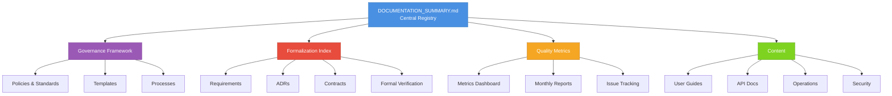
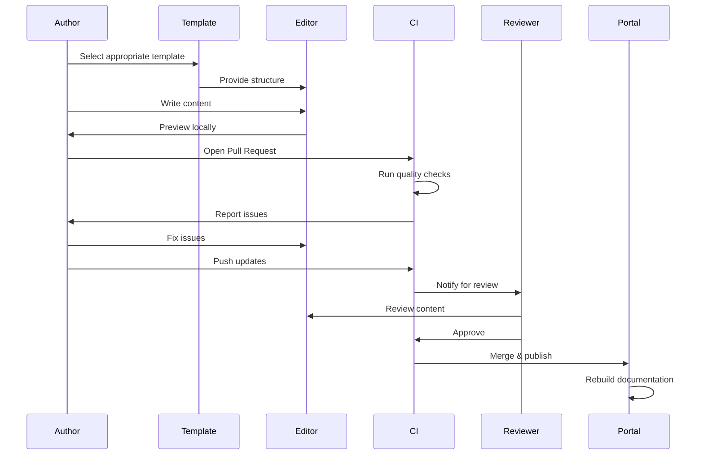
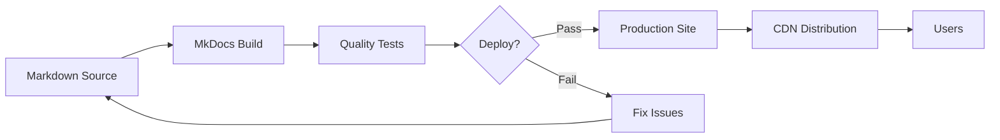

# TradePulse Documentation Architecture

**Purpose:** This document describes the architecture, organization, and design decisions behind TradePulse's documentation system. It explains how different documentation components work together to support engineering excellence, regulatory compliance, and operational reliability.

**Audience:** Documentation authors, technical writers, architects, and anyone contributing to or maintaining TradePulse documentation.

---

## Table of Contents

- [Overview](#overview)
- [Architecture Principles](#architecture-principles)
- [Documentation Topology](#documentation-topology)
- [Information Architecture](#information-architecture)
- [Documentation Flow](#documentation-flow)
- [Quality Assurance Pipeline](#quality-assurance-pipeline)
- [Toolchain and Technology](#toolchain-and-technology)
- [Decision Rationale](#decision-rationale)
- [Patterns and Anti-Patterns](#patterns-and-anti-patterns)

---

## Overview

TradePulse documentation architecture follows a **hub-and-spoke model** with formalized governance:



### Key Characteristics

- **Centralized Registry:** Single source of truth for documentation inventory
- **Distributed Ownership:** Domain owners responsible for their areas
- **Automated Quality:** CI/CD pipeline enforces standards
- **Formalized Decision-Making:** ADRs capture architectural rationale
- **Metrics-Driven Improvement:** Data guides prioritization

---

## Architecture Principles

### 1. Separation of Concerns

**Principle:** Different documentation types serve different purposes and should be organized accordingly.

**Application:**
```
docs/
├── governance/          # HOW we document (process)
├── requirements/        # WHAT we build (specifications)
├── adr/                # WHY we build it this way (decisions)
├── contracts/          # HOW components interact (interfaces)
├── guides/             # HOW to use it (tutorials)
└── operations/         # HOW to run it (runbooks)
```

**Rationale:**
- Readers can find information quickly based on their needs
- Different update cadences (ADRs stable, guides evolving)
- Different quality bars (contracts formal, guides pragmatic)
- Different reviewers (architects for ADRs, SREs for runbooks)

### 2. Single Source of Truth (SSoT)

**Principle:** Each piece of information should exist in exactly one canonical location.

**Application:**
- Canonical documents in `docs/` with stable URLs
- Other documents link to canonical source
- DRY principle: Don't Repeat Yourself - link instead

**Example:**
```markdown
<!-- WRONG: Duplicate content -->
## Authentication
API uses JWT tokens with 1-hour expiration...

<!-- RIGHT: Link to canonical source -->
## Authentication
See [Security Framework](docs/security/authentication.md) for authentication details.
```

**Rationale:**
- Updates only needed in one place
- Eliminates conflicting information
- Reduces maintenance burden
- Improves trustworthiness

### 3. Progressive Disclosure

**Principle:** Present information in layers, from high-level to detailed, allowing readers to drill down as needed.

**Application:**
```
README.md (Overview)
  ↓
docs/quickstart.md (Getting Started)
  ↓
docs/guides/advanced.md (Deep Dive)
  ↓
docs/api/reference.md (Complete Reference)
```

**Rationale:**
- New users aren't overwhelmed
- Experienced users find details quickly
- Different expertise levels served
- Reduces cognitive load

### 4. Documentation as Code

**Principle:** Treat documentation with the same rigor as code: version control, review, testing, CI/CD.

**Application:**
- Markdown in Git with versioning
- Pull request review for changes
- Automated testing (link checks, snippet validation)
- CI/CD quality gates

**Benefits:**
- History and blame tracking
- Collaborative editing
- Automated quality assurance
- Reproducible builds

### 5. Executable Documentation

**Principle:** Documentation that can be validated is more trustworthy than documentation that can't.

**Application:**
- CLI commands with `<!-- verify:cli -->` markers
- Python examples with automated testing
- Jupyter notebooks validated with Papermill
- API examples with contract tests

**Example:**
```bash
<!-- verify:cli -->
# Generate sample data
python -m interfaces.cli generate --output data/sample.csv --bars 100

# Expected output: "Generated 100 bars"
```

**Rationale:**
- Catches documentation drift early
- Builds reader confidence
- Serves as integration tests
- Examples always work

---

## Documentation Topology

### Three-Tier Architecture

TradePulse documentation follows a three-tier model:

#### Tier 1: Canonical References (Authoritative)
**Purpose:** Single source of truth for specifications and decisions

**Characteristics:**
- Stable URLs (no renames without redirects)
- Formal review process
- Version history in document
- High bar for accuracy

**Examples:**
- Architecture Decision Records (ADRs)
- API contracts and specifications
- Requirements specifications
- Security policies

**Update Frequency:** Quarterly or on significant changes

#### Tier 2: Guides & Playbooks (Instructional)
**Purpose:** Task-oriented documentation for accomplishing goals

**Characteristics:**
- Step-by-step instructions
- Verification sections
- Executable examples
- Practical focus

**Examples:**
- Quickstart guides
- Deployment guides
- Incident response playbooks
- Operational runbooks

**Update Frequency:** Monthly or as procedures change

#### Tier 3: Knowledge Base (Supplementary)
**Purpose:** Supporting information and context

**Characteristics:**
- FAQ entries
- Troubleshooting tips
- Design notes
- Experiment results

**Examples:**
- FAQ.md
- Troubleshooting guides
- Performance benchmarks
- Design explorations

**Update Frequency:** Ad-hoc as questions arise

### Document Hierarchy

```
Repository Root
│
├── DOCUMENTATION_SUMMARY.md     [Hub - Central Registry]
├── README.md                    [Entry - Project Overview]
├── CONTRIBUTING.md              [Process - Contribution Guide]
│
└── docs/
    │
    ├── Governance Layer         [Meta - How we document]
    │   ├── documentation_governance.md
    │   ├── documentation_standardisation_playbook.md
    │   ├── documentation_quality_metrics.md
    │   └── DOCUMENTATION_ARCHITECTURE.md (this file)
    │
    ├── Formalization Layer      [What & Why - Specifications]
    │   ├── FORMALIZATION_INDEX.md
    │   ├── requirements/
    │   ├── adr/
    │   ├── contracts/
    │   └── formal/
    │
    ├── Knowledge Layer          [How - Instructions]
    │   ├── guides/
    │   ├── api/
    │   ├── examples/
    │   └── tutorials/
    │
    └── Operations Layer         [Run - Operations]
        ├── runbooks/
        ├── playbooks/
        ├── monitoring/
        └── security/
```

---

## Information Architecture

### Navigation Strategy

**Primary Navigation Paths:**

1. **New User Journey:**
   ```
   README.md → SETUP.md → docs/quickstart.md → docs/guides/
   ```

2. **Developer Journey:**
   ```
   CONTRIBUTING.md → docs/architecture/ → docs/adr/ → docs/api/
   ```

3. **Operator Journey:**
   ```
   DEPLOYMENT.md → docs/runbooks/ → docs/monitoring/ → docs/playbooks/
   ```

4. **Architect Journey:**
   ```
   docs/ARCHITECTURE.md → docs/FORMALIZATION_INDEX.md → docs/adr/
   ```

### Cross-Linking Strategy

**Bidirectional Links:**
- Requirements ↔ ADRs
- ADRs ↔ Implementation
- Guides ↔ API Reference
- Playbooks ↔ Runbooks

**Link Validation:**
- Automated link checking in CI
- Broken links block merges
- Orphaned documents reported

### Search and Discoverability

**Strategies:**
1. **Metadata Tags:** YAML front matter with keywords
2. **Full-Text Search:** MkDocs Material search
3. **Index Pages:** Curated entry points per domain
4. **Table of Contents:** Hierarchical navigation
5. **Breadcrumbs:** Context awareness in navigation

---

## Documentation Flow

### Authoring Workflow



### Review Workflow

**Review Levels:**

1. **Automated Review (CI):**
   - Link validation
   - Markdown linting
   - Snippet execution
   - Front matter validation
   - Cross-reference checking

2. **Peer Review:**
   - Technical accuracy
   - Clarity and completeness
   - Example correctness
   - Adherence to templates

3. **Domain Owner Review:**
   - Architectural alignment
   - Policy compliance
   - Impact assessment
   - Long-term maintenance

### Publishing Workflow



---

## Quality Assurance Pipeline

### Quality Gates

#### Gate 1: Pre-Commit (Local)
**Checks:**
- Markdown linting (markdownlint)
- Basic syntax validation
- Pre-commit hooks

**Enforcement:** Advisory (can be bypassed)

#### Gate 2: Pull Request (CI)
**Checks:**
- Link validation (internal + external)
- Snippet execution tests
- Front matter schema validation
- Cross-reference consistency
- Template compliance

**Enforcement:** Mandatory (blocks merge)

#### Gate 3: Post-Merge (Scheduled)
**Checks:**
- Freshness monitoring
- Orphaned document detection
- Screenshot drift detection
- Accessibility validation

**Enforcement:** Creates issues for remediation

### Metrics Collection

**Real-Time Metrics:**
- Link health (broken/redirected)
- Build success rate
- Review lead time

**Scheduled Metrics:**
- Metadata coverage
- Review freshness
- Snippet pass rate
- Documentation debt age

**Reporting:**
- Dashboard in Grafana
- Monthly snapshots in `reports/docs/monthly/`
- Alerts to #docs-ops Slack channel

---

## Toolchain and Technology

### Core Technologies

| Tool | Purpose | Rationale |
|------|---------|-----------|
| **Markdown** | Content format | Universal, Git-friendly, tooling-rich |
| **MkDocs Material** | Static site generator | Beautiful, fast, feature-rich |
| **YAML Front Matter** | Metadata | Structured, parseable, extensible |
| **Mermaid** | Diagrams | Text-based, version-controlled, renderable |
| **markdownlint** | Linting | Consistent formatting, automated |
| **Papermill** | Notebook testing | Reproducible notebook validation |
| **pytest** | Testing | Standard Python testing framework |

### Decision Rationale

**Why Markdown over AsciiDoc/reStructuredText?**
- **Wider adoption:** More contributors familiar
- **Better tooling:** GitHub, IDEs, converters
- **Simpler syntax:** Lower learning curve
- **Extensibility:** CommonMark + extensions

**Why MkDocs over Sphinx/Docusaurus?**
- **Python ecosystem fit:** TradePulse is Python-heavy
- **Material theme:** Professional, accessible design
- **Fast builds:** Sub-second incremental rebuilds
- **Plugin ecosystem:** Search, versioning, PDF export

**Why Static Site over CMS?**
- **Version control:** Git history for all changes
- **No database:** Simpler deployment, better performance
- **Offline access:** Docs work without network
- **Disaster recovery:** Easy to rebuild from source

### Toolchain Integration

```
┌─────────────────┐
│  Author writes  │
│   Markdown      │
└────────┬────────┘
         │
         ▼
┌─────────────────┐
│  Pre-commit     │
│   validates     │
└────────┬────────┘
         │
         ▼
┌─────────────────┐
│   CI/CD runs    │
│  quality gates  │
└────────┬────────┘
         │
         ▼
┌─────────────────┐
│ MkDocs builds   │
│  static site    │
└────────┬────────┘
         │
         ▼
┌─────────────────┐
│  Deploy to CDN  │
│   (Cloudflare)  │
└─────────────────┘
```

---

## Decision Rationale

### Why Centralized DOCUMENTATION_SUMMARY.md?

**Problem:** Multiple governance documents reference documentation status, but no single source exists.

**Alternatives Considered:**
1. **Distributed status** in each document (rejected: hard to aggregate)
2. **Database/tool** like Confluence (rejected: adds complexity, not Git-versioned)
3. **Auto-generated index** (rejected: loses curated insights)

**Decision:** Create centralized `DOCUMENTATION_SUMMARY.md` as hub

**Rationale:**
- Single place to check documentation health
- Git-versioned, auditable history
- Human-curated with automation support
- Links to all governance documents

### Why Three-Tier Taxonomy?

**Problem:** Flat structure makes it hard to determine document importance and update cadence.

**Alternatives Considered:**
1. **Flat structure** (rejected: no prioritization guidance)
2. **Five-tier structure** (rejected: over-complicated)
3. **Tag-based** (rejected: ambiguous, hard to enforce)

**Decision:** Three tiers (Canonical, Guides, Knowledge Base)

**Rationale:**
- Clear priority levels
- Different review cadences justified
- Scalable as documentation grows
- Easy to explain and remember

### Why YAML Front Matter?

**Problem:** Need structured metadata for automation without disrupting readability.

**Alternatives Considered:**
1. **Markdown headers** (rejected: not machine-parseable)
2. **Separate metadata files** (rejected: divergence risk)
3. **JSON/TOML** (rejected: less Markdown-native)

**Decision:** YAML front matter at document start

**Rationale:**
- Standard in Jekyll, Hugo, MkDocs
- Human-readable and machine-parseable
- Ignored by most Markdown renderers
- Extensible for future needs

### Why Executable Documentation?

**Problem:** Documentation drifts from reality as code evolves.

**Alternatives Considered:**
1. **Manual testing** (rejected: doesn't scale, forgotten)
2. **Trust authors** (rejected: optimistic, fails in practice)
3. **Separate test suite** (rejected: documentation becomes second-class)

**Decision:** Embed verification markers, validate in CI

**Rationale:**
- Documentation drift detected automatically
- Examples serve as integration tests
- Builds reader confidence
- Forces authors to test claims

---

## Patterns and Anti-Patterns

### Documentation Patterns (Do This)

#### Pattern 1: Start with Template
**What:** Always begin from appropriate template in `docs/templates/`

**Why:**
- Ensures completeness
- Maintains consistency
- Saves authoring time
- Built-in best practices

**Example:**
```bash
cp docs/templates/adr.md docs/adr/0042-my-decision.md
# Edit placeholders
```

#### Pattern 2: Write User Stories, Not Feature Lists
**What:** Frame documentation as user journeys, not technology catalogs

**Why:**
- Task-oriented, not feature-oriented
- Readers find answers faster
- Validates documentation usefulness
- Prevents over-documentation

**Example:**
```markdown
<!-- GOOD -->
## Deploying Your First Strategy
As a quantitative researcher, you've backtested a strategy and now want to run it live...

<!-- BAD -->
## Deployment Module
The deployment module has the following classes:
- DeploymentManager
- ConfigurationLoader
- ...
```

#### Pattern 3: Show, Then Explain
**What:** Lead with examples, follow with explanation

**Why:**
- Practical first, theory second
- Readers can copy-paste immediately
- Explanation provides depth for curious
- Accommodates different learning styles

**Example:**
```markdown
## Configuring Risk Limits

```python
risk_manager = RiskManager(
    max_position_size=100_000,
    max_leverage=3.0,
    stop_loss_pct=0.02
)
```

This configuration sets a maximum position size of $100,000...
```

#### Pattern 4: Link, Don't Duplicate
**What:** Reference canonical sources instead of copying content

**Why:**
- Single source of truth
- Updates in one place
- Avoids conflicting information
- Reduces maintenance

**Example:**
```markdown
<!-- GOOD -->
For authentication details, see [Security Framework](../security/authentication.md).

<!-- BAD -->
Authentication uses JWT tokens. Tokens expire after 1 hour...
(duplicating content from security docs)
```

### Documentation Anti-Patterns (Avoid This)

#### Anti-Pattern 1: Documentation Theater
**Problem:** Documents created for compliance checkboxes, not actual use

**Symptoms:**
- No one reads it
- Always out of date
- Doesn't answer real questions
- Created at last minute before release

**Fix:**
- Write docs you'd want to read
- Test with real users
- Link from error messages
- Track usage metrics

#### Anti-Pattern 2: Ivory Tower Documentation
**Problem:** Written by architects for architects, ignoring actual users

**Symptoms:**
- Assumes expert knowledge
- No examples or quickstarts
- Focuses on architecture, not tasks
- Academic tone, not practical

**Fix:**
- Know your audience
- Start with quickstart
- Include copy-paste examples
- Get user feedback

#### Anti-Pattern 3: Orphaned Documents
**Problem:** Documentation not linked from anywhere, impossible to discover

**Symptoms:**
- No incoming links
- Not in navigation
- Not in search results
- File exists but unreachable

**Fix:**
- Add to MkDocs navigation
- Link from related documents
- Include in index pages
- Automated orphan detection

#### Anti-Pattern 4: Stale Documentation
**Problem:** Documentation describes old behavior, misleading readers

**Symptoms:**
- Examples don't work
- Screenshots show old UI
- Links broken
- Refers to removed features

**Fix:**
- Review cadence enforcement
- Automated snippet testing
- Link checking in CI
- Deprecation process

#### Anti-Pattern 5: Kitchen Sink Documentation
**Problem:** Every possible detail included, overwhelming readers

**Symptoms:**
- Extremely long documents
- No clear structure
- Mixes audiences (beginners + experts)
- Hard to find specific information

**Fix:**
- Progressive disclosure
- Separate guides by audience
- Link to deep-dives
- Summary sections

---

## Continuous Evolution

This architecture is not static. It evolves based on:

- **User Feedback:** What's working, what's not
- **Metrics:** Data-driven improvements
- **Technology:** New tooling and capabilities
- **Scale:** As TradePulse grows

**Review Schedule:** Quarterly architectural reviews with Documentation Steward and stakeholders.

**Change Process:**
1. Propose change with rationale
2. Validate with metrics/feedback
3. Update this document (ADR if major)
4. Communicate to contributors
5. Implement incrementally

---

## References

- [DOCUMENTATION_SUMMARY.md](../DOCUMENTATION_SUMMARY.md) - Central registry
- [Documentation Governance](documentation_governance.md) - Governance framework
- [Standardisation Playbook](documentation_standardisation_playbook.md) - Standards
- [Quality Metrics](documentation_quality_metrics.md) - Metrics handbook
- [FORMALIZATION_INDEX.md](FORMALIZATION_INDEX.md) - Formalization guide

---

**Last Updated:** 2025-12-08  
**Next Review:** 2026-03-08  
**Status:** 🟢 Active

*This document describes the "how and why" of TradePulse documentation architecture. For the "what" (inventory), see [DOCUMENTATION_SUMMARY.md](../DOCUMENTATION_SUMMARY.md).*
