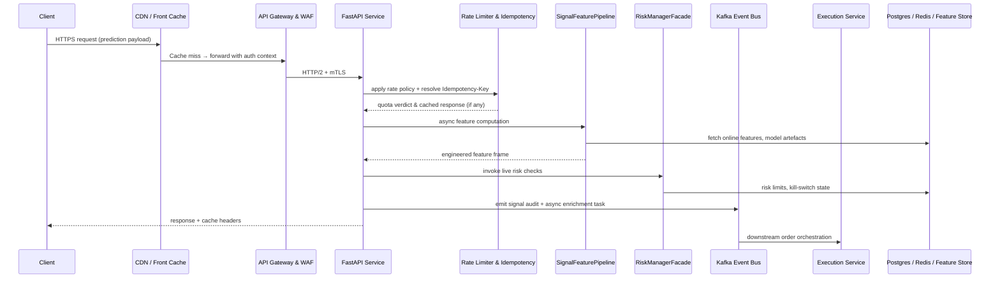

# TradePulse Serving Resilience Blueprint

## Executive Summary

The TradePulse online serving stack must deliver deterministic, low-latency forecasts for live trading while resisting network faults, dependency outages, or regional failures. This blueprint redefines the serving architecture around asynchronous boundaries, fault-containment zones, and observability-driven guardrails. It enumerates the critical request paths, highlights failure and saturation points, and prescribes queueing, pooling, timeout, retry, idempotency, circuit-breaking, rate limiting, and backpressure controls. The guidance aligns with the FastAPI surface defined in [`application/api/service.py`](../../application/api/service.py) and the supporting rate-limit and idempotency subsystems in [`application/api/rate_limit.py`](../../application/api/rate_limit.py) and [`application/api/idempotency.py`](../../application/api/idempotency.py).

## Current Critical Paths

### 1. HTTPS inference path

### 2. Asynchronous enrichment path

1. The API pushes non-critical work (audit trails, feature deltas) into Kafka/NATS via [`core/messaging/event_bus.py`](../../core/messaging/event_bus.py).
2. Dedicated consumer groups materialise slow/IO-heavy enrichments (e.g., Postgres writes, object storage snapshots) off the request thread.
3. Observability streamers publish metrics via `MetricsCollector` for readiness and burn-rate tracking.

## Bottlenecks & Blocking Risks

| Risk | Description | Immediate Mitigation |
| --- | --- | --- |
| Sync feature retrieval | `SignalFeaturePipeline` currently performs synchronous Pandas computations inside request scope, risking event loop stalls.【F:application/api/service.py†L143-L230】 | Move compute-heavy code behind async worker pool with bounded queues and CPU pinning.
| Shared client sessions | External calls (Postgres, Redis, HTTP) can spawn unbounded connections when re-created per request. | Centralise connection pools and reuse them via dependency injection.
| Coupled risk evaluation | Risk manager calls Postgres/SQLite stores synchronously, which can block on FS/IO.【F:application/api/service.py†L240-L314】 | Wrap in async executor with timeout + breaker; stage results via cached snapshots.
| Lack of multi-region routing | Single-region API lacks deterministic failover path. | Introduce global load balancer + active/active inference pools with state replication.
| Front cache limited | TTL cache covers only repeat payloads in-memory.【F:application/api/service.py†L58-L117】 | Expand to CDN + Redis layer with model-aware cache busting.

## Target Architecture

### Layered overview

- **Edge & Front Cache** – Global CDN (CloudFront/Fastly) terminates TLS, enforces WAF rules, and provides 5–30s cache for idempotent GETs/POSTs with JSON bodies hashed via `ETag` emitted by the FastAPI service.
- **Regional API Gateways** – Envoy/NGINX Ingress enabling mutual TLS, HTTP/2, JWT verification, and rate-limiting shadow metrics exported to Prometheus.
- **Serving Pods** – FastAPI containers (`application/api/service.py`) running with uvloop, structured logging, and OpenTelemetry instrumentation. Pods expose `/health/ready` metrics aggregated into Kubernetes readiness gates.
- **Async Worker Pool** – Dedicated deployment subscribing to `signals.enrichment` and `signals.audit` topics. Performs slow IO (Postgres writes, S3 uploads) outside request path to reduce tail latency.
- **Stateful Dependencies** – Redis (cache + rate limiting), Postgres (risk & kill-switch), Kafka (event propagation), Object storage (model bundles), Feature store (Feast/Arrow).
- **Observability Mesh** – OpenTelemetry collectors, Prometheus scrape targets, Grafana dashboards with SLO burn-rate alerts.

### Queueing & Backpressure

1. **Ingress queue:** Introduce Envoy HTTP connection limits and per-pod `max_concurrency` to cap active requests. Overflow surfaces `429` with Retry-After derived from queue depth.
2. **In-process queue:** Replace direct feature computation with `asyncio.Queue(maxsize=workers * 2)` feeding a CPU-bound thread pool. Producers await queue slots, enforcing natural backpressure.
3. **Durable queues:** Publish asynchronous work to Kafka using the existing `KafkaEventBus` with idempotent producer semantics and partition keys by symbol for ordering guarantees.【F:core/messaging/event_bus.py†L148-L271】 Dead-letter topics capture poison messages; consumers apply exponential backoff with jitter.
4. **Backpressure signals:** Emit `queue_depth`, `request_latency_p99`, and `kafka_consumer_lag` metrics. Kubernetes HPA scales worker deployments on combined CPU + queue depth.

### Connection Pooling Strategy

| Dependency | Client | Pool Configuration | Notes |
| --- | --- | --- | --- |
| Postgres risk store | `asyncpg.Pool` | Min 5, max 40 per pod, `statement_cache_size=0` for OLTP, TLS mandatory | Warmed during startup probes. Failover to read replicas for shadow checks.
| Redis rate limiter | `redis.asyncio.ConnectionPool` | Shared across limiter + cache, health-checked via ping | Co-locate with CDN cache invalidation events.
| Kafka | `aiokafka` | Enable idempotent producers, acks=all, linger=10ms, connections reused | MirrorMaker replicates across regions.
| External HTTP (pricing, metadata) | `httpx.AsyncClient` | Per-service client with connection pooling, retries + timeout defaults | Use circuit breaker for upstream degradation.

### Timeout & Retry Matrix

| Operation | Timeout | Retries | Strategy |
| --- | --- | --- | --- |
| Rate limiter backend | 5 ms | 0 | Fail closed with 429 to protect upstreams.
| Feature fetch | 150 ms | 1 | Retry on transient network errors with exponential backoff (25 ms base).
| Risk manager call | 120 ms | 1 | Abort request if exceeded; raise degraded health to remove pod from rotation.
| Kafka publish | 50 ms | 3 | Retry with idempotent producer; route to dead-letter after final failure.
| Post-response enrichment | 500 ms | 5 | Performed asynchronously; use jittered backoff and DLQ fallback.

Timeout values must be injected through `ApiSettings` to maintain config-driven behaviour.

### Idempotency Enhancements

- Retain in-memory cache for sub-second replay detection (`IdempotencyCache`).【F:application/api/idempotency.py†L10-L92】
- Add Redis-backed ledger for cross-pod deduplication (aligning TTL to 15 minutes). Wrap via adapter implementing the existing cache protocol.
- Normalise payload fingerprinting and propagate `Idempotency-Key` through downstream Kafka headers for traceability.
- Reject mismatched replays with deterministic `409` to satisfy compliance logging.

### Circuit Breakers

- Embed `aiobreaker` or custom half-open breaker around Postgres, Redis, and Kafka interactions. Configure thresholds:
  - Trip after 5 consecutive failures within 10 seconds.
  - Half-open after 30 seconds with single probe.
- Surface breaker state via readiness endpoint (`/health/ready`) and metrics exported through `MetricsCollector` to prevent thundering herds.【F:application/api/service.py†L328-L420】

### Rate Limiting & Quotas

- Continue leveraging `SlidingWindowRateLimiter` with Redis backend for multi-instance scaling.【F:application/api/rate_limit.py†L17-L108】
- Introduce **token-bucket global rate** at API gateway for burst absorption (e.g., 1k RPS per org with 10k burst).
- Add **adaptive rate limiting** per venue (market) by ingesting `signals.capacity.*` metrics. When downstream venues throttle, propagate reduced quotas to limiters dynamically.
- Publish limiter saturation metrics to Prometheus and include in readiness gating to shed load early.

### Backpressure Propagation

- Return `429` with `Retry-After` derived from queue depth and Kafka lag when thresholds exceed SLOs.
- Register `QueueDepthExceeded` custom metric events to trigger automated scaling runbooks.
- Ensure asynchronous workers checkpoint offsets after successful writes to avoid replay storms.

### Multi-Region Replication & Failover

1. **Active/Active API Regions** – Deploy identical serving stacks in at least two regions (e.g., us-east, eu-central). Use global load balancer (AWS Global Accelerator, Cloudflare) with health-aware routing.
2. **State Replication**
   - **Kafka**: MirrorMaker 2 replicating `signals.*`, `risk.*`, and `audit.*` topics with offset translation and per-region consumer groups.
   - **Postgres**: Patroni-managed clusters with synchronous replication for critical tables (risk limits, kill-switch) and async replicas for read-heavy analytics.
   - **Redis**: Use Active-Active (Redis Enterprise) or replicate via CRDT-based namespaces for rate-limit and idempotency ledgers.
3. **Failover Drills** – Monthly chaos exercise forcing traffic to secondary region, validating RTO ≤ 120s and zero data loss beyond committed offsets.
4. **Client Affinity** – Session routing via consistent hashing on account/org to maintain cache locality while supporting instant failover on breaker trips.

### Thermal Data Tiers (Cold / Warm / Hot)

| Tier | Purpose | Technology | Retention |
| --- | --- | --- | --- |
| Hot | Sub-second serving state (recent features, TTL cache, idempotency ledger) | In-memory TTL caches, Redis, CDN edge cache | 30–120 seconds |
| Warm | Nearline replay & enrichment (last trading day) | Redis Streams, Kafka compacted topics, Postgres replicas | 24 hours |
| Cold | Historical analytics & disaster recovery | Object storage (S3/GCS), Iceberg/Parquet lake, Glacier | 7 years |

Automated lifecycle policies transition data between tiers. Warm tier acts as the replay source for cache warm-up (described below).

### Cache Strategy

1. **Edge cache** – CDN caches GET/POST with deterministic bodies for up to 30s using FastAPI `ETag` values to ensure consistency.【F:application/api/service.py†L438-L487】
2. **Regional Redis cache** – Mirror TTL cache contents with sharded Redis cluster. Keys include model + feature fingerprint. Invalidation occurs on model publish events pushed via Kafka.
3. **Application TTL cache** – Maintain small LRU for ultra-low latency; continue to emit `X-Cache-Status` headers for observability.【F:application/api/service.py†L58-L117】
4. **Warm cache preloader** – On deploy, run async job that fetches top symbols/horizons from warm tier to prime caches, preventing cold-start latency spikes.

### Security & Governance Hooks

- Enforce mutual TLS and JWT validation before rate limiting to prevent resource waste.
- Record every degraded or failed response in the audit log via `AuditLogger` sink for compliance.【F:application/api/service.py†L346-L420】
- Integrate kill-switch signals from `PostgresKillSwitchStateStore` into circuit breaker logic to shed risk proactively.【F:application/api/service.py†L201-L290】

### Observability & Testing

- Expand readiness probes to include queue depth, breaker states, and replication lag.
- Adopt synthetic traffic canaries per region to continuously assert inference latency and correctness.
- Extend existing `tests/unit/messaging/test_event_bus_extended.py` scenarios with breaker + retry assertions to codify resilience guarantees.【F:tests/unit/messaging/test_event_bus_extended.py†L25-L373】
- Add load tests exercising 99.9 percentile latency budgets under failover scenarios.

## Implementation Roadmap

1. **Phase 1 – Stabilise ingress:** Deploy CDN/WAF configuration, enable Redis-backed rate limiting, and publish saturation metrics.
2. **Phase 2 – Decouple heavy work:** Introduce async worker pool with bounded queues, add CPU executor for feature computation, and wrap external calls with timeouts + retries.
3. **Phase 3 – Resilience primitives:** Implement circuit breakers, Redis idempotency ledger, and Kafka DLQs; update readiness probes.
4. **Phase 4 – Multi-region & caching:** Roll out active/active deployment, configure MirrorMaker and Patroni replication, and establish cache warm-up automation.
5. **Phase 5 – Validation:** Expand integration tests, chaos drills, and documentation updates; track KPIs (latency, error budget burn, replication lag) to confirm improvements.

## Appendix: Configuration References

- `application/settings.py` – Extend to include timeout, retry, and breaker thresholds.
- `configs/helm/tradepulse-api/values.yaml` (future) – Document CDN, queue, and scaling defaults for deployments.
- `observability/dashboards/tradepulse-overview.json` – Update panels for queue depth, breaker state, and regional SLOs.

This blueprint provides the systematic guardrails needed to harden TradePulse serving against load spikes, dependency regressions, and regional failures while preserving deterministic trading signals.
