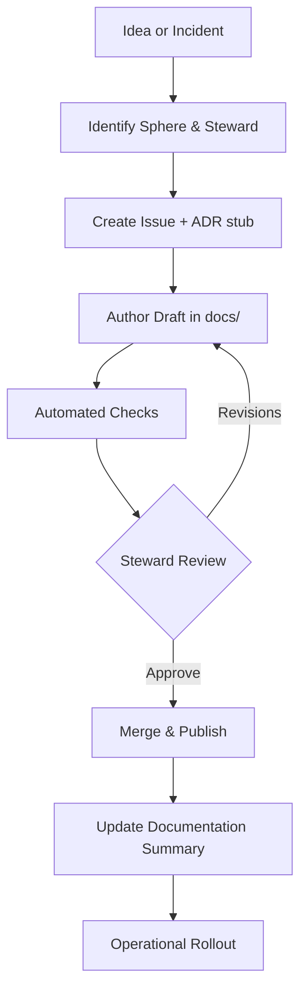

# Documentation Information Architecture

## Objective

This reference defines the canonical structure, lifecycle, and ownership model for the TradePulse documentation
portfolio. It ensures that architecture, operations, and governance narratives remain consistent with the
capability blueprint, that every page has a clear steward, and that contributors can quickly determine where
to add or update content during a release cycle.

Use this guide together with the [Documentation Standardisation Playbook](documentation_standardisation_playbook.md)
and [Documentation Governance](documentation_governance.md) to align tone, review expectations, and audit cadence.

## Information Spheres

| Sphere | Description | Representative Directories | Primary Stewards | Update Cadence |
| --- | --- | --- | --- | --- |
| **Vision & Positioning** | High-level value proposition, stakeholder messaging, strategic context. | `README.md`, `docs/index.md`, `docs/roadmap/` | Product Strategy | Quarterly narrative review. |
| **Architecture & Systems** | Structural overviews, service catalogs, diagrams, ADRs. | `docs/ARCHITECTURE.md`, `docs/architecture/`, `docs/adr/` | Architecture Review Board | Per release train or ADR approval. |
| **Operational Excellence** | Runbooks, incident playbooks, SLO policies, tooling. | `docs/operational_handbook.md`, `docs/runbook_*`, `docs/resilience.md` | Reliability Guild | Monthly readiness audit. |
| **Engineering Enablement** | Developer guides, APIs, configuration, extensibility. | `docs/extending.md`, `docs/integration-api.md`, `docs/scenarios.md` | Developer Enablement Guild | Rolling sprint cadence. |
| **Governance & Compliance** | Security, documentation controls, quality gates. | `SECURITY.md`, `docs/governance.md`, `docs/documentation_*` | Governance Committee | Bi-monthly review board. |
| **Product Experience** | UI/UX guidelines, accessibility, storytelling assets. | `docs/performance.md`, `docs/accessibility.md`, `docs/assets/` | Product Experience Guild | As releases introduce features. |

Each sphere inherits the contribution workflow defined below and maps to program increments tracked in the
[Architecture Review Program](architecture/architecture_review_program.md) and operational scorecards.

## Document Lifecycle States

| State | Entry Criteria | Quality Gates | Exit Criteria |
| --- | --- | --- | --- |
| **Draft** | Author assigned, scope aligned with roadmap item, ADR or task reference created. | Linting via `make docs-lint`, template adherence check. | Peer review scheduled with steward. |
| **Review** | Pull request open, steward acknowledged in comments, diagrams attached. | SME review, terminology validation, security/compliance sign-off if applicable. | Maintainer approval, changelog entry prepared. |
| **Published** | Merged to `main`, site regenerated, navigation updated. | MkDocs build green, links verified by `make docs-check`. | Release note entry generated, documentation summary updated. |
| **Operationalised** | Page referenced in runbooks, onboarding, or policy automation. | Quarterly validation, telemetry instrumentation if data-driven. | Remains evergreen or re-enters Draft upon scope change. |

Lifecycle transitions are recorded in [`DOCUMENTATION_SUMMARY.md`](../DOCUMENTATION_SUMMARY.md) with links to
supporting issues, ADRs, and retrospectives.

## Ownership & Stewardship

- **Sphere Stewards** curate the information architecture for their domains, set acceptance criteria, and own
  backlog prioritisation.
- **Maintainers** ensure contributions honour the [Documentation Quality Metrics](documentation_quality_metrics.md)
  and apply consistent terminology.
- **Contributors** must cross-link new sections to the relevant sphere overview and, when applicable, update
  the architecture blueprint, runbooks, or governance tables.
- **Automation** via GitHub Actions enforces linting, spell checks, and broken link detection (see
  [`docs/github_actions_automation.md`](github_actions_automation.md)).

Ownership tables should be refreshed during release retrospectives and after major organisational changes.

## Navigation & Cross-Linking Patterns

1. **Spheres → Deep Dives:** Top-level sphere pages (e.g., this document, `docs/ARCHITECTURE.md`) must link to
directory-level indices or curated lists so that readers can traverse without relying on MkDocs navigation.
2. **Deep Dives → Runbooks:** Architecture or conceptual documentation should reference the operational
   runbooks that implement the controls or procedures.
3. **Runbooks → Tooling:** Every runbook must link to the CLI/API references that perform the remediation steps.
4. **Tooling → Governance:** Command or API documentation should cite the policies that mandate their usage.
5. **Governance → Metrics:** Governance docs must reference the telemetry dashboards or quality metrics that
   validate compliance (see [Quality Gates](quality_gates.md)).

These linking rules prevent isolated pages and keep architectural intent connected with execution realities.

## Contribution Workflow Reference

Release managers should verify that documentation work items flow through the same lifecycle as code changes,
including post-incident updates captured in [`docs/incident_playbooks.md`](incident_playbooks.md).

## Versioning & Traceability

- **MkDocs + Mike** manage multi-version builds; publish commands are tracked in the release checklist.
- **Semantic Commit Messages** tagged with `docs:` prefixes facilitate audit queries.
- **SBOM Alignment** ensures documentation on dependencies mirrors the machine-readable SBOM under `sbom/`.
- **Archival Policy** requires exporting superseded documents to `docs/archive/` with deprecation notices when
  major program shifts occur.

Adhering to this information architecture keeps TradePulse documentation authoritative, traceable, and ready
for stakeholder scrutiny at any point in the delivery lifecycle.
