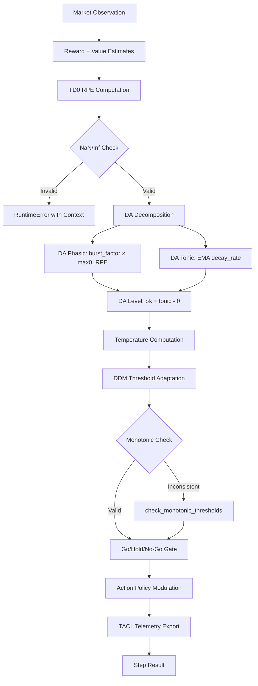

# Dopamine Neuromodulator Module

## Overview

The dopamine module implements a production-grade neuromodulatory controller for trading decisions, based on TD(0) reinforcement learning with phasic/tonic dopamine dynamics, exploration temperature, and Go/Hold/No-Go gating. Evidence: [@SuttonBarto2018RL]

**Version:** 1.0.0  
**Status:** Production  
**Coverage:** 54 tests, comprehensive invariants

## Architecture



## Core Components

### 1. DopamineController

Main controller class implementing the full dopamine modulation pipeline.

**Key Methods:**

```python
def step(
    reward: float,
    value: float,
    next_value: float,
    appetitive_state: float,
    policy_logits: Optional[Sequence[float]] = None,
    *,
    ddm_params: Optional[Tuple[float, float, float]] = None,
    discount_gamma: Optional[float] = None,
) -> Tuple[float, float, Tuple[float, ...], Mapping[str, object]]:
    """Execute one dopamine update step.
    
    Returns:
        (rpe, temperature, scaled_policy, extras)
    """
```

**Exported Extras:**
- `dopamine_level`: Overall DA signal [0, 1]
- `da_tonic`: Tonic DA component
- `da_phasic`: Phasic DA burst
- `rpe`: Reward prediction error δ
- `rpe_var`: Sliding variance of RPE
- `temperature`: Exploration temperature
- `go`, `hold`, `no_go`: Gate states (bool)
- `go_threshold`, `hold_threshold`, `no_go_threshold`: Gate thresholds
- `release_gate_open`: Variance-based release gate
- `ddm_thresholds` (optional): DDM-derived parameters

### 2. TD(0) RPE

Computes temporal difference reward prediction error:

```
δ = r + γ·V' − V
```

**Invariants:**
- γ ∈ (0, 1] (strictly positive)
- All inputs and outputs must be finite (no NaN/±Inf)
- sign(δ) matches sign(r) when V'≈V and γ=1
- δ is monotonically increasing in V'

**Error Handling:**
```python
try:
    rpe = r + gamma * next_value - value
except (OverflowError, FloatingPointError) as e:
    raise RuntimeError(f"RPE computation overflow: {e}\nContext: {context}")

if not math.isfinite(rpe):
    raise RuntimeError(f"RPE non-finite: {rpe}\nContext: {context}")
```

### 3. DA Dynamics

**Phasic DA:**
```python
DA_phasic = max(0, RPE) × burst_factor
```

**Tonic DA:**
```python
DA_tonic = (1 - decay_rate) × DA_tonic_prev + decay_rate × (appetitive + DA_phasic)
```

**DA Level (Sigmoid):**
```python
x = k × (DA_tonic - θ)
DA = clamp(sigmoid(x), 0, 1)
```

### 4. Temperature / Exploration

Temperature controls exploration vs exploitation:

```python
T = clip(T_min, T_base × exp(-k_T × DA) × DDM_scale, T_base × max_mul)
```

**Properties:**
- ↑DA ⇒ ↓T (higher dopamine → more exploitation)
- T > 0 always (never zero or negative)
- Negative RPE boosts T temporarily (exploration after losses)
- Adaptive base temperature via Adam optimizer on RPE variance

### 5. Go/Hold/No-Go Gate

**Priority:** NO_GO > HOLD > GO

**Monotonic Constraint:** go_threshold ≥ hold_threshold ≥ no_go_threshold

**Enforcement:** Uses `check_monotonic_thresholds()` which sorts values to ensure consistency (fail-shut mode).

**Decision Logic:**
```python
hold = (not release_gate) or (DA < hold_threshold)
go = (DA > go_threshold) and (not hold)
no_go = hold or (DA < no_go_threshold)
```

### 6. Release Gate

Variance-based safety mechanism:

```python
if RPE_var > threshold:
    release_gate = False  # Block risky changes
elif RPE_var < threshold - hysteresis:
    release_gate = True   # Allow changes
```

## Configuration Profiles

Three profiles are provided in `config/profiles/`:

| Profile | Use Case | Trade-offs |
|---------|----------|------------|
| **conservative** | Production safety, low-risk | Lower exploration, slower adaptation, stricter NO-GO |
| **normal** | Balanced (default) | Standard exploration/exploitation balance |
| **aggressive** | Research, high-risk | Higher exploration, faster adaptation, looser NO-GO |

### Conservative Profile Highlights
- `invigoration_threshold: 0.80` (harder to GO)
- `no_go_threshold: 0.30` (easier to block)
- `temp_k: 1.5` (faster temperature decay)
- `rpe_var_release_threshold: 0.25` (stricter variance gate)

### Aggressive Profile Highlights
- `invigoration_threshold: 0.65` (easier to GO)
- `no_go_threshold: 0.15` (harder to block)
- `temp_k: 0.8` (slower temperature decay)
- `rpe_var_release_threshold: 0.50` (more permissive variance gate)

## Telemetry (TACL Metrics)

All metrics are logged via `_log()` method to TACL namespace:

```
tacl.dopa.level          # Overall DA signal
tacl.dopa.tonic          # Tonic DA
tacl.dopa.phasic         # Phasic DA  
tacl.dopa.rpe            # Reward prediction error
tacl.dopa.rpe_var        # RPE variance
tacl.dopa.temp           # Exploration temperature
tacl.dopa.go             # GO gate state (1.0/0.0)
tacl.dopa.hold           # HOLD gate state
tacl.dopa.no_go          # NO-GO gate state
tacl.dopa.ddm.scale      # DDM temperature scale (if DDM enabled)
tacl.dopa.ddm.go         # DDM GO threshold
tacl.dopa.ddm.hold       # DDM HOLD threshold
tacl.dopa.ddm.no_go      # DDM NO-GO threshold
```

## Safety Invariants

### Numerical Stability
1. **No NaN/Inf:** All intermediate and final values checked
2. **Context Dumping:** RuntimeError includes full context on violations
3. **Clamping:** All outputs clamped to valid ranges
4. **Gamma Validation:** Strictly (0, 1] enforced

### Monotonic Thresholds
The fail-shut mechanism (`check_monotonic_thresholds`) ensures:
```python
go_threshold >= hold_threshold >= no_go_threshold
```
by sorting the three values if inconsistent.

### Idempotence
With fixed inputs and RNG state, `step()` produces identical outputs.

## Usage Examples

### Basic Usage

```python
from tradepulse.core.neuro.dopamine import DopamineController

# Initialize
controller = DopamineController("config/dopamine.yaml")

# Single step
rpe, temperature, policy, extras = controller.step(
    reward=1.0,
    value=0.5,
    next_value=0.6,
    appetitive_state=0.4,
    policy_logits=(0.1, 0.2, 0.3),
)

print(f"RPE: {rpe:.3f}")
print(f"DA level: {extras['dopamine_level']:.3f}")
print(f"Temperature: {temperature:.3f}")
print(f"Gate: GO={extras['go']}, HOLD={extras['hold']}, NO-GO={extras['no_go']}")
```

### With DDM Parameters

```python
# DDM: drift v, boundary a, non-decision time t0
ddm_params = (0.9, 1.1, 0.2)

rpe, temp, policy, extras = controller.step(
    reward=1.0,
    value=0.5,
    next_value=0.6,
    appetitive_state=0.4,
    policy_logits=(0.1, 0.2, 0.3),
    ddm_params=ddm_params,
)

ddm = extras["ddm_thresholds"]
print(f"DDM temp scale: {ddm.temperature_scale:.3f}")
print(f"DDM thresholds: go={ddm.go_threshold:.3f}, hold={ddm.hold_threshold:.3f}, no_go={ddm.no_go_threshold:.3f}")
```

### Config Migration

```bash
# Migrate old config to v1.0.0
python tools/migrate_dopamine_config.py old_config.yaml new_config.yaml

# Dry run
python tools/migrate_dopamine_config.py old_config.yaml --dry-run
```

## Performance

**Benchmark:** `benchmarks/dopamine_step_bench.py`

**Current Performance (baseline):**
- ~776 steps/s (with telemetry)
- ~1,288 μs/step

**Target:** ≥15,000 steps/s

**Known Bottlenecks:**
- Telemetry logging (I/O overhead)
- YAML config access in hot path
- EMA/Adam computations

**Optimization Strategies:**
1. Cache config values in local variables
2. Optional telemetry (disable for production hot paths)
3. Vectorization of policy modulation
4. JIT compilation with Numba (if feasible)

## Testing

### Run Tests

```bash
# All dopamine tests
pytest tests/core/neuro/dopamine/ -v

# With coverage
pytest tests/core/neuro/dopamine/ --cov=tradepulse.core.neuro.dopamine --cov-report=term-missing

# Property tests only (when complete)
pytest tests/core/neuro/dopamine/test_properties.py -v

# Invariants tests
pytest tests/core/neuro/dopamine/test_invariants.py -v
```

### Test Coverage

**Current:** 54 tests passing
- 20 controller tests
- 34 invariants tests
- Property tests in progress

**Target:** ≥95% line/branch coverage

## Schema Validation

JSON Schema: `schemas/dopamine.schema.json`

**Validation Rules:**
- `gamma ∈ (0, 1]`
- All gains ≥ 0
- Hysteresis ≥ 0
- `T_min > 0`
- `base_temperature > min_temperature`
- `go_threshold ≥ hold_threshold ≥ no_go_threshold` (semantic, not in schema)

## Future Enhancements

- [ ] MFD (Monotonic Free Energy Descent) gate
- [ ] Rate limiting for DDM_scale changes (utility exists, needs integration)
- [ ] Runtime state HTTP endpoint (`/runtime/thermo/neuro/dopa/state`)
- [ ] gRPC service for remote DA queries
- [ ] CLI tool: `tp-neuro dopa step`
- [ ] Mutation testing (target: ≥90% kill rate)
- [ ] Property-based tests completion
- [ ] Performance optimization to meet 15k steps/s target

## References

- TD Learning: Sutton & Barto, "Reinforcement Learning" (2018)
- Dopamine: Schultz et al., "A Neural Substrate of Prediction and Reward" (1997)
- DDM: Ratcliff & McKoon, "The Diffusion Decision Model" (2008)
- Go/No-Go: Frank et al., "Basal Ganglia and Reinforcement Learning" (2006)

## Changelog

### v1.0.0 (2025-11-11)
- **Added:** Production-grade numerical safety (`_invariants.py`)
- **Added:** Comprehensive telemetry (TACL metrics)
- **Added:** Three safety profiles (conservative/normal/aggressive)
- **Added:** JSON schema validation
- **Added:** Config migration tool
- **Added:** 54 unit tests with property tests
- **Changed:** Field names: `tonic_level` → `da_tonic`, `phasic_level` → `da_phasic`, `rpe_variance` → `rpe_var`
- **Changed:** Monotonic threshold enforcement via sorting (robust fail-shut)
- **Fixed:** Gamma validation to strictly (0, 1]
- **Fixed:** Context dumping on NaN/Inf errors
