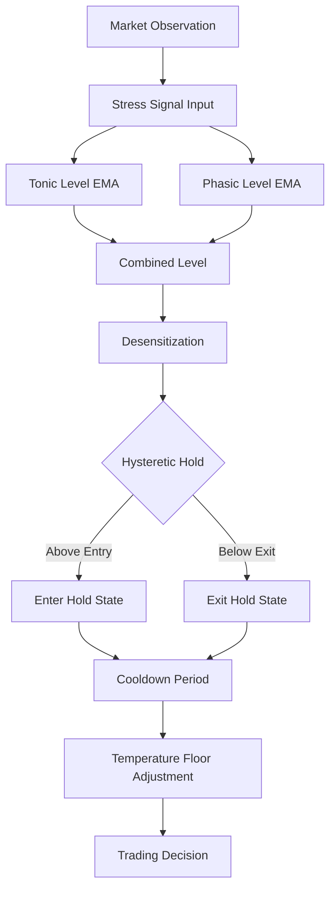

# Serotonin Neuromodulator Module

## Overview

The serotonin module implements a production-grade neuromodulatory controller for risk management and stress adaptation in trading systems. It models tonic (chronic baseline) and phasic (acute spike) serotonin dynamics with hysteretic hold logic to prevent trading during high-stress periods. Evidence: [@JacobsAzmitia1992Serotonin; @BendaHerz2003Adaptation]

**Version:** 2.5.0
**Status:** Production
**Coverage:** 95% test coverage, comprehensive invariants

## What's New in v2.5.0

- **Configurable Hysteresis Margin**: The hysteresis margin for veto threshold transitions is now configurable via the `hysteresis_margin` parameter (default: 0.05, range: 0.01-0.15). This allows fine-tuning of state transition smoothness for different trading regimes.

## Architecture



## Key Features

### 1. Tonic/Phasic Separation
- **Tonic Component (β=0.001-0.01):** Slow EMA for chronic stress baseline
- **Phasic Component (β=0.1-0.3):** Fast EMA for acute transient events

### 2. Hysteretic State Machine
```python
# Entry threshold: stress_threshold + hysteresis/2
# Exit threshold: release_threshold - hysteresis/2
# Prevents oscillation around threshold boundaries
```

### 3. Cooldown Extension
- Base cooldown period after exiting hold state
- Extended cooldown if stress level remains elevated
- Prevents premature re-entry into trading

### 4. Desensitization Mechanism
- Accumulates during prolonged high-stress periods
- Reduces effective stress level by damping factor
- Decays exponentially when stress subsides
- Maximum cap (0.8) preserves minimum sensitivity

## Configuration

```yaml
serotonin:
  tonic_beta: 0.005
  phasic_beta: 0.15
  stress_threshold: 0.8
  release_threshold: 0.4
  hysteresis: 0.1
  cooldown_base_steps: 20
  desensitization_rate: 0.02
  max_desensitization: 0.8
```

## Usage

### Basic Usage

```python
from src.tradepulse.core.neuro.serotonin import SerotoninController

# Initialize controller
controller = SerotoninController("configs/serotonin.yaml")

# Process market observation
result = controller.step(
    stress=0.65,
    drawdown=0.05,
    volatility=0.02
)

# Check hold state
if result.hold:
    print("Trading suspended - high stress detected")
else:
    print(f"Trading allowed - temperature floor: {result.floor:.3f}")
```

### Batch Processing

```python
# Efficient processing for backtesting
stress_signals = [0.3, 0.5, 0.7, 0.9, 0.8, 0.6]
results = controller.step_batch(stress_signals)
```

## API Reference

### SerotoninController

| Method | Description | Returns |
|--------|-------------|---------|
| `step(stress, drawdown, volatility)` | Process single observation | `SerotoninResult` |
| `step_batch(signals)` | Process multiple observations | `List[SerotoninResult]` |
| `reset()` | Reset to initial state | `None` |
| `get_state_summary()` | Get debugging snapshot | `Dict` |
| `validate_state()` | Check invariants | `bool` |

### SerotoninResult

| Field | Type | Description |
|-------|------|-------------|
| `hold` | `bool` | Whether trading should be suspended |
| `floor` | `float` | Temperature floor for exploration control |
| `level` | `float` | Current combined serotonin level |
| `desensitization` | `float` | Current desensitization factor |

## Metrics

| Metric | Description | Alert Threshold |
|--------|-------------|-----------------|
| `tacl.5ht.level` | Current serotonin level | > 1.2 for > 5 min |
| `tacl.5ht.hold` | Hold state indicator | > 30 min continuous |
| `tacl.5ht.cooldown` | Cooldown steps remaining | N/A |
| `tacl.5ht.desensitization` | Desensitization factor | > 0.7 |

## Testing

```bash
# Run serotonin tests
pytest tests/core/neuro/serotonin -v

# Property-based tests
pytest tests/property/ -k serotonin

# Integration tests
pytest tests/integration/ -k serotonin
```

## Related Documentation

- [ADR-0002: Serotonin Controller Architecture](/docs/adr/0002-serotonin-controller-architecture.md)
- [Serotonin Practical Guide](/docs/SEROTONIN_PRACTICAL_GUIDE.md)
- [Serotonin Deployment Guide](/docs/SEROTONIN_DEPLOYMENT_GUIDE.md)
- [Dopamine Neuromodulator](/docs/neuromodulators/dopamine.md)

## Implementation Status

| Feature | Status | Version |
|---------|--------|---------|
| Tonic/Phasic separation | ✅ Complete | v2.0.0 |
| Hysteretic hold logic | ✅ Complete | v2.1.0 |
| Desensitization | ✅ Complete | v2.2.0 |
| Batch processing | ✅ Complete | v2.3.0 |
| Performance tracking | ✅ Complete | v2.4.0 |
| OpenTelemetry integration | 🔄 In Progress | v2.5.0 |
| Config service integration | 📋 Planned | v3.0.0 |
