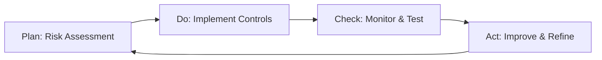

# Security Operations Guide
## Comprehensive Guide for Requirements 5-10

---

# 5. Real-time Monitoring & Threat Detection

## 5.1 SIEM Integration

### SIEM Stack Architecture
```
Log Sources → Collectors → Processing → Storage → Analysis → Alerting
```

### Supported SIEM Platforms
- **Splunk**: Enterprise SIEM with AI/ML capabilities
- **ELK Stack**: Elasticsearch, Logstash, Kibana for open-source option
- **Azure Sentinel**: Cloud-native SIEM
- **AWS Security Hub**: Centralized security findings

### SIEM Integration Configuration

**Splunk Integration**:
```python
# application/monitoring/splunk_integration.py
import splunk_http_event_collector as hec

class SplunkSecurityLogger:
    def __init__(self, token: str, url: str):
        self.collector = hec.http_event_collector(token, url)

    def log_security_event(self, event_type: str, details: dict):
        """Log security event to Splunk."""
        event = {
            'event': {
                'type': event_type,
                'timestamp': datetime.utcnow().isoformat(),
                'source': 'tradepulse',
                **details
            },
            'sourcetype': 'tradepulse:security',
            'index': 'security'
        }
        self.collector.sendEvent(event)
```

### Security Events to Monitor
- Authentication attempts (success/failure)
- Authorization denials
- Privilege escalations
- Data access (sensitive data)
- Configuration changes
- API anomalies
- Network intrusions
- Malware detections

## 5.2 ML-based Threat Detection

### Anomaly Detection Models

**User Behavior Analytics (UBA)**:
```python
from sklearn.ensemble import IsolationForest
import numpy as np

class UserBehaviorAnomalyDetector:
    """Detect anomalous user behavior."""

    def __init__(self):
        self.model = IsolationForest(contamination=0.01)
        self.trained = False

    def train(self, normal_behavior_data: np.ndarray):
        """Train on normal user behavior."""
        self.model.fit(normal_behavior_data)
        self.trained = True

    def detect_anomaly(self, user_activity: dict) -> tuple[bool, float]:
        """Detect if user activity is anomalous."""
        if not self.trained:
            raise ValueError("Model not trained")

        features = self._extract_features(user_activity)
        prediction = self.model.predict([features])[0]
        anomaly_score = self.model.score_samples([features])[0]

        is_anomaly = prediction == -1
        return is_anomaly, anomaly_score

    def _extract_features(self, activity: dict) -> list:
        """Extract features from user activity."""
        return [
            activity.get('login_hour', 0),
            activity.get('failed_attempts', 0),
            activity.get('countries_accessed', 0),
            activity.get('api_calls_per_hour', 0),
            activity.get('data_download_mb', 0),
        ]
```

### Real-time Alerting System

**Alert Configuration** (`configs/security/alerts.yaml`):
```yaml
alerts:
  - name: "Multiple Failed Logins"
    condition: "failed_login_count > 5 in 5 minutes"
    severity: "high"
    action:
      - notify_soc
      - lock_account

  - name: "Unauthorized API Access"
    condition: "http_status = 403 and count > 10 in 1 minute"
    severity: "critical"
    action:
      - notify_soc
      - block_ip
      - create_incident

  - name: "Abnormal Data Access"
    condition: "data_access_volume > threshold and classification = 'restricted'"
    severity: "critical"
    action:
      - notify_soc
      - alert_dpo
      - create_incident
      - trigger_dlp_review
```

## 5.3 Security Metrics Dashboard

**Key Metrics**:
- Mean Time to Detect (MTTD): < 1 hour target
- Mean Time to Respond (MTTR): < 4 hours target
- False Positive Rate: < 5% target
- Security Events per Day: Trending
- Critical Alerts: Real-time count
- Vulnerability Age: By severity

---

# 6. Incident Management & Recovery

## 6.1 Incident Response Plan (IRP)

### Incident Response Phases (NIST 800-61)

**1. Preparation**
- Incident response team established
- Playbooks documented and tested
- Tools and access provisioned
- Training completed
- Communication plan defined

**2. Detection and Analysis**
- Monitor security alerts
- Analyze indicators of compromise (IoCs)
- Determine incident scope and severity
- Document all findings
- Preserve evidence

**3. Containment, Eradication, and Recovery**
- Short-term containment: Isolate affected systems
- Long-term containment: Apply temporary fixes
- Eradication: Remove threat actor access
- Recovery: Restore systems to normal operation
- Validation: Verify threat elimination

**4. Post-Incident Activity**
- Lessons learned session
- Incident report documentation
- Update playbooks
- Implement preventive measures
- Share threat intelligence

### Incident Classification Matrix

| Severity | Examples | Response Time | Escalation |
|----------|----------|---------------|------------|
| **P0 - Critical** | Data breach, ransomware, system compromise | Immediate (< 15 min) | CISO, CEO, Board |
| **P1 - High** | Unauthorized access, DDoS, malware | < 1 hour | CISO, Security Team |
| **P2 - Medium** | Policy violation, failed attack attempt | < 4 hours | Security Team |
| **P3 - Low** | Security scan findings, minor policy breach | < 24 hours | Security Team |

### Incident Response Playbooks

**Playbook: Data Breach Response**:
```yaml
incident_type: data_breach
trigger: "Unauthorized data access or exfiltration detected"

steps:
  1_immediate:
    - Activate incident response team
    - Isolate affected systems
    - Preserve evidence and logs
    - Notify CISO and legal team

  2_assessment:
    - Determine scope of breach
    - Identify affected data and users
    - Assess regulatory notification requirements
    - Document timeline and IOCs

  3_containment:
    - Revoke compromised credentials
    - Block attacker access vectors
    - Apply security patches
    - Monitor for re-entry attempts

  4_eradication:
    - Remove malware/backdoors
    - Close security gaps
    - Reset all potentially compromised accounts

  5_recovery:
    - Restore systems from clean backups
    - Implement enhanced monitoring
    - Conduct security validation testing

  6_post_incident:
    - Notify affected parties (GDPR: 72 hours)
    - File regulatory reports (if required)
    - Conduct lessons learned
    - Update security controls

notifications:
  internal:
    - CISO
    - Legal team
    - Privacy officer
    - Communications team

  external:
    - Regulatory authorities (if applicable)
    - Affected customers/users
    - Law enforcement (if applicable)
    - Insurance provider
```

## 6.2 Business Continuity Plan (BCP)

### RTO/RPO Targets by System Tier

| Tier | Systems | RTO | RPO | Strategy |
|------|---------|-----|-----|----------|
| **Tier 0** | Trading engine, Order execution | 1 hour | 15 minutes | Active-active multi-region |
| **Tier 1** | API gateway, Authentication | 2 hours | 30 minutes | Active-passive failover |
| **Tier 2** | Analytics, Reporting | 4 hours | 1 hour | Backup and restore |
| **Tier 3** | Admin tools, Documentation | 24 hours | 4 hours | Best effort recovery |

### Business Impact Analysis

**Critical Business Functions**:
1. Order execution and trade processing
2. Real-time market data ingestion
3. Risk management and compliance checks
4. User authentication and authorization
5. Audit logging and regulatory reporting

**Dependencies**:
- External: Exchange APIs, market data providers
- Internal: Databases, message queues, authentication services
- Infrastructure: Network, compute, storage

### Continuity Strategies

**High Availability**:
- Multi-AZ deployment for critical services
- Load balancing across multiple instances
- Database replication with automatic failover
- Message queue clustering

**Disaster Recovery**:
- Multi-region deployment (primary + DR site)
- Automated failover procedures
- Regular DR drills (semi-annual)
- Backup verification testing (monthly)

## 6.3 Disaster Recovery Plan (DRP)

### DR Architecture

```
┌─────────────────────────────────────────────┐
│         Primary Region (us-east-1)          │
│  - Active traffic serving                   │
│  - Real-time replication to DR              │
│  - Continuous backups                       │
└─────────────────────────────────────────────┘
                    ↓ Replication
┌─────────────────────────────────────────────┐
│           DR Region (us-west-2)             │
│  - Passive standby                          │
│  - Receives replicated data                 │
│  - Ready for failover                       │
└─────────────────────────────────────────────┘
```

### Backup Strategy

**Backup Types**:
- **Incremental**: Hourly (changed data only)
- **Full**: Daily (complete system state)
- **Archive**: Monthly (long-term retention)

**Backup Locations**:
- Primary: Same region, different AZ
- Secondary: Different region
- Tertiary: Offline/cold storage

**Backup Verification**:
```python
class BackupVerification:
    """Verify backup integrity and recoverability."""

    def verify_backup(self, backup_id: str) -> dict:
        """Comprehensive backup verification."""
        results = {
            'backup_id': backup_id,
            'timestamp': datetime.utcnow(),
            'checks': {}
        }

        # Check 1: Backup exists and is accessible
        results['checks']['accessibility'] = self._check_accessibility(backup_id)

        # Check 2: Backup integrity (checksums)
        results['checks']['integrity'] = self._verify_checksums(backup_id)

        # Check 3: Backup completeness
        results['checks']['completeness'] = self._check_completeness(backup_id)

        # Check 4: Restore test (sample)
        results['checks']['restorability'] = self._test_restore(backup_id)

        results['overall_status'] = all(
            check['passed'] for check in results['checks'].values()
        )

        return results
```

### DR Testing Schedule

- **Tabletop Exercises**: Quarterly
- **Partial Failover Test**: Semi-annually
- **Full DR Drill**: Annually
- **Backup Restore Test**: Monthly

---

# 7. Audit & Continuous Improvement

## 7.1 Audit Procedures

### Internal Audit Schedule

**Quarterly Audits**:
- Access control review
- Privilege escalation check
- Configuration compliance
- Security policy adherence
- Incident response effectiveness

**Annual Audits**:
- Comprehensive security assessment
- ISO 27001 compliance audit
- SOC 2 Type II preparation
- Penetration testing
- Business continuity plan review

### Audit Checklist

**Access Control Audit**:
- [ ] All user accounts have valid business justification
- [ ] MFA enabled for 100% of accounts
- [ ] No shared accounts or generic credentials
- [ ] Privileged accounts follow least privilege
- [ ] Access reviews completed within last 90 days
- [ ] Terminated user accounts disabled within 24 hours
- [ ] Service account credentials rotated per policy

**Security Configuration Audit**:
- [ ] All systems patched to current levels
- [ ] Security baselines applied and verified
- [ ] Unnecessary services disabled
- [ ] Logging enabled and forwarded to SIEM
- [ ] Encryption enabled for data at rest and in transit
- [ ] Security groups follow principle of least privilege
- [ ] Backup and recovery tested within last 30 days

## 7.2 Penetration Testing Program

### Testing Scope

**Annual External Penetration Test**:
- Public-facing web applications
- API endpoints
- Network perimeter
- Cloud infrastructure
- Social engineering (with approval)

**Bi-annual Internal Penetration Test**:
- Internal network segmentation
- Privilege escalation paths
- Lateral movement capabilities
- Data access controls
- Internal application security

### Penetration Testing Methodology

1. **Planning**: Define scope, rules of engagement
2. **Reconnaissance**: Information gathering
3. **Scanning**: Vulnerability identification
4. **Exploitation**: Attempt to exploit vulnerabilities
5. **Post-Exploitation**: Assess impact and persistence
6. **Reporting**: Document findings with remediation guidance

### Remediation SLA

| Severity | Remediation Timeline | Re-test |
|----------|---------------------|---------|
| Critical | 7 days | Immediate |
| High | 30 days | Within 60 days |
| Medium | 90 days | Next scheduled test |
| Low | 180 days | Next scheduled test |

## 7.3 Continuous Improvement Cycle

### PDCA (Plan-Do-Check-Act) Model



### Security Metrics for Improvement

**Trending Metrics**:
- Vulnerability detection rate
- Mean time to remediate
- Security incident frequency
- Training completion rate
- Audit finding closure rate

**Improvement Initiatives**:
```python
class SecurityImprovementTracker:
    """Track security improvement initiatives."""

    def __init__(self):
        self.initiatives = []

    def add_initiative(self, initiative: dict):
        """Add security improvement initiative."""
        required_fields = ['title', 'description', 'owner',
                          'target_date', 'success_metrics']
        if not all(field in initiative for field in required_fields):
            raise ValueError("Missing required fields")

        initiative['status'] = 'planned'
        initiative['created_date'] = datetime.utcnow()
        self.initiatives.append(initiative)

    def update_status(self, initiative_id: str, status: str, notes: str):
        """Update initiative status."""
        valid_statuses = ['planned', 'in_progress', 'completed', 'cancelled']
        if status not in valid_statuses:
            raise ValueError(f"Invalid status: {status}")

        initiative = self._find_initiative(initiative_id)
        initiative['status'] = status
        initiative['last_updated'] = datetime.utcnow()
        initiative['notes'] = notes
```

---

# 8. Human Factor & Training

## 8.1 Security Training Program

### Training Curriculum

**Role-Based Training Tracks**:

**All Employees**:
- Security awareness basics (annual, 1 hour)
- Phishing identification (quarterly refresher)
- Password security best practices
- Physical security procedures
- Incident reporting procedures

**Developers**:
- Secure coding practices (annual, 4 hours)
- OWASP Top 10 awareness
- Secrets management
- Security testing
- Code review for security

**System Administrators**:
- Infrastructure security (annual, 4 hours)
- Patch management
- Access control administration
- Security monitoring
- Incident response

**Managers**:
- Security leadership (annual, 2 hours)
- Risk management
- Compliance requirements
- Incident communication
- Security culture building

### Training Delivery Methods

- **E-learning**: Self-paced online courses
- **Instructor-led**: Virtual or in-person workshops
- **Hands-on Labs**: Practical security exercises
- **Simulations**: Phishing simulations, tabletop exercises
- **Microlearning**: Short security tips and reminders

### Training Tracking

```python
class SecurityTrainingTracker:
    """Track employee security training completion."""

    def check_compliance(self, employee_id: str) -> dict:
        """Check training compliance for employee."""
        employee = self._get_employee(employee_id)
        required_courses = self._get_required_courses(employee.role)

        compliance = {
            'employee_id': employee_id,
            'compliant': True,
            'courses': []
        }

        for course in required_courses:
            completion = self._get_completion_status(employee_id, course)
            is_current = self._is_current(completion, course.validity_period)

            compliance['courses'].append({
                'course': course.name,
                'completed': completion is not None,
                'current': is_current,
                'due_date': self._calculate_due_date(completion, course)
            })

            if not is_current:
                compliance['compliant'] = False

        return compliance
```

## 8.2 Access Control Policies

### Password Policy

**Requirements**:
- Minimum 12 characters
- Mix of uppercase, lowercase, numbers, symbols
- No dictionary words or common patterns
- No reuse of last 12 passwords
- Change every 90 days (service accounts)
- Account lockout after 5 failed attempts
- Password manager strongly recommended

### MFA Policy

**Requirements**:
- MFA required for all user accounts
- At least two factors:
  - Something you know (password)
  - Something you have (phone, token)
  - Something you are (biometric) - optional
- Backup authentication methods configured
- MFA device registration process documented

### Remote Access Policy

**Requirements**:
- VPN required for remote access to internal systems
- VPN with MFA enforced
- Automatic session timeout after 8 hours
- No split tunneling allowed for production access
- Remote access logged and monitored

## 8.3 BYOD Security Requirements

### BYOD Policy

**Acceptable Use**:
- Email access allowed on personal devices
- Collaboration tools (Slack, Teams) allowed
- No access to production systems or sensitive data
- Must enroll in Mobile Device Management (MDM)
- Must enable device encryption
- Must set device password/PIN

**Security Requirements**:
- Device encryption mandatory
- Remote wipe capability enabled
- Automatic screen lock (5 minutes)
- OS and app updates current
- Antivirus/anti-malware installed
- Lost/stolen device must be reported immediately

### MDM Configuration

```yaml
mdm_policies:
  ios:
    - require_passcode: true
    - min_passcode_length: 6
    - max_failed_attempts: 10
    - auto_lock_timeout: 5  # minutes
    - require_encryption: true
    - allow_jailbroken: false

  android:
    - require_passcode: true
    - min_passcode_length: 6
    - max_failed_attempts: 10
    - auto_lock_timeout: 5  # minutes
    - require_encryption: true
    - allow_rooted: false

  restrictions:
    - block_camera: false
    - block_screenshots: true  # for sensitive apps
    - require_vpn: true  # for corporate access
```

## 8.4 Phishing Awareness Program

### Phishing Simulation Campaign

**Monthly Simulations**:
- Simulated phishing emails sent to all employees
- Various attack vectors: credential harvesting, malware, social engineering
- Immediate training for users who click/submit
- Tracking and reporting of results

**Simulation Scenarios**:
1. CEO fraud / Business Email Compromise
2. Credential harvesting (fake login pages)
3. Malicious attachments
4. Urgent action requests
5. Invoice fraud

### Phishing Reporting

**Process**:
1. User identifies suspicious email
2. Reports via "Report Phishing" button or forward to security@
3. Security team analyzes within 1 hour
4. If malicious: Alert sent, emails quarantined
5. User receives feedback on report

**Metrics**:
- Phishing click rate (target: < 5%)
- Reporting rate (target: > 80% of simulations)
- Time to report (target: < 1 hour average)

---

# 9. Legal Compliance & Standards

## 9.1 Compliance Matrix

### GDPR Compliance

**Key Requirements**:
- Lawful basis for processing personal data
- Data subject rights implementation
- Data protection by design and by default
- Data breach notification (72 hours)
- Data Protection Impact Assessments (DPIA)
- Privacy policy and transparency

**Implementation**:
```python
class GDPRCompliance:
    """GDPR compliance implementation."""

    def handle_data_subject_request(self, request_type: str, user_id: str):
        """Handle GDPR data subject rights requests."""
        handlers = {
            'access': self._right_to_access,
            'rectification': self._right_to_rectification,
            'erasure': self._right_to_erasure,
            'restriction': self._right_to_restriction,
            'portability': self._right_to_portability,
            'object': self._right_to_object,
        }

        if request_type not in handlers:
            raise ValueError(f"Unknown request type: {request_type}")

        # Log the request for audit trail
        self._log_dsr(request_type, user_id)

        # Execute the request handler
        return handlers[request_type](user_id)

    def _right_to_access(self, user_id: str) -> dict:
        """Provide user with all their personal data."""
        return {
            'profile': self._get_user_profile(user_id),
            'transactions': self._get_user_transactions(user_id),
            'activity_logs': self._get_user_activity(user_id),
            'consent_records': self._get_consent_records(user_id),
        }

    def _right_to_erasure(self, user_id: str):
        """Delete user data (right to be forgotten)."""
        # Check if there are legal obligations to retain
        if self._has_retention_obligation(user_id):
            raise ValueError("Cannot erase: legal retention requirement")

        # Anonymize or delete user data
        self._anonymize_user_data(user_id)
        self._delete_user_account(user_id)

        # Log the erasure
        self._log_erasure(user_id)
```

### CCPA Compliance

**Key Requirements**:
- Notice of data collection
- Right to know what data is collected
- Right to delete personal information
- Right to opt-out of data sale
- Do Not Sell My Personal Information link

### Financial Services Compliance

**SEC/FINRA Requirements**:
- Trade data retention (7 years)
- Order audit trail
- Best execution documentation
- Supervision and surveillance
- Business continuity planning

**MiFID II Requirements**:
- Transaction reporting
- Clock synchronization (±100 microseconds UTC)
- Order record keeping
- Investor protection rules

## 9.2 Data Privacy Procedures

### Privacy by Design Principles

1. **Proactive not Reactive**: Anticipate privacy issues
2. **Privacy as Default**: Maximum privacy settings by default
3. **Privacy Embedded**: Built into design, not bolt-on
4. **Full Functionality**: Positive-sum, not zero-sum
5. **End-to-End Security**: Lifecycle protection
6. **Visibility and Transparency**: Keep it open
7. **Respect for User Privacy**: Keep it user-centric

### Data Protection Impact Assessment (DPIA)

**When Required**:
- Processing of sensitive personal data at scale
- Systematic monitoring of public areas
- Automated decision-making with legal effects
- New technologies with high privacy risk

**DPIA Process**:
1. Describe processing activities
2. Assess necessity and proportionality
3. Identify privacy risks
4. Identify mitigation measures
5. Document and review
6. Consult DPA if high risk remains

## 9.3 Regulatory Monitoring

### Change Monitoring Process

**Monitoring Sources**:
- Regulatory agency websites and newsletters
- Legal counsel briefings
- Industry association updates
- Professional compliance services
- Regulatory technology (RegTech) tools

### Impact Assessment

**New Regulation Analysis**:
```python
class RegulatoryChangeAssessment:
    """Assess impact of regulatory changes."""

    def assess_impact(self, regulation: dict) -> dict:
        """Assess impact of new regulation on TradePulse."""
        assessment = {
            'regulation_id': regulation['id'],
            'name': regulation['name'],
            'effective_date': regulation['effective_date'],
            'jurisdiction': regulation['jurisdiction'],
            'impact_areas': [],
            'required_changes': [],
            'compliance_deadline': regulation['effective_date'],
        }

        # Analyze impact on different areas
        areas = ['data_processing', 'trading_operations', 'reporting',
                'security', 'infrastructure']

        for area in areas:
            impact = self._analyze_area_impact(regulation, area)
            if impact['affected']:
                assessment['impact_areas'].append(impact)
                assessment['required_changes'].extend(impact['changes'])

        # Calculate implementation timeline
        assessment['implementation_plan'] = self._create_implementation_plan(
            assessment['required_changes'],
            assessment['compliance_deadline']
        )

        return assessment
```

### Compliance Gap Analysis

**Regular Reviews**:
- Quarterly: Review for new regulations
- Semi-annually: Comprehensive compliance assessment
- Annually: External compliance audit

---

# 10. Scalability & Growth Security

## 10.1 Security Scaling Guidelines

### Scaling Patterns

**Horizontal Scaling**:
- Stateless services for easy replication
- Load balancing with session affinity
- Distributed caching (Redis Cluster)
- Database read replicas
- Message queue partitioning

**Security Considerations**:
- Consistent security policies across all instances
- Centralized secret management
- Unified audit logging
- Network policies for new instances
- Auto-scaling security groups

### Performance vs Security Trade-offs

**Decision Matrix**:

| Scenario | Security Control | Performance Impact | Recommendation |
|----------|-----------------|-------------------|----------------|
| API Rate Limiting | Strict limits | Low | Implement with CDN caching |
| Encryption | TLS 1.3 | Low (~5%) | Always enable |
| Input Validation | Deep inspection | Medium | Async validation where possible |
| Audit Logging | Full logging | Low | Use async writes, optimize queries |
| MFA | Required | Medium (UX) | Implement with remember device |

## 10.2 Capacity Planning with Security

### Security Overhead Calculation

**Monitoring Overhead**:
- SIEM log ingestion: ~5-10% storage overhead
- Security scanning: ~2-5% CPU during scans
- Encryption: ~3-5% CPU/network overhead
- DLP scanning: ~5-10% performance impact

**Capacity Planning Formula**:
```
Total Capacity = Base Capacity × (1 + Security Overhead) × Growth Factor × Safety Margin

Example:
- Base: 1000 TPS (transactions per second)
- Security Overhead: 15% (0.15)
- Growth Factor: 2x (100% YoY growth)
- Safety Margin: 20% (0.20)

Total = 1000 × 1.15 × 2 × 1.20 = 2,760 TPS capacity needed
```

### Scaling Security Infrastructure

**SIEM Scaling**:
- Events per day: Calculate based on log sources
- Storage: 400 days retention at calculated rate
- Processing: Real-time correlation and alerting
- Indexing: Fast search capability

**Security Scanning Scaling**:
- Parallel scanners for large codebases
- Distributed DAST scanning
- Incremental security scans
- Caching of scan results

## 10.3 Lifecycle Security Management

### New Feature Security Process

**Security Gate 0: Planning**
- Threat modeling
- Security requirements definition
- Privacy impact assessment
- Compliance review

**Security Gate 1: Development**
- Secure code review
- SAST findings resolved
- Dependency vulnerabilities addressed
- Security tests written

**Security Gate 2: Testing**
- DAST scan passed
- Penetration test completed
- Security tests passed
- Performance with security validated

**Security Gate 3: Deployment**
- IaC security scan passed
- Secrets properly configured
- Monitoring and alerting configured
- Runbooks updated

**Security Gate 4: Operations**
- Security metrics baseline established
- Incident response procedures documented
- Regular security reviews scheduled

### Security Debt Management

**Technical Security Debt Categories**:
1. **Critical**: Active vulnerabilities
2. **High**: Missing security controls
3. **Medium**: Outdated security practices
4. **Low**: Security improvements

**Debt Management Strategy**:
```python
class SecurityDebtTracker:
    """Track and prioritize security debt."""

    def prioritize_debt(self, debt_items: List[dict]) -> List[dict]:
        """Prioritize security debt for remediation."""
        for item in debt_items:
            # Calculate priority score
            score = self._calculate_priority_score(item)
            item['priority_score'] = score

        # Sort by priority (high to low)
        return sorted(debt_items, key=lambda x: x['priority_score'],
                     reverse=True)

    def _calculate_priority_score(self, item: dict) -> float:
        """Calculate priority score based on multiple factors."""
        # Factors: severity, exploitability, exposure, impact
        score = (
            item['severity'] * 0.4 +
            item['exploitability'] * 0.3 +
            item['exposure'] * 0.2 +
            item['business_impact'] * 0.1
        )
        return score
```

### Growth Security Checklist

**Per Growth Milestone**:
- [ ] Threat model updated for new scale
- [ ] Security controls validated at new scale
- [ ] Performance testing with security enabled
- [ ] Capacity planning includes security overhead
- [ ] Monitoring and alerting thresholds adjusted
- [ ] Incident response procedures updated
- [ ] Disaster recovery tested at new scale
- [ ] Security audit performed

---

## Implementation Timeline

### Phase 1: Foundation (Months 1-3)
- ✅ Complete security documentation
- ✅ Establish security roles and responsibilities
- ✅ Deploy SIEM and monitoring
- ⏳ Conduct security training
- ⏳ Implement incident response procedures

### Phase 2: Enhancement (Months 4-6)
- 📋 ISO 27001 gap analysis
- 📋 Penetration testing program
- 📋 Advanced threat detection (ML)
- 📋 Security automation enhancement
- 📋 Compliance automation

### Phase 3: Maturity (Months 7-12)
- 📋 ISO 27001 certification
- 📋 SOC 2 Type II audit
- 📋 Bug bounty program launch
- 📋 Security operations center (SOC) establishment
- 📋 Continuous security improvement

## Success Metrics

### Security Posture
- ✅ Risk assessment: 100% of identified risks addressed
- ✅ Control implementation: 80% implemented, 95% target
- ✅ Vulnerability management: MTTR < 7 days for critical
- ⏳ Training completion: 85% current, 95% target
- ⏳ Audit compliance: 0 critical findings target

### Operational Excellence
- ✅ MTTD: < 1 hour target
- ✅ MTTR: < 4 hours target
- ⏳ Security test coverage: 85% current, 95% target
- ⏳ Deployment security gate pass rate: 90% current, 95% target
- ⏳ False positive rate: < 5% target

---

**Document Owner**: Security Operations Team
**Last Updated**: 2025-11-10
**Version**: 1.0
**Review Cycle**: Quarterly
**Next Review**: 2026-02-10
