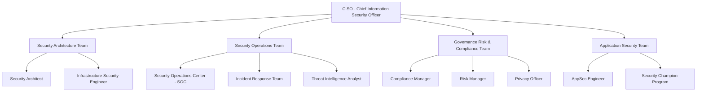
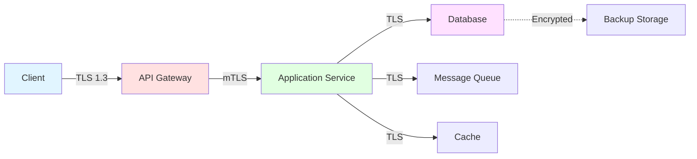
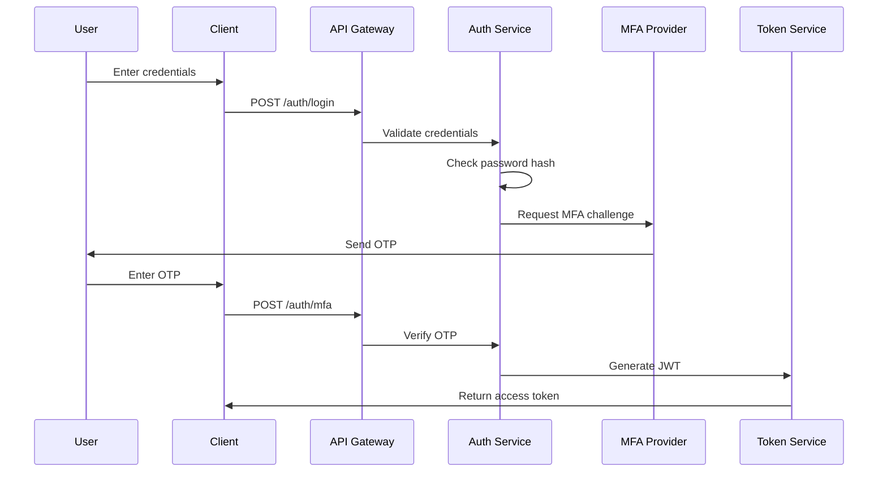
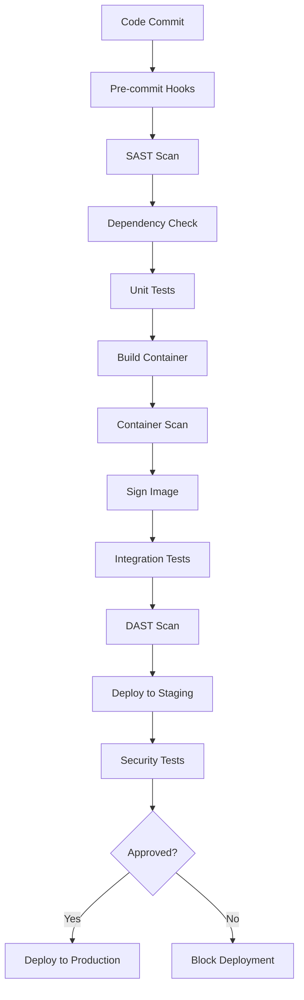

# Secure Architecture Design

## Overview

This document outlines the secure architecture design for TradePulse, implementing defense-in-depth principles, network segmentation, least privilege access, and security roles and responsibilities.

## 1. Security Architecture Principles

### 1.1 Defense in Depth

Multiple layers of security controls to protect against threats:

```
┌─────────────────────────────────────────────────────────────┐
│                    Layer 7: Governance                       │
│              Security Policies & Procedures                  │
├─────────────────────────────────────────────────────────────┤
│                    Layer 6: Physical                         │
│         Data Center Security, Hardware Controls              │
├─────────────────────────────────────────────────────────────┤
│                    Layer 5: Network                          │
│    Firewalls, IDS/IPS, Network Segmentation, DDoS           │
├─────────────────────────────────────────────────────────────┤
│                    Layer 4: Host                             │
│  OS Hardening, Antivirus, Host Firewall, Patch Management   │
├─────────────────────────────────────────────────────────────┤
│                    Layer 3: Application                      │
│   WAF, Input Validation, RBAC, Secure Coding, SAST/DAST     │
├─────────────────────────────────────────────────────────────┤
│                    Layer 2: Data                             │
│    Encryption, DLP, Data Classification, Backups             │
├─────────────────────────────────────────────────────────────┤
│                    Layer 1: User                             │
│  Security Awareness, MFA, Access Controls, Monitoring        │
└─────────────────────────────────────────────────────────────┘
```

### 1.2 Zero Trust Architecture

Never trust, always verify:

- **Identity Verification**: Continuous authentication and authorization
- **Device Security**: Device health checks before access
- **Least Privilege**: Minimal access rights for users and services
- **Micro-segmentation**: Granular network segmentation
- **Encryption Everywhere**: End-to-end encryption
- **Analytics and Visibility**: Continuous monitoring and logging

### 1.3 Secure by Design

Security integrated from the beginning:

- **Threat Modeling**: Identify threats during design phase
- **Privacy by Design**: Privacy considerations in all features
- **Security Requirements**: Security requirements before development
- **Secure Defaults**: Secure configurations out of the box
- **Fail Securely**: Graceful degradation with security maintained

## 2. Security Roles and Responsibilities

### 2.1 Security Organization



### 2.2 Role Definitions

#### Chief Information Security Officer (CISO)
- **Responsibilities**:
  - Overall security strategy and governance
  - Security budget and resource allocation
  - Board and executive reporting
  - Regulatory compliance oversight
  - Security program maturity
- **Authority**: Final decision on security matters
- **Accountability**: Security posture of organization

#### Security Architect
- **Responsibilities**:
  - Design secure system architecture
  - Security pattern and standards definition
  - Technology evaluation and selection
  - Architecture review and approval
  - Security debt management
- **Authority**: Approve/reject architecture changes
- **Accountability**: Architecture security

#### Security Operations Center (SOC)
- **Responsibilities**:
  - 24/7 security monitoring
  - Incident detection and triage
  - Alert investigation and response
  - Threat hunting
  - Security tools management
- **Authority**: Initiate incident response
- **Accountability**: Detection and response time

#### Application Security Engineer
- **Responsibilities**:
  - Security code review
  - SAST/DAST tool management
  - Vulnerability remediation guidance
  - Secure coding training
  - Security testing automation
- **Authority**: Block insecure code deployments
- **Accountability**: Application security vulnerabilities

#### Compliance Manager
- **Responsibilities**:
  - Regulatory compliance tracking
  - Audit coordination
  - Policy and procedure documentation
  - Compliance gap analysis
  - Certification management (ISO 27001, SOC 2)
- **Authority**: Compliance program decisions
- **Accountability**: Regulatory compliance status

#### Security Champion (per team)
- **Responsibilities**:
  - Promote security awareness in team
  - First-line security consultation
  - Security testing in sprint
  - Vulnerability triage
  - Security training advocate
- **Authority**: Security best practice recommendations
- **Accountability**: Team security posture

### 2.3 RACI Matrix

| Activity | CISO | Architect | SOC | AppSec | Compliance | Developer | Security Champion |
|----------|------|-----------|-----|--------|------------|-----------|-------------------|
| Security Strategy | A | C | C | C | C | I | I |
| Architecture Design | A | R | C | C | I | I | I |
| Incident Response | A | I | R | C | I | I | C |
| Code Security Review | I | C | I | R | I | C | C |
| Compliance Audit | A | C | I | I | R | I | I |
| Vulnerability Remediation | I | C | I | C | I | R | C |
| Security Monitoring | A | I | R | C | I | I | I |
| Policy Development | A | C | C | C | R | I | I |

**Legend**: R = Responsible, A = Accountable, C = Consulted, I = Informed

## 3. Network Architecture

### 3.1 Network Segmentation

```
Internet
    ↓
┌────────────────────────────────────────────────────────┐
│  DMZ Zone (Public-facing services)                     │
│  - Load Balancer                                       │
│  - WAF                                                 │
│  - API Gateway                                         │
│  - CDN Edge                                            │
└────────────────────────────────────────────────────────┘
    ↓ Firewall
┌────────────────────────────────────────────────────────┐
│  Application Zone (Internal services)                  │
│  - Web Application Servers                             │
│  - Application Servers                                 │
│  - Message Queue                                       │
│  - Cache Layer                                         │
└────────────────────────────────────────────────────────┘
    ↓ Firewall
┌────────────────────────────────────────────────────────┐
│  Data Zone (Databases and storage)                     │
│  - Database Servers                                    │
│  - Data Lake                                           │
│  - Backup Storage                                      │
│  - Secrets Vault                                       │
└────────────────────────────────────────────────────────┘
    ↓ Firewall
┌────────────────────────────────────────────────────────┐
│  Management Zone (Administration)                      │
│  - Monitoring Systems                                  │
│  - CI/CD Pipeline                                      │
│  - Logging Infrastructure                              │
│  - Bastion Hosts                                       │
└────────────────────────────────────────────────────────┘
```

### 3.2 Network Security Controls

#### Firewall Rules
- **Default Deny**: Block all traffic by default
- **Explicit Allow**: Whitelist required traffic only
- **Stateful Inspection**: Track connection state
- **Application-Layer**: Layer 7 filtering where applicable
- **Regular Review**: Quarterly firewall rule review

#### DMZ Configuration
- **Purpose**: Isolate public-facing services
- **Access Control**:
  - Inbound: HTTPS (443), API endpoints
  - Outbound: Restricted to application zone
- **Services**: Load balancer, WAF, API gateway
- **Monitoring**: Enhanced logging and alerting

#### Internal Zones
- **Application Zone**:
  - Access from DMZ only
  - No direct internet access
  - Service-to-service authentication required
- **Data Zone**:
  - Access from application zone only
  - Encrypted connections required
  - Database firewall enabled
- **Management Zone**:
  - VPN/bastion access only
  - MFA required
  - Admin audit logging

### 3.3 Micro-segmentation

Kubernetes network policies for container-level segmentation:

```yaml
apiVersion: networking.k8s.io/v1
kind: NetworkPolicy
metadata:
  name: trading-service-policy
spec:
  podSelector:
    matchLabels:
      app: trading-service
  policyTypes:
  - Ingress
  - Egress
  ingress:
  - from:
    - podSelector:
        matchLabels:
          app: api-gateway
    ports:
    - protocol: TCP
      port: 8080
  egress:
  - to:
    - podSelector:
        matchLabels:
          app: database
    ports:
    - protocol: TCP
      port: 5432
  - to:
    - podSelector:
        matchLabels:
          app: message-queue
    ports:
    - protocol: TCP
      port: 5672
```

## 4. Application Architecture

### 4.1 Multi-tier Architecture

```
┌─────────────────────────────────────────────────────────┐
│                 Presentation Layer                       │
│  - Web UI (React/Next.js)                               │
│  - Mobile Apps                                           │
│  - CLI Tools                                             │
│  Security: CSP, XSS Protection, Input Validation        │
└─────────────────────────────────────────────────────────┘
                          ↓
┌─────────────────────────────────────────────────────────┐
│                  API Gateway Layer                       │
│  - Authentication & Authorization                        │
│  - Rate Limiting                                         │
│  - Request Validation                                    │
│  - API Versioning                                        │
│  Security: OAuth 2.0, JWT, API Keys, WAF                │
└─────────────────────────────────────────────────────────┘
                          ↓
┌─────────────────────────────────────────────────────────┐
│                  Business Logic Layer                    │
│  - Trading Engine                                        │
│  - Risk Management                                       │
│  - Strategy Execution                                    │
│  - Analytics Services                                    │
│  Security: RBAC, Input Validation, Secure Coding        │
└─────────────────────────────────────────────────────────┘
                          ↓
┌─────────────────────────────────────────────────────────┐
│                   Data Access Layer                      │
│  - ORM (SQLAlchemy)                                     │
│  - Caching (Redis)                                       │
│  - Message Queue (RabbitMQ)                              │
│  Security: Parameterized Queries, Encryption            │
└─────────────────────────────────────────────────────────┘
                          ↓
┌─────────────────────────────────────────────────────────┐
│                    Data Storage Layer                    │
│  - PostgreSQL (Transactional)                           │
│  - TimescaleDB (Time-series)                            │
│  - S3 (Object Storage)                                   │
│  Security: TDE, Encryption at Rest, Access Controls     │
└─────────────────────────────────────────────────────────┘
```

### 4.2 Principle of Least Privilege

#### Service Accounts
- **Database Access**: Read-only vs. read-write roles
- **API Access**: Scoped permissions per service
- **Cloud Resources**: IAM roles with minimal permissions
- **Secret Access**: Access only to required secrets

#### User Roles
```yaml
roles:
  viewer:
    permissions:
      - read:strategies
      - read:performance
      - read:analytics

  trader:
    permissions:
      - read:strategies
      - write:orders
      - read:positions
      - read:analytics

  analyst:
    permissions:
      - read:strategies
      - write:strategies
      - read:backtest_results
      - execute:backtest

  admin:
    permissions:
      - read:*
      - write:*
      - admin:users
      - admin:system_config

  auditor:
    permissions:
      - read:audit_logs
      - read:compliance_reports
      - read:risk_reports
```

#### Permission Enforcement

```python
from functools import wraps
from flask import g, abort

def require_permission(permission: str):
    """Decorator to enforce permission checks."""
    def decorator(f):
        @wraps(f)
        def decorated_function(*args, **kwargs):
            if not g.user.has_permission(permission):
                abort(403, description=f"Permission denied: {permission}")
            return f(*args, **kwargs)
        return decorated_function
    return decorator

@app.route('/api/v1/orders', methods=['POST'])
@require_permission('write:orders')
def create_order():
    # Order creation logic
    pass
```

### 4.3 Critical Component Isolation

#### Trading Engine Isolation
- **Dedicated Resources**: Separate compute and memory
- **Network Isolation**: Separate network namespace
- **Data Isolation**: Separate database schema
- **Secret Isolation**: Dedicated secret storage path

#### Secrets Management Isolation
- **HashiCorp Vault**:
  - Separate namespace per environment
  - Dynamic credentials for databases
  - Encrypted transit and storage
  - Audit logging enabled

```
vault/
├── production/
│   ├── trading/          (trading service secrets)
│   ├── analytics/        (analytics service secrets)
│   └── admin/            (admin credentials)
├── staging/
│   └── ...
└── development/
    └── ...
```

## 5. Data Security Architecture

### 5.1 Data Flow Security



### 5.2 Encryption Architecture

#### Data at Rest
- **Databases**: Transparent Data Encryption (TDE)
- **File Systems**: Full disk encryption (LUKS/dm-crypt)
- **Object Storage**: Server-side encryption (SSE-KMS)
- **Backups**: Client-side encryption before upload
- **Keys**: Stored in HSM or cloud KMS

#### Data in Transit
- **External**: TLS 1.3 with perfect forward secrecy
- **Internal**: mTLS between services
- **VPN**: WireGuard for administrative access
- **Certificate Management**: Automated with Let's Encrypt

#### Key Management Hierarchy

```
Root Key (HSM)
    ↓
Master Encryption Key
    ↓
Data Encryption Keys
    ↓
Individual Data Items
```

### 5.3 Data Classification Enforcement

```python
class DataClassification(Enum):
    PUBLIC = "public"
    INTERNAL = "internal"
    CONFIDENTIAL = "confidential"
    RESTRICTED = "restricted"

class SecureDataAccess:
    def __init__(self, classification: DataClassification):
        self.classification = classification

    def get_data(self, user: User) -> bytes:
        """Retrieve data with classification-based controls."""
        if not self._check_access(user):
            raise PermissionError("Insufficient access level")

        data = self._fetch_data()

        # Apply DLP controls
        if self.classification in [DataClassification.CONFIDENTIAL,
                                   DataClassification.RESTRICTED]:
            self._log_access(user, "read")
            self._apply_watermark(data, user)

        return data

    def _check_access(self, user: User) -> bool:
        """Check if user has required clearance."""
        required_level = self._get_required_level()
        return user.clearance_level >= required_level
```

## 6. Identity and Access Management

### 6.1 Authentication Architecture



### 6.2 Authorization Architecture

```python
class RBACEngine:
    """Role-Based Access Control enforcement."""

    def __init__(self):
        self.roles = self._load_roles()
        self.permissions = self._load_permissions()

    def check_permission(self, user: User, resource: str,
                        action: str) -> bool:
        """Check if user has permission for action on resource."""
        user_roles = self._get_user_roles(user)

        for role in user_roles:
            permissions = self.roles[role].permissions
            if self._permission_matches(permissions, resource, action):
                # Log authorization decision
                self._audit_log(user, resource, action, granted=True)
                return True

        self._audit_log(user, resource, action, granted=False)
        return False

    def _permission_matches(self, permissions: List[Permission],
                           resource: str, action: str) -> bool:
        """Check if any permission allows the action."""
        for perm in permissions:
            if perm.resource == resource and perm.action == action:
                return True
            # Check wildcards
            if perm.resource == '*' or perm.action == '*':
                return True
        return False
```

## 7. Monitoring and Logging Architecture

### 7.1 Security Monitoring Stack

```
┌─────────────────────────────────────────────────────────┐
│                    Detection Layer                       │
│  - IDS/IPS                                              │
│  - WAF                                                  │
│  - Endpoint Detection & Response (EDR)                  │
│  - Network Traffic Analysis                             │
└─────────────────────────────────────────────────────────┘
                          ↓
┌─────────────────────────────────────────────────────────┐
│                   Collection Layer                       │
│  - Log Shippers (Filebeat, Fluentd)                    │
│  - Metrics Collectors (Prometheus)                      │
│  - Trace Collectors (Jaeger)                           │
└─────────────────────────────────────────────────────────┘
                          ↓
┌─────────────────────────────────────────────────────────┐
│                   Processing Layer                       │
│  - Log Parsing & Enrichment                            │
│  - Anomaly Detection (ML models)                        │
│  - Correlation Rules                                    │
│  - Threat Intelligence Integration                      │
└─────────────────────────────────────────────────────────┘
                          ↓
┌─────────────────────────────────────────────────────────┐
│                    Storage Layer                         │
│  - Elasticsearch / OpenSearch                           │
│  - Long-term Archive (S3 Glacier)                       │
│  - Hot/Warm/Cold tiers                                  │
└─────────────────────────────────────────────────────────┘
                          ↓
┌─────────────────────────────────────────────────────────┐
│                   Analysis Layer                         │
│  - SIEM Dashboard (Kibana, Grafana)                    │
│  - Security Operations Center (SOC)                     │
│  - Incident Response Platform                           │
│  - Compliance Reporting                                 │
└─────────────────────────────────────────────────────────┘
```

### 7.2 Audit Logging Requirements

All security-relevant events must be logged:

```python
class SecurityAuditLogger:
    """Centralized security audit logging."""

    def log_authentication(self, user: str, success: bool,
                          source_ip: str, mfa_used: bool):
        """Log authentication attempts."""
        self._log({
            'event_type': 'authentication',
            'timestamp': datetime.utcnow().isoformat(),
            'user': user,
            'success': success,
            'source_ip': source_ip,
            'mfa_used': mfa_used,
            'user_agent': request.headers.get('User-Agent'),
        })

    def log_authorization(self, user: str, resource: str,
                         action: str, granted: bool):
        """Log authorization decisions."""
        self._log({
            'event_type': 'authorization',
            'timestamp': datetime.utcnow().isoformat(),
            'user': user,
            'resource': resource,
            'action': action,
            'granted': granted,
        })

    def log_data_access(self, user: str, data_classification: str,
                       operation: str):
        """Log sensitive data access."""
        self._log({
            'event_type': 'data_access',
            'timestamp': datetime.utcnow().isoformat(),
            'user': user,
            'classification': data_classification,
            'operation': operation,
        })
```

## 8. Deployment Security

### 8.1 CI/CD Security Pipeline



### 8.2 Secure Deployment Practices

- **Immutable Infrastructure**: No in-place updates
- **Blue-Green Deployment**: Zero-downtime deployments
- **Canary Releases**: Gradual rollout with monitoring
- **Rollback Capability**: Quick rollback on issues
- **Configuration as Code**: GitOps for all configs

## References

- NIST SP 800-53 Rev. 5: Security and Privacy Controls
- NIST SP 800-160: Systems Security Engineering
- ISO/IEC 27001:2022: Information Security Management
- Zero Trust Architecture (NIST SP 800-207)
- CIS Controls v8
- OWASP Application Security Architecture

---

**Document Owner**: Security Architecture Team
**Last Updated**: 2025-11-10
**Review Cycle**: Quarterly
**Next Review**: 2026-02-10
