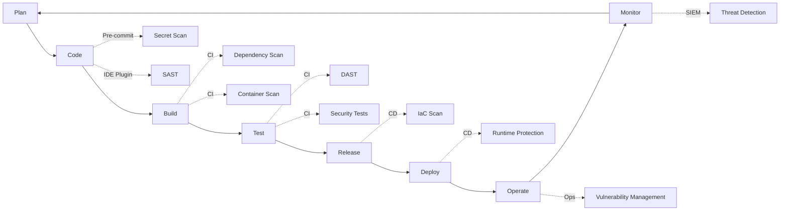

# DevSecOps Integration Guide

## Overview

This document describes the integration of security into all phases of the development lifecycle (DevSecOps), including CI/CD automation, security scanning, and vulnerability detection.

## 1. DevSecOps Philosophy

### 1.1 Core Principles

- **Shift Left**: Security from the beginning of SDLC
- **Automation**: Automated security checks in pipeline
- **Continuous**: Security is continuous, not a phase
- **Shared Responsibility**: Everyone owns security
- **Fast Feedback**: Immediate security feedback to developers

### 1.2 DevSecOps Pipeline



## 2. Security in Planning Phase

### 2.1 Threat Modeling

**When**: During feature design and architecture review

**Process**:
1. Identify assets and entry points
2. Create data flow diagrams
3. Apply STRIDE methodology
4. Document threats and mitigations
5. Review with security team

**Tool**: Microsoft Threat Modeling Tool, OWASP Threat Dragon

```python
# Example threat model metadata in code
"""
Threat Model: Order Execution Service
Assets: Trading credentials, order data, execution logic
Entry Points: REST API, Message Queue
Threats:
  - T1: SQL Injection via order parameters (Mitigated: Parameterized queries)
  - T2: Unauthorized order submission (Mitigated: JWT authentication)
  - T3: Order replay attacks (Mitigated: Nonce + timestamp validation)
"""
```

### 2.2 Security Requirements

**When**: User story creation

**Process**:
- Define security acceptance criteria
- Document data classification
- Identify compliance requirements
- Plan security tests

**Example**:
```yaml
User Story: As a trader, I want to submit orders via API
Security Requirements:
  - Authentication: JWT token with scopes
  - Authorization: User must have 'write:orders' permission
  - Input Validation: Order parameters validated against schema
  - Rate Limiting: Max 100 orders/minute per user
  - Audit Logging: All order submissions logged
  - Encryption: TLS 1.3 for API calls
```

## 3. Security in Development Phase

### 3.1 Secure Coding Standards

**Required Practices**:
- Input validation on all external data
- Parameterized queries (no string concatenation)
- Output encoding to prevent XSS
- Proper error handling (no sensitive data in errors)
- Secrets in environment variables or Vault
- Least privilege for service accounts

**Example - Input Validation**:
```python
from pydantic import BaseModel, Field, validator
from decimal import Decimal

class OrderRequest(BaseModel):
    """Validated order request."""
    symbol: str = Field(..., regex=r'^[A-Z]{3,10}/[A-Z]{3,10}$')
    quantity: Decimal = Field(..., gt=0, le=1000000)
    price: Decimal = Field(..., gt=0)

    @validator('symbol')
    def validate_symbol(cls, v):
        # Additional business logic validation
        if not cls._is_valid_symbol(v):
            raise ValueError(f'Invalid trading symbol: {v}')
        return v
```

### 3.2 IDE Security Plugins

**Recommended Tools**:
- **Snyk**: Real-time vulnerability detection
- **SonarLint**: Code quality and security
- **GitGuardian**: Secret detection
- **Checkmarx**: SAST in IDE

**VS Code Extensions**:
```json
{
  "recommendations": [
    "snyk-security.snyk-vulnerability-scanner",
    "SonarSource.sonarlint-vscode",
    "GitGuardian.ggshield",
    "ms-python.python",
    "ms-azuretools.vscode-docker"
  ]
}
```

### 3.3 Pre-commit Hooks

**Configuration** (`.pre-commit-config.yaml`):
```yaml
repos:
  - repo: https://github.com/pre-commit/pre-commit-hooks
    rev: v4.5.0
    hooks:
      - id: check-added-large-files
        args: ['--maxkb=1000']
      - id: detect-private-key
      - id: check-yaml
      - id: check-json

  - repo: https://github.com/Yelp/detect-secrets
    rev: v1.4.0
    hooks:
      - id: detect-secrets
        args: ['--baseline', '.secrets.baseline']

  - repo: https://github.com/PyCQA/bandit
    rev: '1.7.5'
    hooks:
      - id: bandit
        args: ['-c', 'pyproject.toml']
        additional_dependencies: ['bandit[toml]']

  - repo: https://github.com/pycqa/flake8
    rev: 6.1.0
    hooks:
      - id: flake8
        args: ['--config=.flake8']

  - repo: local
    hooks:
      - id: gitleaks
        name: gitleaks
        entry: gitleaks protect --verbose --redact --staged
        language: system
        pass_filenames: false
```

## 4. Security in Build Phase

### 4.1 Static Application Security Testing (SAST)

**Tools**:
- **Bandit**: Python security linter
- **Semgrep**: Multi-language static analysis
- **SonarQube**: Code quality and security
- **CodeQL**: Semantic code analysis

**GitHub Actions Workflow** (`.github/workflows/sast.yml`):
```yaml
name: SAST Security Scan

on:
  push:
    branches: [ main, develop ]
  pull_request:
    branches: [ main, develop ]

jobs:
  bandit:
    runs-on: ubuntu-latest
    steps:
      - uses: actions/checkout@v4
      - uses: actions/setup-python@v5
        with:
          python-version: '3.11'
      - name: Install Bandit
        run: pip install bandit[toml]
      - name: Run Bandit
        run: bandit -r . -f sarif -o bandit-results.sarif
      - name: Upload SARIF
        uses: github/codeql-action/upload-sarif@v3
        with:
          sarif_file: bandit-results.sarif

  semgrep:
    runs-on: ubuntu-latest
    steps:
      - uses: actions/checkout@v4
      - name: Run Semgrep
        uses: semgrep/semgrep-action@v1
        with:
          config: >-
            p/security-audit
            p/secrets
            p/owasp-top-ten

  codeql:
    runs-on: ubuntu-latest
    permissions:
      security-events: write
    steps:
      - uses: actions/checkout@v4
      - uses: github/codeql-action/init@v3
        with:
          languages: python, javascript, go
      - uses: github/codeql-action/autobuild@v3
      - uses: github/codeql-action/analyze@v3
```

### 4.2 Dependency Scanning

**Tools**:
- **pip-audit**: Python dependency vulnerabilities
- **npm audit**: JavaScript dependencies
- **Snyk**: Multi-language dependency scanning
- **Dependabot**: Automated dependency updates

**Dependency Scan Workflow**:
```yaml
name: Dependency Security Scan

on:
  push:
    branches: [ main ]
  schedule:
    - cron: '0 2 * * *'  # Daily at 2 AM

jobs:
  python-deps:
    runs-on: ubuntu-latest
    steps:
      - uses: actions/checkout@v4
      - uses: actions/setup-python@v5
        with:
          python-version: '3.11'
      - name: Install dependencies
        run: pip install -r requirements.txt
      - name: Run pip-audit
        run: |
          pip install pip-audit
          pip-audit --desc --format json --output pip-audit-results.json
      - name: Upload results
        uses: actions/upload-artifact@v4
        with:
          name: pip-audit-results
          path: pip-audit-results.json

  sbom-generation:
    runs-on: ubuntu-latest
    steps:
      - uses: actions/checkout@v4
      - name: Generate SBOM
        uses: anchore/sbom-action@v0
        with:
          format: cyclonedx-json
          output-file: sbom.json
      - name: Upload SBOM
        uses: actions/upload-artifact@v4
        with:
          name: sbom
          path: sbom.json
```

### 4.3 Container Security Scanning

**Tools**:
- **Trivy**: Comprehensive container scanner
- **Grype**: Vulnerability scanner
- **Snyk Container**: Container security

**Container Scan Workflow**:
```yaml
name: Container Security Scan

on:
  push:
    branches: [ main ]
  pull_request:
    branches: [ main ]

jobs:
  container-scan:
    runs-on: ubuntu-latest
    steps:
      - uses: actions/checkout@v4

      - name: Build container image
        run: docker build -t tradepulse:${{ github.sha }} .

      - name: Run Trivy scanner
        uses: aquasecurity/trivy-action@master
        with:
          image-ref: tradepulse:${{ github.sha }}
          format: 'sarif'
          output: 'trivy-results.sarif'
          severity: 'CRITICAL,HIGH'

      - name: Upload Trivy results
        uses: github/codeql-action/upload-sarif@v3
        with:
          sarif_file: 'trivy-results.sarif'

      - name: Run Grype scanner
        uses: anchore/scan-action@v3
        with:
          image: tradepulse:${{ github.sha }}
          fail-build: true
          severity-cutoff: high

      - name: Sign container image
        if: github.ref == 'refs/heads/main'
        run: |
          cosign sign --key cosign.key tradepulse:${{ github.sha }}
```

## 5. Security in Test Phase

### 5.1 Security Unit Tests

**Example - Authentication Tests**:
```python
import pytest
from application.auth import authenticate_user, generate_token

def test_authentication_requires_mfa():
    """Test that MFA is enforced for authentication."""
    user = create_test_user(mfa_enabled=True)

    # First factor should not be sufficient
    result = authenticate_user(user.username, 'correct_password')
    assert result.status == 'mfa_required'
    assert result.token is None

def test_failed_login_rate_limiting():
    """Test that failed logins trigger rate limiting."""
    user = create_test_user()

    # Attempt multiple failed logins
    for _ in range(5):
        authenticate_user(user.username, 'wrong_password')

    # Next attempt should be rate limited
    result = authenticate_user(user.username, 'correct_password')
    assert result.status == 'rate_limited'

def test_token_expiration():
    """Test that tokens expire after configured time."""
    user = create_test_user()
    token = generate_token(user, expires_in=1)  # 1 second

    # Token should be valid immediately
    assert validate_token(token).is_valid

    # Token should be expired after 2 seconds
    time.sleep(2)
    assert not validate_token(token).is_valid

def test_session_timeout():
    """Test that sessions timeout after inactivity."""
    session = create_session(timeout_minutes=15)

    # Session should be valid initially
    assert session.is_active()

    # Simulate inactivity
    session.last_activity = datetime.now() - timedelta(minutes=16)

    # Session should be expired
    assert not session.is_active()
```

### 5.2 Dynamic Application Security Testing (DAST)

**Tools**:
- **OWASP ZAP**: Web application scanner
- **Burp Suite**: Professional security testing
- **Nuclei**: Template-based scanning

**DAST Workflow**:
```yaml
name: DAST Security Scan

on:
  schedule:
    - cron: '0 3 * * 0'  # Weekly on Sunday

jobs:
  dast-scan:
    runs-on: ubuntu-latest
    steps:
      - uses: actions/checkout@v4

      - name: Start application
        run: |
          docker-compose up -d
          sleep 30  # Wait for services to start

      - name: Run OWASP ZAP scan
        uses: zaproxy/action-baseline@v0.10.0
        with:
          target: 'http://localhost:8000'
          rules_file_name: '.zap/rules.tsv'
          cmd_options: '-a'

      - name: Upload ZAP results
        uses: actions/upload-artifact@v4
        with:
          name: zap-results
          path: report_html.html
```

### 5.3 Security Integration Tests

**Example - API Security Tests**:
```python
import pytest
from tests.fixtures import api_client, test_user

def test_api_requires_authentication(api_client):
    """Test that API endpoints require authentication."""
    response = api_client.get('/api/v1/orders')
    assert response.status_code == 401
    assert 'WWW-Authenticate' in response.headers

def test_api_rate_limiting(api_client, test_user):
    """Test that API enforces rate limits."""
    token = api_client.get_auth_token(test_user)

    # Make requests up to the limit
    for _ in range(100):
        response = api_client.get('/api/v1/positions',
                                   headers={'Authorization': f'Bearer {token}'})
        assert response.status_code == 200

    # Next request should be rate limited
    response = api_client.get('/api/v1/positions',
                               headers={'Authorization': f'Bearer {token}'})
    assert response.status_code == 429
    assert 'Retry-After' in response.headers

def test_api_input_validation(api_client, test_user):
    """Test that API validates input properly."""
    token = api_client.get_auth_token(test_user)

    # Test SQL injection attempt
    malicious_input = "' OR '1'='1"
    response = api_client.get(f'/api/v1/strategies/{malicious_input}',
                               headers={'Authorization': f'Bearer {token}'})
    assert response.status_code == 400

    # Test XSS attempt
    malicious_input = "<script>alert('xss')</script>"
    response = api_client.post('/api/v1/strategies',
                                json={'name': malicious_input},
                                headers={'Authorization': f'Bearer {token}'})
    assert response.status_code == 400
```

## 6. Security in Release Phase

### 6.1 Security Release Checklist

- [ ] All SAST findings resolved or accepted
- [ ] Dependency vulnerabilities addressed
- [ ] Container scans passed
- [ ] Security tests passed
- [ ] Secrets rotated if needed
- [ ] Release notes include security fixes
- [ ] SBOM generated and attached
- [ ] Container images signed
- [ ] Security review approved

### 6.2 Infrastructure as Code (IaC) Security

**Tools**:
- **Checkov**: IaC security scanner
- **tfsec**: Terraform security scanner
- **terrascan**: Multi-cloud IaC scanner

**IaC Scan Workflow**:
```yaml
name: IaC Security Scan

on:
  push:
    paths:
      - 'infra/**'
      - 'terraform/**'

jobs:
  iac-scan:
    runs-on: ubuntu-latest
    steps:
      - uses: actions/checkout@v4

      - name: Run Checkov
        uses: bridgecrewio/checkov-action@master
        with:
          directory: infra/
          framework: terraform
          output_format: sarif
          output_file_path: checkov-results.sarif

      - name: Upload Checkov results
        uses: github/codeql-action/upload-sarif@v3
        with:
          sarif_file: checkov-results.sarif

      - name: Run tfsec
        uses: aquasecurity/tfsec-action@v1.0.0
        with:
          working_directory: infra/
```

## 7. Security in Deploy Phase

### 7.1 Deployment Security Gates

**Pre-deployment Checks**:
```python
class DeploymentSecurityGate:
    """Security gates for deployment approval."""

    def __init__(self, environment: str):
        self.environment = environment
        self.checks = []

    def add_check(self, check: Callable) -> None:
        """Add a security check to the gate."""
        self.checks.append(check)

    def evaluate(self) -> Tuple[bool, List[str]]:
        """Evaluate all security checks."""
        failures = []

        for check in self.checks:
            try:
                if not check():
                    failures.append(check.__name__)
            except Exception as e:
                failures.append(f"{check.__name__}: {str(e)}")

        return len(failures) == 0, failures

# Example usage
gate = DeploymentSecurityGate('production')
gate.add_check(lambda: check_no_critical_vulnerabilities())
gate.add_check(lambda: check_all_secrets_rotated())
gate.add_check(lambda: check_security_tests_passed())
gate.add_check(lambda: check_compliance_requirements())

passed, failures = gate.evaluate()
if not passed:
    raise DeploymentBlockedError(f"Security gates failed: {failures}")
```

### 7.2 Secrets Management in Deployment

**HashiCorp Vault Integration**:
```yaml
# GitHub Actions with Vault
jobs:
  deploy:
    runs-on: ubuntu-latest
    steps:
      - uses: actions/checkout@v4

      - name: Import Secrets from Vault
        uses: hashicorp/vault-action@v2
        with:
          url: ${{ secrets.VAULT_ADDR }}
          method: jwt
          role: github-actions
          secrets: |
            secret/data/production/database username | DB_USER ;
            secret/data/production/database password | DB_PASS ;
            secret/data/production/api api_key | API_KEY

      - name: Deploy with secrets
        env:
          DB_USER: ${{ env.DB_USER }}
          DB_PASS: ${{ env.DB_PASS }}
          API_KEY: ${{ env.API_KEY }}
        run: |
          ./deploy.sh
```

## 8. Security in Operations Phase

### 8.1 Runtime Security

**Tools**:
- **Falco**: Runtime security for containers
- **Aqua Security**: Container runtime protection
- **Sysdig**: Container security and monitoring

**Falco Rules Example**:
```yaml
- rule: Unauthorized Process in Container
  desc: Detect processes not in whitelist
  condition: >
    spawned_process and
    container and
    not proc.name in (allowed_processes)
  output: >
    Unauthorized process started in container
    (user=%user.name command=%proc.cmdline container=%container.name)
  priority: WARNING

- rule: Sensitive File Access
  desc: Detect access to sensitive files
  condition: >
    open_read and
    fd.name in (sensitive_files) and
    not proc.name in (authorized_processes)
  output: >
    Sensitive file accessed
    (file=%fd.name user=%user.name proc=%proc.name)
  priority: CRITICAL
```

### 8.2 Continuous Vulnerability Management

**Process**:
1. **Daily Scanning**: Automated vulnerability scans
2. **Prioritization**: CVSS score + exploitability + business impact
3. **Remediation**: Patch or mitigate within SLA
4. **Verification**: Rescan to confirm fix
5. **Reporting**: Track metrics and trends

**SLA by Severity**:
- Critical: 7 days
- High: 30 days
- Medium: 90 days
- Low: 180 days

## 9. Security Metrics and KPIs

### 9.1 Key Metrics

```python
class DevSecOpsMetrics:
    """Track DevSecOps metrics."""

    def calculate_metrics(self, period_days: int = 30) -> Dict:
        """Calculate security metrics for the period."""
        return {
            # Vulnerability Metrics
            'vulnerabilities_found': self._count_vulnerabilities(),
            'vulnerabilities_fixed': self._count_fixed_vulnerabilities(),
            'mean_time_to_remediate': self._calculate_mttr(),
            'vulnerability_debt': self._calculate_vuln_debt(),

            # Scanning Metrics
            'scans_performed': self._count_scans(),
            'scan_coverage': self._calculate_scan_coverage(),
            'false_positive_rate': self._calculate_fp_rate(),

            # Deployment Metrics
            'deployments_blocked': self._count_blocked_deployments(),
            'security_gate_pass_rate': self._calculate_pass_rate(),

            # Code Security Metrics
            'secure_code_review_rate': self._calculate_review_rate(),
            'security_tests_coverage': self._calculate_test_coverage(),
        }
```

### 9.2 Dashboard Visualization

**Grafana Dashboard** (`monitoring/grafana/devsecops-dashboard.json`):
```json
{
  "dashboard": {
    "title": "DevSecOps Security Metrics",
    "panels": [
      {
        "title": "Vulnerability Trend",
        "type": "graph",
        "datasource": "Prometheus",
        "targets": [
          {
            "expr": "sum(vulnerabilities_by_severity)"
          }
        ]
      },
      {
        "title": "Mean Time to Remediate",
        "type": "stat",
        "datasource": "Prometheus",
        "targets": [
          {
            "expr": "avg(vulnerability_remediation_time_hours)"
          }
        ]
      }
    ]
  }
}
```

## References

- OWASP DevSecOps Guideline
- NIST SP 800-218: Secure Software Development Framework (SSDF)
- SAFECode: Fundamental Practices for Secure Software Development
- DevSecOps Manifesto
- Cloud Native Security Whitepaper

---

**Document Owner**: DevSecOps Team
**Last Updated**: 2025-11-10
**Review Cycle**: Quarterly
**Next Review**: 2026-02-10
