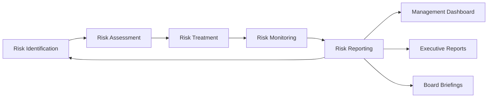

# Risk Identification and Analysis Framework

## Overview

This document outlines the comprehensive risk identification and analysis framework for TradePulse, utilizing FMEA, PESTLE, and SWOT methodologies to identify, assess, and mitigate risks at every project stage.

## 1. Risk Analysis Methodologies

### 1.1 FMEA (Failure Mode and Effects Analysis)

FMEA is used to identify potential failure modes in the system and their effects on operations.

#### Critical Components Analysis

| Component | Failure Mode | Effect | Severity (1-10) | Probability (1-10) | Detection (1-10) | RPN | Mitigation |
|-----------|--------------|--------|-----------------|-------------------|------------------|-----|------------|
| Data Feed | Connection Loss | Trading halt | 9 | 4 | 3 | 108 | Redundant feeds, circuit breaker |
| Order Execution | API Timeout | Failed trades | 8 | 3 | 2 | 48 | Retry logic, dead letter queue |
| Risk Manager | Calculation Error | Incorrect limits | 10 | 2 | 4 | 80 | Validation checks, audit trail |
| Authentication | Token Expiry | Access denied | 7 | 3 | 2 | 42 | Token refresh, session management |
| Database | Connection Pool Exhaustion | System unavailable | 9 | 3 | 3 | 81 | Pool monitoring, auto-scaling |
| Message Queue | Message Loss | Data inconsistency | 8 | 2 | 4 | 64 | Persistent storage, acknowledgments |
| Encryption | Key Compromise | Data breach | 10 | 1 | 5 | 50 | Key rotation, HSM storage |
| Network | DDoS Attack | Service unavailable | 9 | 5 | 2 | 90 | Rate limiting, WAF, CDN |

**RPN = Risk Priority Number (Severity × Probability × Detection)**

#### Risk Priority Thresholds
- **Critical (RPN > 100)**: Immediate action required
- **High (RPN 60-100)**: Address within sprint
- **Medium (RPN 30-60)**: Planned mitigation
- **Low (RPN < 30)**: Monitor and review

### 1.2 PESTLE Analysis

Political, Economic, Social, Technological, Legal, and Environmental factors affecting TradePulse.

#### Political Factors
- **Regulatory Changes**: SEC, FINRA, EU AI Act compliance requirements
- **Cross-border Trading**: International sanctions and restrictions
- **Government Oversight**: Financial system stability regulations
- **Risk**: Policy changes affecting algorithmic trading
- **Mitigation**: Regulatory monitoring system, compliance automation

#### Economic Factors
- **Market Volatility**: Flash crashes, circuit breakers
- **Interest Rate Changes**: Impact on trading strategies
- **Currency Fluctuations**: Multi-currency portfolio risk
- **Economic Crises**: Liquidity constraints
- **Risk**: System overload during high volatility
- **Mitigation**: Load testing, auto-scaling, circuit breakers

#### Social Factors
- **Public Trust**: Security breach impact on reputation
- **User Behavior**: Social engineering attacks
- **Employee Awareness**: Security culture
- **Risk**: Phishing and insider threats
- **Mitigation**: Security training, awareness programs, access controls

#### Technological Factors
- **API Dependencies**: Third-party service reliability
- **Infrastructure Security**: Cloud provider vulnerabilities
- **Technology Obsolescence**: Legacy system risks
- **Emerging Threats**: Zero-day vulnerabilities
- **Risk**: Dependency vulnerabilities, supply chain attacks
- **Mitigation**: Dependency scanning, SBOM generation, vendor assessment

#### Legal Factors
- **GDPR Compliance**: Data privacy requirements
- **CCPA**: California consumer privacy
- **HIPAA**: Health data protection (if applicable)
- **MiFID II**: Trading transparency and reporting
- **Risk**: Non-compliance penalties, legal liability
- **Mitigation**: Privacy by design, data retention policies, audit trails

#### Environmental Factors
- **Data Center Outages**: Natural disasters, power failures
- **Climate Events**: Geographic distribution of services
- **Energy Supply**: Critical infrastructure dependencies
- **Risk**: Service interruption, data loss
- **Mitigation**: Multi-region deployment, disaster recovery, backups

### 1.3 SWOT Analysis

#### Strengths
- ✅ **Advanced Security Features**: Vault integration, encryption at rest/transit
- ✅ **Automated Security Scanning**: CodeQL, Bandit, SAST/DAST in CI/CD
- ✅ **Comprehensive Audit Logging**: Full traceability of security events
- ✅ **Risk Management System**: Pre-trade checks, circuit breakers, kill switch
- ✅ **Modern Architecture**: Microservices with defense-in-depth
- ✅ **Security-First Culture**: Regular training, security champions

#### Weaknesses
- ⚠️ **Complex System**: Multiple services increase attack surface
- ⚠️ **Third-party Dependencies**: Supply chain risks
- ⚠️ **Human Factor**: Social engineering vulnerability
- ⚠️ **Legacy Components**: Gradual modernization needed
- ⚠️ **Documentation Gaps**: Some security procedures in progress
- ⚠️ **Test Coverage**: Security test coverage improvement needed

#### Opportunities
- 🔹 **AI/ML Security**: Automated threat detection and response
- 🔹 **Zero Trust Architecture**: Enhanced access control
- 🔹 **Blockchain Integration**: Immutable audit trails
- 🔹 **Advanced Encryption**: Quantum-resistant algorithms
- 🔹 **Security Certifications**: ISO 27001, SOC 2 Type II
- 🔹 **Bug Bounty Program**: Community-driven security testing

#### Threats
- 🔴 **Sophisticated Attacks**: APT, ransomware, zero-day exploits
- 🔴 **Regulatory Changes**: New compliance requirements
- 🔴 **Insider Threats**: Malicious or negligent employees
- 🔴 **Supply Chain Attacks**: Compromised dependencies
- 🔴 **Market Manipulation**: Algorithmic trading vulnerabilities
- 🔴 **DDoS Attacks**: Service availability threats

## 2. Threat Identification

### 2.1 Information Security Threats

#### Data Breach
- **Threat**: Unauthorized access to sensitive trading data, strategies, or credentials
- **Impact**: Financial loss, competitive disadvantage, regulatory penalties
- **Likelihood**: Medium
- **Controls**: Encryption, access controls, DLP, monitoring
- **Detection**: SIEM alerts, anomaly detection, audit reviews

#### Man-in-the-Middle (MITM)
- **Threat**: Interception of trading communications
- **Impact**: Order manipulation, data theft
- **Likelihood**: Low (with TLS)
- **Controls**: TLS 1.3, certificate pinning, mutual authentication
- **Detection**: Network monitoring, certificate validation

#### SQL Injection
- **Threat**: Database compromise through injection attacks
- **Impact**: Data breach, system manipulation
- **Likelihood**: Very Low (parameterized queries)
- **Controls**: Parameterized queries, input validation, ORM
- **Detection**: WAF, SIEM, code scanning

#### API Abuse
- **Threat**: Unauthorized API access, rate limit bypass
- **Impact**: Resource exhaustion, unauthorized trading
- **Likelihood**: Medium
- **Controls**: API authentication, rate limiting, request validation
- **Detection**: API monitoring, anomaly detection

### 2.2 Technical Stability Threats

#### Service Outage
- **Threat**: System unavailability due to failures
- **Impact**: Trading interruption, financial loss
- **Likelihood**: Low
- **Controls**: High availability, redundancy, failover
- **Detection**: Health checks, uptime monitoring

#### Performance Degradation
- **Threat**: Slow response times affecting trading
- **Impact**: Missed opportunities, slippage
- **Likelihood**: Medium
- **Controls**: Load balancing, caching, optimization
- **Detection**: APM, latency monitoring, profiling

#### Data Corruption
- **Threat**: Data integrity issues
- **Impact**: Incorrect trading decisions, compliance issues
- **Likelihood**: Low
- **Controls**: Data validation, checksums, backups
- **Detection**: Integrity checks, reconciliation

### 2.3 Human Factor Threats

#### Phishing
- **Threat**: Social engineering to steal credentials
- **Impact**: Account compromise, unauthorized access
- **Likelihood**: High
- **Controls**: Email filtering, MFA, security awareness
- **Detection**: Email security, user reporting, behavioral analytics

#### Insider Threat
- **Threat**: Malicious or negligent employees
- **Impact**: Data theft, sabotage, fraud
- **Likelihood**: Low
- **Controls**: Background checks, access controls, monitoring
- **Detection**: User behavior analytics, audit logs

#### Credential Stuffing
- **Threat**: Automated login attempts with stolen credentials
- **Impact**: Account takeover
- **Likelihood**: Medium
- **Controls**: MFA, account lockout, CAPTCHA
- **Detection**: Failed login monitoring, rate limiting

## 3. Vulnerability Assessment

### 3.1 Current Vulnerabilities (Historical Incidents)

Based on historical security assessments and incident tracking:

| Vulnerability | Category | CVSS Score | Status | Remediation |
|---------------|----------|------------|--------|-------------|
| Outdated dependencies | Supply Chain | 7.5 (High) | Mitigated | Automated dependency updates |
| Weak session timeout | Authentication | 6.0 (Medium) | Fixed | Reduced timeout to 15 minutes |
| Missing rate limiting | API Security | 5.5 (Medium) | Fixed | Implemented rate limiting |
| Insufficient logging | Monitoring | 4.0 (Low) | Enhanced | Comprehensive audit logging |
| Path traversal risk | Input Validation | 6.5 (Medium) | Fixed | Path validation implemented |

### 3.2 Emerging Threats Research

#### AI/ML Specific Threats
- **Model Poisoning**: Adversarial inputs to corrupt ML models
- **Model Theft**: Extraction of proprietary trading algorithms
- **Adversarial Examples**: Inputs designed to fool ML systems
- **Mitigation**: Input validation, model versioning, adversarial training

#### Cloud-Specific Threats
- **Misconfiguration**: Exposed storage, weak IAM policies
- **Account Hijacking**: Compromised cloud credentials
- **Data Residency**: Compliance issues with data location
- **Mitigation**: IaC scanning, least privilege, encryption, compliance automation

#### Cryptocurrency Trading Threats
- **Flash Loan Attacks**: Market manipulation
- **Front-Running**: Order anticipation and exploitation
- **Smart Contract Vulnerabilities**: DeFi integration risks
- **Mitigation**: Transaction monitoring, anomaly detection, smart contract audits

## 4. Risk Register

### 4.1 Risk Categories

```yaml
risk_categories:
  - Security
  - Operational
  - Financial
  - Compliance
  - Reputational
  - Strategic
```

### 4.2 Risk Assessment Matrix

| Risk Level | Impact | Probability | Response |
|------------|--------|-------------|----------|
| Critical | Very High | High | Immediate action, escalate to executives |
| High | High | Medium | Prioritize mitigation, weekly review |
| Medium | Medium | Medium | Plan mitigation, monthly review |
| Low | Low | Low | Monitor, quarterly review |

### 4.3 Top 10 Risks (Prioritized)

1. **Unauthorized Access to Trading Systems**
   - Impact: Very High | Probability: Medium | Risk Level: Critical
   - Mitigation: MFA, least privilege, continuous monitoring

2. **Data Breach (Customer/Trading Data)**
   - Impact: Very High | Probability: Low | Risk Level: High
   - Mitigation: Encryption, DLP, access controls, audit trails

3. **Service Outage During Trading Hours**
   - Impact: High | Probability: Low | Risk Level: High
   - Mitigation: High availability, disaster recovery, failover

4. **Regulatory Non-compliance**
   - Impact: High | Probability: Low | Risk Level: High
   - Mitigation: Compliance automation, regular audits, legal review

5. **Supply Chain Attack**
   - Impact: Very High | Probability: Very Low | Risk Level: Medium
   - Mitigation: SBOM, dependency scanning, vendor assessment

6. **DDoS Attack**
   - Impact: High | Probability: Medium | Risk Level: High
   - Mitigation: CDN, rate limiting, WAF, traffic filtering

7. **Insider Threat**
   - Impact: High | Probability: Very Low | Risk Level: Medium
   - Mitigation: Background checks, monitoring, separation of duties

8. **Algorithm Manipulation**
   - Impact: Very High | Probability: Very Low | Risk Level: Medium
   - Mitigation: Code review, testing, change management, audit trails

9. **Key/Secret Compromise**
   - Impact: Very High | Probability: Very Low | Risk Level: Medium
   - Mitigation: Vault, rotation, HSM, detection, revocation

10. **Phishing/Social Engineering**
    - Impact: Medium | Probability: High | Risk Level: High
    - Mitigation: Training, email filtering, MFA, incident response

## 5. Risk Treatment Plan

### 5.1 Risk Response Strategies

- **Avoid**: Eliminate the risk by not performing the activity
- **Mitigate**: Reduce likelihood or impact through controls
- **Transfer**: Share risk through insurance or contracts
- **Accept**: Acknowledge risk when mitigation cost exceeds impact

### 5.2 Control Implementation Priority

#### Phase 1: Critical Controls (Immediate)
- ✅ Implement MFA for all accounts
- ✅ Enable encryption at rest and in transit
- ✅ Deploy SIEM and monitoring
- ✅ Establish incident response procedures
- ✅ Conduct security awareness training

#### Phase 2: High Priority Controls (1-3 months)
- ⏳ Complete ISO 27001 gap analysis
- ⏳ Implement zero trust architecture
- ⏳ Enhance vulnerability management
- ⏳ Deploy DLP solution
- ⏳ Establish bug bounty program

#### Phase 3: Medium Priority Controls (3-6 months)
- 📋 Achieve ISO 27001 certification
- 📋 Implement advanced threat detection (AI/ML)
- 📋 Establish security operations center (SOC)
- 📋 Deploy deception technology
- 📋 Enhance third-party risk management

## 6. Continuous Risk Assessment

### 6.1 Assessment Schedule

- **Daily**: Automated vulnerability scanning, threat intelligence
- **Weekly**: Risk dashboard review, incident analysis
- **Monthly**: Risk register updates, control effectiveness
- **Quarterly**: Risk assessment review, executive briefing
- **Annually**: Comprehensive risk assessment, external audit

### 6.2 Key Risk Indicators (KRIs)

- Number of security incidents per month
- Mean time to detect (MTTD) threats
- Mean time to respond (MTTR) to incidents
- Percentage of systems with updated patches
- Number of critical vulnerabilities
- Security training completion rate
- Third-party security assessment scores

### 6.3 Risk Reporting



## 7. Integration with Development Lifecycle

### 7.1 Risk in Planning Phase
- Threat modeling for new features
- Security requirements definition
- Risk impact assessment

### 7.2 Risk in Development Phase
- Secure coding practices
- Static analysis and code review
- Dependency scanning

### 7.3 Risk in Testing Phase
- Security testing (SAST/DAST)
- Penetration testing
- Vulnerability assessment

### 7.4 Risk in Deployment Phase
- Security configuration review
- Change management controls
- Post-deployment monitoring

## References

- NIST SP 800-30: Guide for Conducting Risk Assessments
- NIST Cybersecurity Framework
- ISO 31000: Risk Management
- ISO 27005: Information Security Risk Management
- OWASP Risk Rating Methodology
- FAIR (Factor Analysis of Information Risk)

---

**Document Owner**: Security Team  
**Last Updated**: 2025-11-10  
**Review Cycle**: Quarterly  
**Next Review**: 2026-02-10
