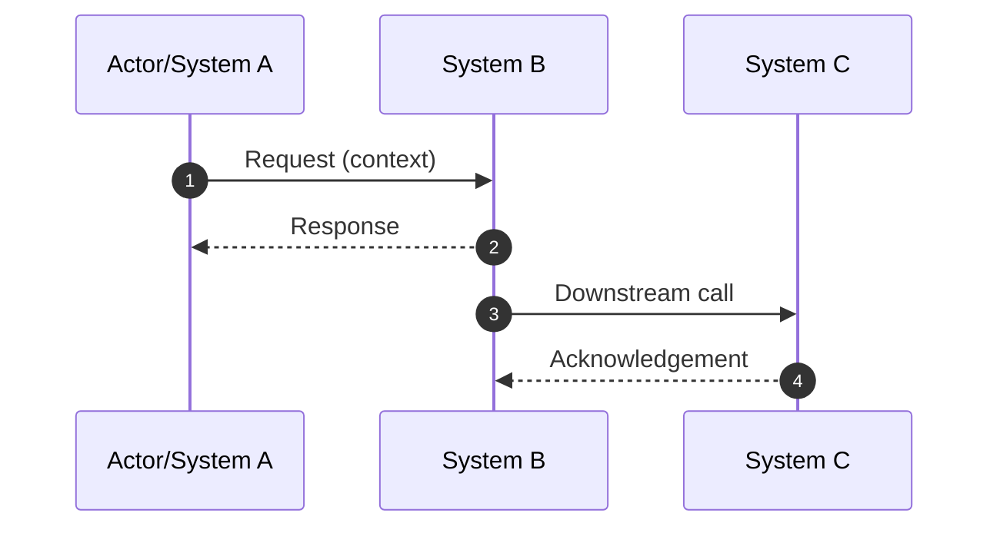

# Sequence Diagram Package Template

How to use this template

- Store Mermaid/PlantUML sources under `docs/assets/sequence/<name>.mmd`.
- Export rendered diagrams to `docs/assets/sequence/<name>.png` and reference
  both files for traceability.
- Keep interactions scoped to a single use case; large flows should be split.
- Update the metadata block for review ownership and remove this guidance.

## Scenario Summary

- **Use Case:**
- **Primary Actors:**
- **Trigger:**
- **Success Criteria:**

## Diagram

- **Source:** `docs/assets/sequence/<name>.mmd`
- **Rendered Asset:** `docs/assets/sequence/<name>.png`

## Narrative Walkthrough

1. Step-by-step description aligning with the diagram above.
2. Highlight concurrency, retries, or compensating actions.
3. Cite safeguards (timeouts, circuit breakers, audits).

## Metrics & Guardrails

| Metric | Owner | SLI/SLO | Alert |
| ------ | ----- | ------- | ----- |
| | | | |

## Change Log

| Date | Author | Change |
| ---- | ------ | ------ |
| 2025-12-28 | Docs Guild | Reviewed template metadata and refreshed module alignment notes. |
| YYYY-MM-DD | name | Initial draft |
