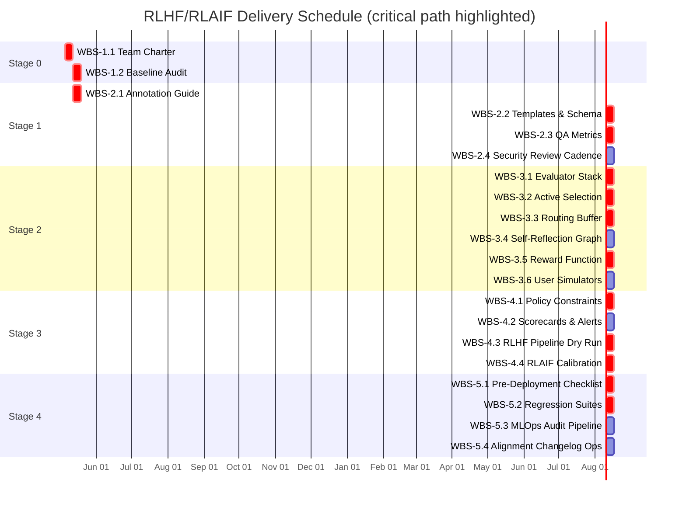
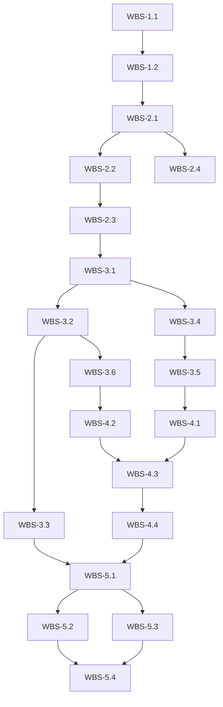

# RLHF/RLAIF Scope & Delivery Plan

## Overview
- The program establishes a consistent RLHF/RLAIF training process prioritising safety, reproducibility, and modular scaling of feedback loops.【F:docs/rlhf_rlaif_strategy.md†L3-L110】
- Implementation is structured across staged milestones from team formation through ongoing audits, aligning owners with the plan in §14.【F:docs/rlhf_rlaif_strategy.md†L135-L142】
- Future enhancements (e.g., multimodal RLAIF, federated learning) are tracked as out-of-scope backlog extensions per §15.【F:docs/rlhf_rlaif_strategy.md†L144-L148】

## Assumptions
1. Kick-off occurs on 2025-05-05 (first Monday after approval); adjust if governance sign-off slips. (Not in source → treat as schedule assumption.)
2. Weekly task cadence equals seven calendar days; holidays handled via float.
3. Security, compliance, and QA reviewers remain available throughout critical path activities.

## Scope Boundaries
### In Scope
- Annotation guide, templates, QA controls, and bilingual security review cadence.【F:docs/rlhf_rlaif_strategy.md†L11-L47】
- Multi-tier evaluators, active selection, self-reflection, reward modelling, and simulators.【F:docs/rlhf_rlaif_strategy.md†L49-L95】
- Safety policies, scorecards, RLHF/RLAIF pipelines, pre-deployment gates, regression tests, and MLOps audit trail.【F:docs/rlhf_rlaif_strategy.md†L81-L133】
- Stage-driven governance and ownership assignments for rollout.【F:docs/rlhf_rlaif_strategy.md†L135-L142】

### Out of Scope
- Multimodal RLAIF expansion, federated learning, real-time human-in-the-loop operations, and ESG impact analysis (captured as future roadmap).【F:docs/rlhf_rlaif_strategy.md†L144-L148】

### Clarified
- **Regulatory sign-off for alignment changelog:** Per the security requirements specification (docs/security/requirements/security-requirements-specification.md §9.1), production releases involving RLHF/RLAIF pipelines must be reviewed by the Compliance Team against SEC, FINRA, and MiFID II requirements. The Compliance Officer verifies alignment with ISO 27001 standards before final approval. For releases affecting trading logic or risk controls, additional sign-off from the Security Team Lead is required per the incident coordination procedures.

## Deliverable Traceability
Deliverables `DEL-001`–`DEL-016` are catalogued in `scope/deliverables.csv` with Definition of Done, dependencies, WBS linkage, and exact source citations. Cross-reference matrix is enforced via `scope/wbs_dictionary.md` and validated by `scope/validate_scope.py`.

## Schedule Visuals
### Gantt (weekly granularity)

### Dependency Network

## Governance & Quality Controls
- Release versioning follows semantic increments recorded in `docs/alignment/changelog.md`; each release update requires checksum capture of critical artefacts (guide, schemas, reward configs).【F:docs/rlhf_rlaif_strategy.md†L12-L133】
- Change approval workflow: WBS owner drafts, Security/Compliance reviews, QA validates, and Program Council signs off before promotion to next stage.
- Automated checks include schema validation, evaluator smoke tests, selection telemetry, policy static analysis, pipeline dry runs, and regression baselines aligned with deliverable DoD statements.【F:docs/rlhf_rlaif_strategy.md†L41-L133】
- Quarterly independent audits ensure adherence to policies and documentation completeness, feeding outcomes into the changelog cycle.【F:docs/rlhf_rlaif_strategy.md†L129-L133】

## Reproducibility & Verification
1. Execute `python scope/validate_scope.py` to confirm WBS integrity, owner assignments, deliverable coverage, and citation formatting.
2. Run designated test suites per `test_refs` in `scope/wbs.json` before closing each WBS task; store evidence in the release folder.
3. Maintain artefact checksums (e.g., `shasum -a 256`) for guide, templates, schemas, and policy files prior to deployment gating.

## Update Procedure
- Any scope or deliverable change triggers a new entry in the changelog, version bump, and rerun of validation plus impacted regression suites.
- Approvals must be documented in meeting minutes linked to the relevant deliverable and WBS entry.
- Network and Gantt diagrams should be regenerated upon baseline shifts to keep stakeholders aligned.
